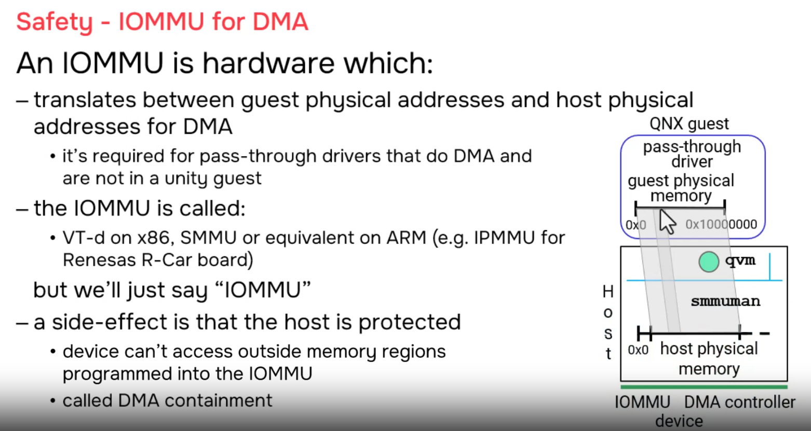
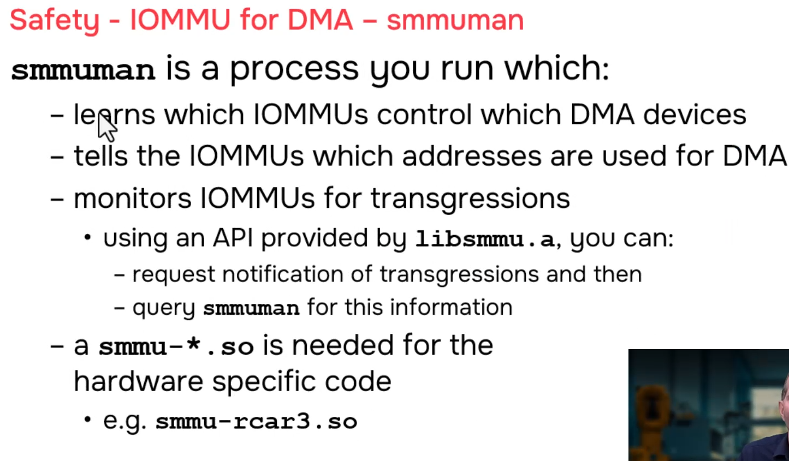
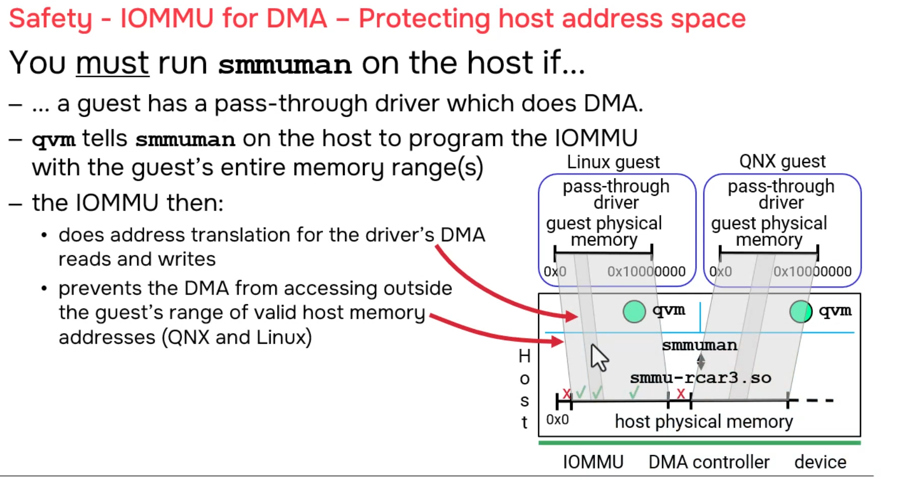
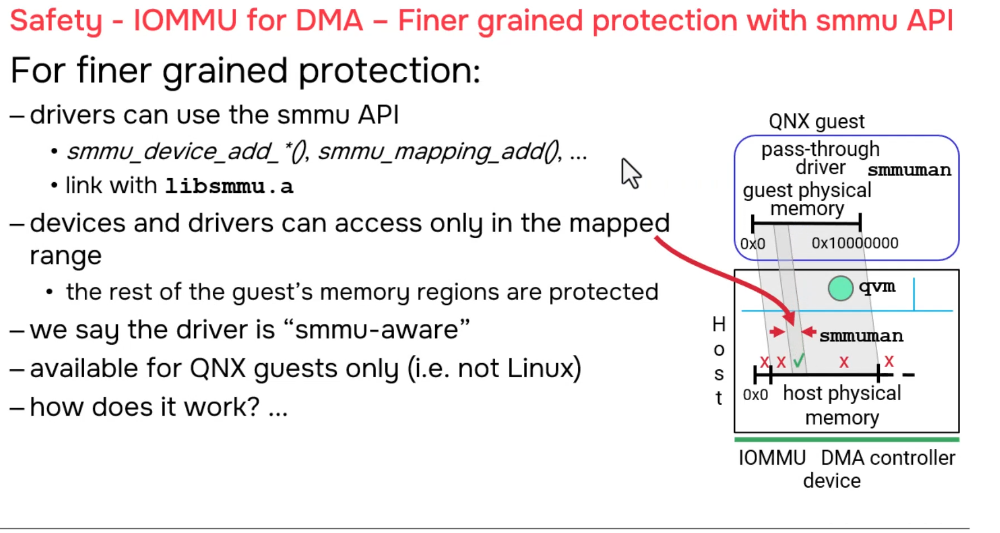
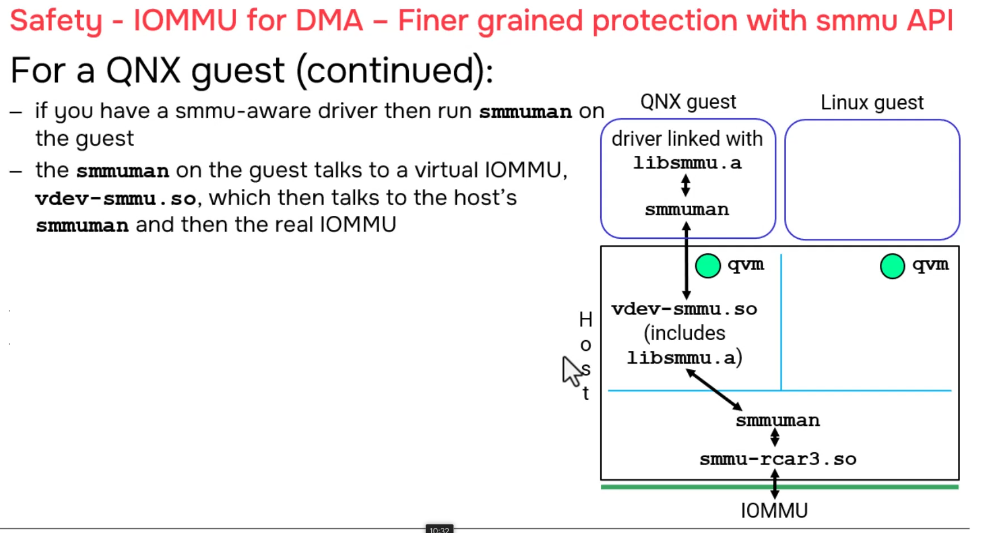
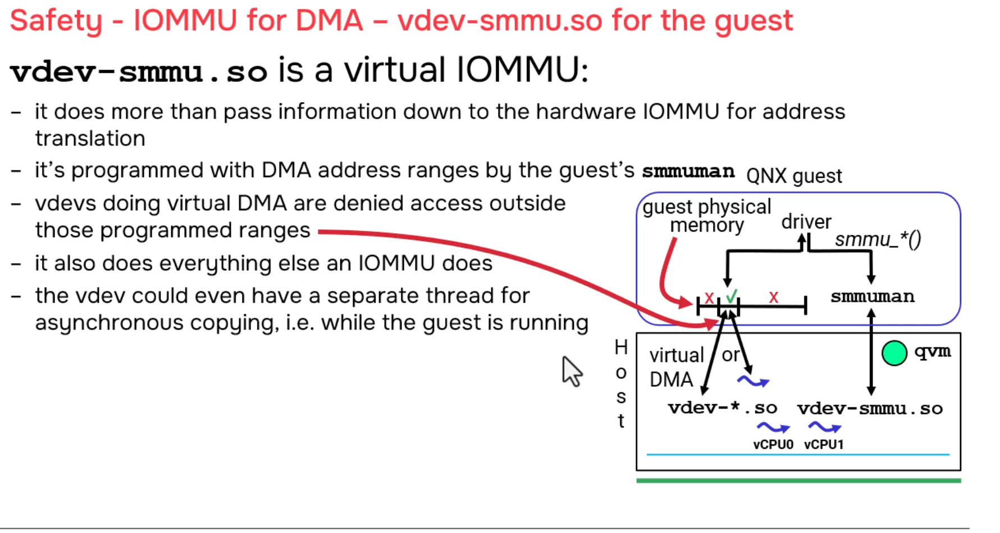
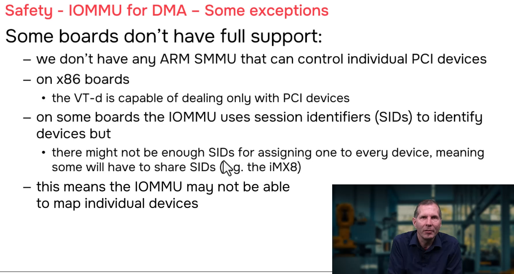
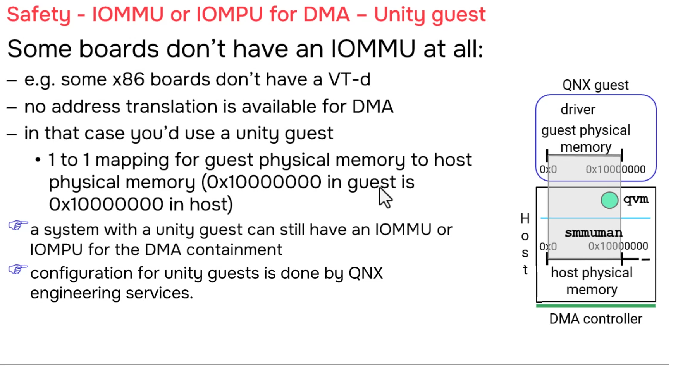
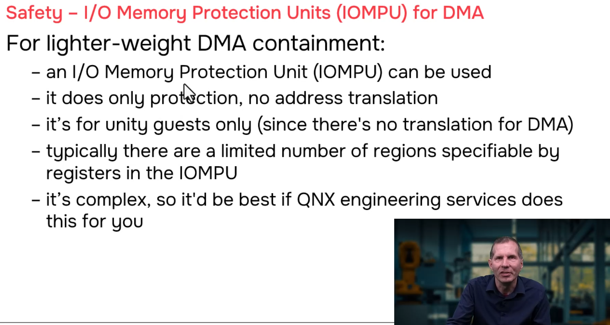

# QNX Hypervisor — IOMMU for DMA

## Overview

This section covers the Input/Output Memory Management Unit (IOMMU) and its critical role in DMA (Direct Memory Access) virtualization. The IOMMU translates device DMA addresses from Guest Physical Address (GPA) space to Host Physical Address (HPA) space, providing essential protection against unauthorized memory access. We also cover the software stack (`smmuman`), fine-grained protection for QNX guests, virtual DMA emulation, and hardware limitations including Unity Guests and IOMPUs.

---

## 1. What is an IOMMU?

### Simple Definition

> **IOMMU = Hardware that translates DMA addresses and protects memory**

Just as the CPU's MMU translates virtual addresses to physical addresses for programs, the IOMMU translates device addresses to physical addresses for DMA transfers.

### The Core Purpose

| Purpose | Description |
|---------|-------------|
| **Translation** | Converts GPA (what the guest thinks is physical) to HPA (actual physical memory) |
| **Protection** | Blocks DMA to unauthorized memory regions |

### Industry Names

| Platform | Name | Full Name |
|----------|------|-----------|
| **Generic** | **IOMMU** | Input/Output Memory Management Unit |
| **x86 Intel** | VT-d | Virtualization Technology for Directed I/O |
| **ARM (most)** | SMMU | System Memory Management Unit |
| **Renesas R-Car** | IPMMU | Image Processing MMU |

> The presenter jokes that **"DMAMMU"** (DMA Memory Management Unit) would be more precise, but IOMMU is the established term.

---

## 2. Why IOMMU is Critical: The DMA Danger

### Without IOMMU: Complete System Vulnerability

```
┌─────────────────────────────────────────────────────────────────────┐
│                    DMA WITHOUT IOMMU (DANGEROUS)                   │
│                                                                     │
│  Guest A has a pass-through network card. Attacker compromises it. │
│                                                                     │
│  Attacker tells NIC: "DMA write to 0xFFFF0000"                     │
│                                                                     │
│  Without IOMMU:                                                     │
│  ┌─────────┐     ┌─────────────────┐     ┌─────────────────┐     │
│  │ Device  │────►│  PHYSICAL RAM   │     │  PHYSICAL RAM   │     │
│  │ (NIC)   │ DMA │                 │     │                 │     │
│  │         │────►│  0xFFFF0000     │     │  0x00000000     │     │
│  │         │     │  HOST KERNEL!   │     │  Guest B RAM    │     │
│  │         │     │                 │     │                 │     │
│  └─────────┘     └─────────────────┘     └─────────────────┘     │
│                                                                     │
│  Device writes DIRECTLY to physical memory. No checks. No blocks.  │
│  Can overwrite: host kernel, other guests, device registers.         │
│                                                                     │
│  RESULT: Complete system compromise. Full security breach.           │
│                                                                     │
└─────────────────────────────────────────────────────────────────────┘
```

### With IOMMU: Protected and Contained

```
┌─────────────────────────────────────────────────────────────────────┐
│                    DMA WITH IOMMU (PROTECTED)                      │
│                                                                     │
│  Same attack: Attacker tells NIC "DMA write to 0xFFFF0000"         │
│                                                                     │
│  With IOMMU:                                                        │
│  ┌─────────┐     ┌─────────┐     ┌─────────────────┐             │
│  │ Device  │────►│  IOMMU  │────►│  PHYSICAL RAM   │             │
│  │ (NIC)   │ DMA │         │     │                 │             │
│  │         │     │ Checks:  │     │  0xFFFF0000     │             │
│  │         │     │ "0xFFFF0 │     │  NOT in table!  │             │
│  │         │     │  000?"   │     │                 │             │
│  │         │     │          │     │  BLOCKED!       │             │
│  │         │     │ Answer:  │     │  Device cannot  │             │
│  │         │     │ "NO!"    │     │  access this.   │             │
│  │         │     │          │     │                 │             │
│  └─────────┘     └─────────┘     └─────────────────┘             │
│                                                                     │
│  IOMMU also notifies smmuman: "Device tried illegal access!"       │
│  Your application can log, alert, or take action.                  │
│                                                                     │
│  RESULT: Attack blocked. System protected.                         │
│                                                                     │
└─────────────────────────────────────────────────────────────────────┘
```

---

## 3. The Software Stack: `smmuman`

### What is `smmuman`?

> **smmuman** = **S**ystem **M**emory **M**anagement **U**nit **Man**ager

A process that runs in the host (and optionally in QNX guests) to manage the IOMMU hardware.

### Architecture

```
┌─────────────────────────────────────────────────────────────────────┐
│                    SMMUMAN ARCHITECTURE                              │
│                                                                     │
│  ┌─────────────────────────────────────────────────────────────┐   │
│  │  YOUR APPLICATION (optional)                                  │   │
│  │  ┌─────────────────┐                                        │   │
│  │  │ libsmmu API     │  • Request notifications               │   │
│  │  │                 │  • Query violations                    │   │
│  │  │ smmu_register_  │  • Handle DMA containment events         │   │
│  │  │ notification()  │                                        │   │
│  │  │ smmu_query_     │                                        │   │
│  │  │ violation()     │                                        │   │
│  │  └────────┬────────┘                                        │   │
│  │           │                                                  │   │
│  │           ▼                                                  │   │
│  │  ┌─────────────────┐                                        │   │
│  │  │ smmuman         │  • Manages IOMMU hardware              │   │
│  │  │ (process)       │  • Programs translation tables         │   │
│  │  │                 │  • Monitors for violations             │   │
│  │  │ • Receives      │  • Notifies applications               │   │
│  │  │   device list   │                                        │   │
│  │  │   from qvm      │                                        │   │
│  │  │ • Programs      │                                        │   │
│  │  │   IOMMU tables  │                                        │   │
│  │  │ • Catches       │                                        │   │
│  │  │   violations    │                                        │   │
│  │  └────────┬────────┘                                        │   │
│  │           │                                                  │   │
│  │           ▼                                                  │   │
│  │  ┌─────────────────┐                                        │   │
│  │  │ BSP DLL         │  • Hardware-specific code              │   │
│  │  │ (e.g.,          │  • Renesas IPMMU, ARM SMMU, x86 VT-d  │   │
│  │  │  smmu-rcar.so)  │  • Talks to actual IOMMU registers     │   │
│  │  └────────┬────────┘                                        │   │
│  │           │                                                  │   │
│  └───────────┼──────────────────────────────────────────────────┘   │
│              │                                                      │
│              ▼                                                      │
│  ┌─────────────────┐                                               │
│  │  IOMMU HARDWARE │                                               │
│  │  (VT-d / SMMU / │                                               │
│  │   IPMMU)         │                                               │
│  └─────────────────┘                                               │
│                                                                     │
└─────────────────────────────────────────────────────────────────────┘
```

### Hardware Abstraction

| Platform | IOMMU Name | BSP DLL Example |
|----------|-----------|-----------------|
| x86 Intel | VT-d | `smmu-vtd.so` |
| ARM generic | SMMU | `smmu-smmu.so` |
| Renesas R-Car | IPMMU | `smmu-rcar.so` |
| Qualcomm | custom | `smmu-qualcomm.so` |

> `smmuman` is **hardware-agnostic**. The BSP provides the hardware-specific DLL.

---

## 4. What `qvm` Does Automatically

### Automatic IOMMU Programming at Guest Boot

```
┌─────────────────────────────────────────────────────────────────────┐
│  QVM BOOT SEQUENCE — AUTOMATIC IOMMU SETUP                         │
│                                                                     │
│  Step 1: qvm reads .qvmconf                                         │
│  ─────────────────────────                                          │
│  system name=guest-a                                                │
│  ram addr=0x40000000,size=0x4000000   ← 64 MB RAM at GPA          │
│                                                                     │
│  Step 2: qvm allocates host physical memory                         │
│  ────────────────────────────────────────                            │
│  procnto allocates 64 MB at HPA 0x10000000                            │
│                                                                     │
│  Step 3: qvm maps GPA → HPA (MMU Stage 2 for CPU)                   │
│  ─────────────────────────────────────────────────                   │
│  CPU MMU Stage 2: 0x40000000 → 0x10000000                           │
│                                                                     │
│  Step 4: qvm AUTOMATICALLY programs IOMMU                          │
│  ────────────────────────────────────────                            │
│  IOMMU table entry:                                                 │
│  ┌─────────────────┐    ┌─────────────────┐                          │
│  │ GPA 0x40000000  │───►│ HPA 0x10000000  │  ← Start of guest RAM  │
│  │   to 0x43FFFFFF │    │   to 0x13FFFFFF │  ← 64 MB range         │
│  └─────────────────┘    └─────────────────┘                          │
│                                                                     │
│  This is FREE protection — qvm does it automatically!               │
│                                                                     │
└─────────────────────────────────────────────────────────────────────┘
```

### What This Automatic Protection Gives You

```
Host Physical Address Space (example 2 GB board):
┌─────────────────────────────────────────────────────────────┐
│ 0x00000000 - 0x0FFFFFFF │ Host kernel, drivers, procnto      │
│                         │ ❌ NOT in IOMMU → PROTECTED        │
├─────────────────────────┼──────────────────────────────────────┤
│ 0x10000000 - 0x13FFFFFF │ Guest A RAM (64 MB)                │
│                         │ ✅ In IOMMU → Device CAN access      │
├─────────────────────────┼──────────────────────────────────────┤
│ 0x14000000 - 0x17FFFFFF │ Guest B RAM (64 MB)                │
│                         │ ✅ In IOMMU → Device CAN access      │
│                         │ ⚠️ Guest A device can corrupt B!     │
├─────────────────────────┼──────────────────────────────────────┤
│ 0x18000000 - 0x1FFFFFFF │ Unused / reserved                  │
│                         │ ❌ NOT in IOMMU → PROTECTED        │
├─────────────────────────┼──────────────────────────────────────┤
│ 0x20000000 - 0x2FFFFFFF │ Device registers, MMIO             │
│                         │ ❌ NOT in IOMMU → PROTECTED        │
└─────────────────────────────────────────────────────────────┘

PROBLEM: Both Guest A and Guest B RAM are in IOMMU.
Guest A's device can DMA to Guest B's RAM!

SOLUTION: Fine-grained protection (requires libsmmu in QNX guest)
```

---

## 5. Fine-Grained Protection with `libsmmu`

### The Problem: Coarse Protection is Too Broad

```
┌─────────────────────────────────────────────────────────────────────┐
│  COARSE PROTECTION (qvm automatic)                                  │
│                                                                     │
│  IOMMU Table:                                                       │
│  ┌─────────────────┐    ┌─────────────────┐                          │
│  │ Guest A RAM     │───│ 0x40000000-0x43FFFFFF │                    │
│  │ (entire 64 MB)  │    │ (all accessible)      │                    │
│  └─────────────────┘    └─────────────────┘                          │
│                                                                     │
│  Device can access ANYWHERE in Guest A's 64 MB!                       │
│  ❌ Can corrupt Guest A's own stack                                  │
│  ❌ Can corrupt Guest A's own heap                                   │
│  ❌ Can corrupt other drivers' buffers in Guest A                    │
│                                                                     │
│  Only safe from: host kernel, other guests, reserved memory          │
│                                                                     │
└─────────────────────────────────────────────────────────────────────┘
```

### The Solution: Restrict to Specific Buffers

```
┌─────────────────────────────────────────────────────────────────────┐
│  FINE-GRAINED PROTECTION (libsmmu in QNX guest)                     │
│                                                                     │
│  IOMMU Table after fine-grained setup:                               │
│  ┌─────────────────┐    ┌─────────────────┐                          │
│  │ DMA Buffer 1    │───│ 0x40000000-0x403FFFFF │  ← 4 MB ONLY        │
│  │ (4 MB for NIC)   │    │ (device can access)  │                    │
│  ├─────────────────┤    ├─────────────────┤                          │
│  │ Rest of Guest A │───│ BLOCKED!          │  ← Not accessible       │
│  │ RAM (60 MB)      │    │ (smmuman notified) │                    │
│  ├─────────────────┤    ├─────────────────┤                          │
│  │ Guest B RAM      │───│ BLOCKED!          │  ← Not accessible       │
│  │                  │    │ (already blocked)  │                    │
│  └─────────────────┘    └─────────────────┘                          │
│                                                                     │
│  RESULT: Device can ONLY access its 4 MB DMA buffer.                │
│          Any other address → BLOCKED + notification                   │
│                                                                     │
└─────────────────────────────────────────────────────────────────────┘
```

### The Complete Path: Guest Driver → IOMMU Hardware

```
┌─────────────────────────────────────────────────────────────────────┐
│  FINE-GRAINED PROTECTION: THE COMPLETE PATH                        │
│                                                                     │
│  STEP 1: QNX Guest Driver allocates DMA buffer                       │
│  ┌─────────────────┐                                                │
│  │ Guest Driver    │  void *buf = dma_alloc(4MB);                   │
│  │ (your code)     │  // buf is at GPA 0x40000000                   │
│  └─────────────────┘                                                │
│           │                                                         │
│           ▼                                                         │
│  STEP 2: Driver links with libsmmu.a                                │
│  ┌─────────────────┐                                                │
│  │ libsmmu.a       │  Static library with API functions:            │
│  │ (static library)│  • smmu_device_add()                            │
│  │                 │  • smmu_mapping_add()  ← THE KEY FUNCTION       │
│  │                 │  • smmu_register_notification()                 │
│  └─────────────────┘                                                │
│           │                                                         │
│           ▼                                                         │
│  STEP 3: Driver calls smmu_mapping_add()                            │
│  ┌─────────────────┐                                                │
│  │ smmu_mapping_add│  "Only allow device to access 0x40000000       │
│  │ (API call)      │   to 0x403FFFFF (4 MB), not the full 64 MB"   │
│  └─────────────────┘                                                │
│           │                                                         │
│           ▼                                                         │
│  STEP 4: libsmmu talks to smmuman in GUEST                          │
│  ┌─────────────────┐                                                │
│  │ smmuman         │  Runs INSIDE the QNX guest                     │
│  │ (in guest)      │  Receives the mapping request                   │
│  └─────────────────┘                                                │
│           │                                                         │
│           ▼                                                         │
│  STEP 5: Guest smmuman talks to Virtual IOMMU vdev                  │
│  ┌─────────────────┐                                                │
│  │ Virtual IOMMU   │  Emulated vdev in qvm                            │
│  │ vdev            │  Traps IOMMU register accesses from guest       │
│  └─────────────────┘                                                │
│           │                                                         │
│           ▼                                                         │
│  STEP 6: qvm handles trap, forwards to HOST smmuman                   │
│  ┌─────────────────┐                                                │
│  │ qvm             │  Guest exit → handle trap → forward to host     │
│  │ (guest exit)    │  smmuman                                        │
│  └─────────────────┘                                                │
│           │                                                         │
│           ▼                                                         │
│  STEP 7: Host smmuman programs REAL IOMMU hardware                  │
│  ┌─────────────────┐                                                │
│  │ smmuman         │  Runs in HOST                                    │
│  │ (in host)       │  Programs actual IOMMU chip (VT-d/SMMU/IPMMU)   │
│  │                 │  via BSP DLL                                    │
│  └─────────────────┘                                                │
│           │                                                         │
│           ▼                                                         │
│  STEP 8: Real IOMMU hardware updated                                │
│  ┌─────────────────┐                                                │
│  │ IOMMU Hardware  │  New translation table:                         │
│  │                 │  • 0x40000000 → 0x10000000 (4 MB ONLY)         │
│  │                 │  • 0x40400000 → BLOCKED (rest of guest RAM)   │
│  └─────────────────┘                                                │
│                                                                     │
│  RESULT: Device can ONLY access 4 MB buffer!                        │
│          Any other address → BLOCKED + notification                 │
│                                                                     │
└─────────────────────────────────────────────────────────────────────┘
```

### Configuration for Fine-Grained Protection

```qvmconf
# ============================================
# QNX Guest with Fine-Grained IOMMU
# ============================================

system name=qnx-dma-guest
ram addr=0x40000000,size=0x4000000   # 64 MB guest RAM

# Virtual IOMMU device (REQUIRED for guest smmuman)
vdev smmu
    addr=0x9000000

# Pass-through device that does DMA
pass addr=0xFE000000,host=0x3F000000,size=0x10000
pass interrupt=42

# Boot image
load addr=0x40000000,file=/data/guests/qnx/guest-boot.img
```

**Inside the guest, you must run:**
```bash
# 1. Start smmuman inside the guest
smmuman &

# 2. Your driver (linked with libsmmu.a) runs
#    and calls smmu_mapping_add() to restrict DMA
```

### Code Example: Using `libsmmu` in QNX Guest Driver

```c
// ============================================================
// dma_driver.c — QNX guest driver with fine-grained IOMMU
// ============================================================

#include <smmu/smmu.h>
#include <sys/mman.h>
#include <stdlib.h>
#include <stdio.h>

#define DMA_BUFFER_SIZE  (4 * 1024 * 1024)   // 4 MB
#define DEVICE_ID        0x1234               // PCI device ID

int main() {
    smmu_ctx_t ctx;
    void *dma_buffer;
    smmu_paddr_t buffer_paddr;
    int rc;
    
    // Step 1: Initialize SMMU context
    rc = smmu_ctx_init(&ctx, SMMU_FLAG_NONE);
    if (rc != 0) {
        fprintf(stderr, "Failed to init SMMU context: %d\n", rc);
        return -1;
    }
    
    // Step 2: Allocate DMA buffer (must be physically contiguous)
    dma_buffer = mmap(NULL, DMA_BUFFER_SIZE, 
                      PROT_READ | PROT_WRITE,
                      MAP_PHYS | MAP_ANON, 
                      NOFD, 0);
    if (dma_buffer == MAP_FAILED) {
        perror("mmap");
        return -1;
    }
    
    // Get physical address of buffer
    buffer_paddr = (smmu_paddr_t)dma_buffer;  // Simplified
    
    printf("DMA buffer: VA=%p, GPA=%p, size=%d MB\n",
           dma_buffer, (void*)buffer_paddr, DMA_BUFFER_SIZE / (1024*1024));
    
    // Step 3: Register device with IOMMU
    rc = smmu_device_add(ctx, DEVICE_ID, SMMU_FLAG_READ | SMMU_FLAG_WRITE);
    if (rc != 0) {
        fprintf(stderr, "Failed to add device: %d\n", rc);
        return -1;
    }
    
    // Step 4: Program ONLY this buffer into IOMMU
    // This is the CRITICAL step for fine-grained protection!
    rc = smmu_mapping_add(ctx, DEVICE_ID,
                          buffer_paddr,           // GPA start
                          DMA_BUFFER_SIZE,        // Size
                          buffer_paddr,           // HPA start (same for unity)
                          SMMU_FLAG_READ | SMMU_FLAG_WRITE);
    if (rc != 0) {
        fprintf(stderr, "Failed to add mapping: %d\n", rc);
        return -1;
    }
    
    printf("IOMMU programmed: device 0x%x can ONLY access %p - %p\n",
           DEVICE_ID, (void*)buffer_paddr, 
           (void*)(buffer_paddr + DMA_BUFFER_SIZE - 1));
    
    // Step 5: Register for violation notifications
    smmu_notification_t notif;
    rc = smmu_register_notification(ctx, &notif, SMMU_NOTIFY_VIOLATION);
    if (rc != 0) {
        fprintf(stderr, "Failed to register notification: %d\n", rc);
        return -1;
    }
    
    // Step 6: Start DMA
    // Tell device: "DMA to buffer_paddr"
    start_device_dma(DEVICE_ID, buffer_paddr, DMA_BUFFER_SIZE);
    
    // Step 7: Monitor for violations
    while (1) {
        rc = smmu_wait_notification(ctx, &notif, 1000);  // 1 sec timeout
        if (rc == 0) {
            // VIOLATION DETECTED!
            printf("ALERT: DMA violation detected!\n");
            printf("  Device: 0x%x\n", notif.device_id);
            printf("  Address: 0x%llx\n", (unsigned long long)notif.address);
            printf("  Type: %s\n", 
                   notif.type == SMMU_VIOLATION_WRITE ? "WRITE" : "READ");
            
            // Handle violation: stop device, log, alert, etc.
            stop_device_dma(DEVICE_ID);
            log_security_event(&notif);
            
            // Optional: terminate guest (local DSS)
            // raise(SIGKILL);  // or notify safety monitor
        }
        
        // Normal operation...
        process_dma_completions();
    }
    
    // Cleanup
    smmu_mapping_remove(ctx, DEVICE_ID, buffer_paddr, DMA_BUFFER_SIZE);
    smmu_device_remove(ctx, DEVICE_ID);
    smmu_ctx_fini(ctx);
    munmap(dma_buffer, DMA_BUFFER_SIZE);
    
    return 0;
}
```

---

## 6. Linux/Android Guest: Limited Protection

### What Linux Gets Automatically

```
┌─────────────────────────────────────────────────────────────────────┐
│  LINUX GUEST — AUTOMATIC (COARSE) PROTECTION ONLY                  │
│                                                                     │
│  ┌─────────────────────────────────────────────────────────────┐   │
│  │  LINUX GUEST                                                  │   │
│  │                                                               │   │
│  │  ┌─────────────────┐    ┌─────────────────┐                   │   │
│  │  │ Driver          │    │ NO smmuman      │  ← Not available │   │
│  │  │ (in guest)      │    │ NO libsmmu      │  ← Not available │   │
│  │  │                 │    │                 │                   │   │
│  │  │ 1. Allocate     │    │                 │                   │   │
│  │  │    DMA buffer   │    │                 │                   │   │
│  │  │    (via Linux   │    │                 │                   │   │
│  │  │     dma_alloc)  │    │                 │                   │   │
│  │  │                 │    │                 │                   │   │
│  │  │ 2. Tell device  │    │                 │                   │   │
│  │  │    to DMA to    │    │                 │                   │   │
│  │  │    buffer       │    │                 │                   │   │
│  │  └─────────────────┘    └─────────────────┘                   │   │
│  │                                                               │   │
│  └─────────────────────────────────────────────────────────────┘   │
│                              │                                       │
│                              │ (no guest smmuman)                    │
│                              ▼                                       │
│  ┌─────────────────────────────────────────────────────────────┐   │
│  │  HOST                                                         │   │
│  │                                                               │   │
│  │  ┌─────────────────┐    ┌─────────────────┐                   │   │
│  │  │ qvm             │    │ smmuman         │                   │   │
│  │  │ • At boot,      │    │ • Programs      │                   │   │
│  │  │   programmed    │    │   IOMMU with    │                   │   │
│  │  │   ENTIRE guest  │    │   qvm's ranges  │                   │   │
│  │  │   RAM into      │    │                 │                   │   │
│  │  │   IOMMU         │    │                 │                   │   │
│  │  └─────────────────┘    └─────────────────┘                   │   │
│  │                                                               │   │
│  │  IOMMU Table (coarse, from qvm boot):                         │   │
│  │  ┌─────────────────┐    ┌─────────────────┐                   │   │
│  │  │ 0x40000000      │───│ 0x10000000      │  ← ALL guest RAM  │   │
│  │  │ (entire guest   │    │ (64 MB)         │    (64 MB)        │   │
│  │  │  RAM, 64 MB)    │    │                 │                   │   │
│  │  └─────────────────┘    └─────────────────┘                   │   │
│  │                                                               │   │
│  │  PROTECTION LEVEL:                                            │   │
│  │  ✅ Device CANNOT write to host kernel (0x00000000)           │   │
│  │  ✅ Device CANNOT write to other guests (0x14000000+)         │   │
│  │  ❌ Device CAN write to ANYWHERE in its own 64 MB RAM         │   │
│  │      (including stack, heap, other drivers' buffers)           │   │
│  │                                                               │   │
│  └─────────────────────────────────────────────────────────────┘   │
│                                                                     │
│  LIMITATION: No fine-grained protection within guest.              │
│  If driver has a bug and DMAs to wrong address within guest RAM,    │
│  IOMMU will ALLOW it (because entire range is mapped).              │
│                                                                     │
│  "But there's nothing stopping you from writing some code           │
│   that programs this hardware. You can do that."                   │
│   → You'd have to write Linux kernel module that directly           │
│     talks to IOMMU registers. Very complex, not recommended.          │
│                                                                     │
└─────────────────────────────────────────────────────────────────────┘
```

---

## 7. Virtual DMA: Emulated DMA Without Hardware

### The Concept

What if you have a **virtual device** (not real hardware) but you want it to behave like real DMA?

```
┌─────────────────────────────────────────────────────────────────────┐
│  VIRTUAL DMA — EMULATING DMA WITHOUT REAL HARDWARE                   │
│                                                                     │
│  REAL DMA (with hardware):                                           │
│  1. Driver tells device: "DMA from buffer X"                        │
│  2. Driver continues running (doesn't wait)                         │
│  3. Device does transfer independently                                │
│  4. Device interrupts when done                                     │
│  5. Driver handles completion                                       │
│                                                                     │
│  KEY: Driver and device work IN PARALLEL                              │
│                                                                     │
│  ═══════════════════════════════════════════════════════════════     │
│                                                                     │
│  VIRTUAL DMA (software emulation):                                   │
│                                                                     │
│  ┌─────────────────┐    ┌─────────────────┐    ┌─────────────────┐ │
│  │ Guest Driver    │    │ Virtual Device  │    │ Worker Thread   │ │
│  │ (vdev)          │    │ (vdev code)     │    │ (in vdev)       │ │
│  │                 │    │                 │    │                 │ │
│  │ 1. Driver does  │───►│ 2. Trap! Guest  │    │                 │ │
│  │    I/O to start │    │    exit. vdev   │    │                 │ │
│  │    "DMA"        │    │    handles it.  │    │                 │ │
│  │                 │    │                 │    │                 │ │
│  │                 │◄───│ 3. IMMEDIATELY  │    │                 │ │
│  │ 4. Driver       │    │    do guest     │───►│ 5. Start worker │ │
│  │    continues    │    │    entrance.    │    │    thread       │ │
│  │    running!     │    │    Driver runs  │    │                 │ │
│  │                 │    │    again.       │    │                 │ │
│  │                 │    │                 │    │ 6. memcpy()     │ │
│  │                 │    │                 │    │    (simulates   │ │
│  │                 │    │                 │    │    DMA transfer)│ │
│  │                 │    │                 │    │                 │ │
│  │ 7. Later: check │◄───│◄───────────────────────│ 7. Signal done  │ │
│  │    completion   │    │    (interrupt)  │    │                 │ │
│  │                 │    │                 │    │                 │ │
│  └─────────────────┘    └─────────────────┘    └─────────────────┘ │
│                                                                     │
│  TIMELINE:                                                           │
│  Driver runs ──► starts "DMA" ──► continues running ──► later checks │
│                    │                    │              completion     │
│                    │                    │                             │
│                    └──► Worker thread does memcpy() in background     │
│                                                                     │
│  This is TRUE DMA semantics — just done in software!                 │
│                                                                     │
│  Use cases: virtio-net, virtio-blk, custom virtual devices             │
│                                                                     │
└─────────────────────────────────────────────────────────────────────┘
```

### Virtual DMA with Virtual IOMMU

```
┌─────────────────────────────────────────────────────────────────────┐
│  VIRTUAL DMA + VIRTUAL IOMMU (for testing/development)              │
│                                                                     │
│  Even with no real IOMMU hardware, you can:                         │
│  1. Load virtual IOMMU vdev in guest                                 │
│  2. Run smmuman in guest                                             │
│  3. Program virtual IOMMU tables                                     │
│                                                                     │
│  This gives you the SOFTWARE API experience without real hardware.   │
│  No actual protection (it's emulated), but your code works the same. │
│                                                                     │
│  "It won't give you any protection though, but you can do that."     │
│                                                                     │
│  Useful for:                                                         │
│  • Development and testing                                           │
│  • Understanding IOMMU API before deploying on real hardware        │
│  • Virtual device development                                        │
│                                                                     │
└─────────────────────────────────────────────────────────────────────┘
```

---

## 8. Hardware Limitations

### Limitation 1: ARM SMMU and PCI Devices

```
┌─────────────────────────────────────────────────────────────────────┐
│  ARM SMMU LIMITATION: No Per-Device PCI Control                      │
│                                                                     │
│  Scenario: Board with 8 PCI devices, all doing DMA                   │
│                                                                     │
│  ARM SMMU: "I can protect memory regions, but I cannot               │
│            assign different regions to different PCI devices."       │
│                                                                     │
│  Result:                                                             │
│  ┌─────────────────┐                                                │
│  │ PCI Device 1    │───► All share SAME IOMMU table                  │
│  │ PCI Device 2    │     (cannot isolate per-device)                 │
│  │ PCI Device 3    │                                                │
│  │ ...             │                                                │
│  └─────────────────┘                                                │
│                                                                     │
│  "We don't have any ARM SMMUs that can control individual            │
│   PCI devices. So we can't give you fine-grained protection          │
│   for each one of them because the SMMU can't control                 │
│   individual PCI devices."                                           │
│                                                                     │
│  What you get: All PCI devices share the same protection domain.      │
│                                                                     │
└─────────────────────────────────────────────────────────────────────┘
```

### Limitation 2: x86 VT-d and Non-PCI Devices

```
┌─────────────────────────────────────────────────────────────────────┐
│  x86 VT-d LIMITATION: PCI Only                                       │
│                                                                     │
│  VT-d: "I can protect PCI devices, but NOT non-PCI devices."        │
│                                                                     │
│  Scenario: DMA to on-chip memory controller (not PCI)                │
│                                                                     │
│  Result: No fine-grained IOMMU protection for non-PCI DMA!            │
│                                                                     │
│  "On x86, if you're doing DMA to a non-PCI device,                   │
│   you can't get fine-grained protection."                             │
│                                                                     │
│  What you get: Coarse protection only (entire guest RAM).              │
│                                                                     │
└─────────────────────────────────────────────────────────────────────┘
```

### Limitation 3: Session ID Exhaustion

```
┌─────────────────────────────────────────────────────────────────────┐
│  SESSION ID LIMITATION: Too Many DMA Regions                         │
│                                                                     │
│  Some IOMMUs use "session identifiers" or "context IDs"               │
│  to track different protection domains.                                │
│                                                                     │
│  Problem: Hardware has LIMITED number of these IDs.                   │
│                                                                     │
│  Example: IOMMU supports 8 session IDs                                │
│           You have 10 guests with DMA                                 │
│                                                                     │
│  Result: "There might not be enough session identifiers for           │
│           all the DMA memory that you want to protect.                │
│           So you can't get fine-grained protection for all of        │
│           them if you have too many."                                 │
│                                                                     │
│  Fallback: Coarse protection (entire guest RAM) or none.              │
│                                                                     │
└─────────────────────────────────────────────────────────────────────┘
```

### Limitation 4: No IOMMU at All → Unity Guest

```
┌─────────────────────────────────────────────────────────────────────┐
│  NO IOMMU HARDWARE → UNITY GUEST REQUIRED                             │
│                                                                     │
│  Some cheap boards don't have IOMMU (no VT-d, no SMMU).              │
│                                                                     │
│  Without IOMMU:                                                      │
│  • No hardware to translate DMA addresses                             │
│  • Device receives GPA, but memory system expects HPA                │
│  • MISMATCH! Device writes to wrong physical location!                │
│                                                                     │
│  SOLUTION: UNITY GUEST                                               │
│                                                                     │
│  ┌─────────────────┐    ┌─────────────────┐                          │
│  │ Normal Guest    │    │ Unity Guest      │                          │
│  │                 │    │                  │                          │
│  │ GPA 0x40000000  │    │ GPA 0x10000000   │                          │
│  │ ↓               │    │ ↓                │                          │
│  │ HPA 0x10000000  │    │ HPA 0x10000000   │                          │
│  │ (translation)   │    │ (NO translation) │                          │
│  │                 │    │                  │                          │
│  │ Needs IOMMU     │    │ No IOMMU needed! │                          │
│  │ for DMA         │    │ Address is same! │                          │
│  └─────────────────┘    └─────────────────┘                          │
│                                                                     │
│  Unity Guest: GPA == HPA (one-to-one mapping)                        │
│                                                                     │
│  "Guest physical address 0 is host physical address 0.               │
│   Guest physical address 0x10000000 is host physical address         │
│   0x10000000. It has to be one-to-one mapping."                       │
│                                                                     │
│  ⚠️ "Configuring unity guests is complex, involves BSP stuff,        │
│      and so on. So typically, you have us configure unity guests."    │
│                                                                     │
│  Note: A system with unity guests CAN still have an IOMMU.            │
│  You might be a unity guest for some other reason, not because        │
│  of missing IOMMU.                                                   │
│                                                                     │
└─────────────────────────────────────────────────────────────────────┘
```

### Unity Guest Configuration

```qvmconf
# ============================================
# UNITY GUEST (GPA == HPA)
# ============================================

system name=unity-guest
# RAM starts at same address as host physical
ram addr=0x10000000,size=0x4000000   # GPA 0x10000000 = HPA 0x10000000

# No IOMMU needed for DMA
# Device uses addresses directly

# Boot image
load addr=0x10000000,file=/data/guests/unity/guest-boot.img
```

---

## 9. IOMPU: Cheap Protection-Only Alternative

```
┌─────────────────────────────────────────────────────────────────────┐
│  IOMPU: I/O Memory Protection Unit (Cheap Chips)                    │
│                                                                     │
│  Problem: Chip vendors want CHEAP chips. IOMMU is expensive.        │
│                                                                     │
│  Solution: IOMPU — protection WITHOUT translation                    │
│                                                                     │
│  ┌─────────────────┐    ┌─────────────────┐    ┌─────────────────┐ │
│  │ IOMMU           │    │ IOMPU           │    │ Nothing         │ │
│  │                 │    │                 │    │                 │ │
│  │ • Translation   │    │ • NO translation│    │ • No translation│ │
│  │ • Protection    │    │ • Protection    │    │ • No protection │ │
│  │ • Expensive     │    │ • Cheap         │    │ • Free          │ │
│  │                 │    │                 │    │                 │ │
│  │ Full featured   │    │ Budget option   │    │ Dangerous       │ │
│  └─────────────────┘    └─────────────────┘    └─────────────────┘ │
│                                                                     │
│  IOMPU Behavior:                                                     │
│  • Device gives address                                               │
│  • IOMPU checks: "Is this in my allowed list?"                       │
│  • YES → allow (NO translation, address used as-is)                   │
│  • NO  → block                                                       │
│                                                                     │
│  Requirements:                                                       │
│  • MUST use Unity Guest (GPA == HPA) because no translation         │
│  • Limited number of protected regions (hardware constraint)         │
│  • "Typically for this hardware, this IOMPU hardware,                 │
│     they don't give you a lot of regions to program in.               │
│     So therefore, you can only do a limited number."                  │
│                                                                     │
│  ⚠️ "These are complex to use and it's best to again ask us for help  │
│      if you have a board that has an IOMPU and no IOMMU."           │
│                                                                     │
│  The presenter coined "IOMPU" as a new term for this concept.        │
│                                                                     │
└─────────────────────────────────────────────────────────────────────┘
```

---

## 10. Complete Configuration Examples

### Example 1: QNX Guest with Fine-Grained IOMMU

```qvmconf
# ============================================
# HOST: smmuman runs here
# ============================================
# Start in host startup script:
# smmuman -c /etc/smmuman.conf

# ============================================
# GUEST: QNX with pass-through DMA
# ============================================
system name=qnx-dma-guest
ram addr=0x40000000,size=0x4000000   # 64 MB guest RAM

cpu cluster=0,cores=2

# Virtual IOMMU (for guest smmuman)
vdev smmu
    addr=0x9000000

# Pass-through device (NIC with DMA)
pass addr=0xFE000000,host=0x3F000000,size=0x100000   # Device registers
pass interrupt=42

# Boot image
load addr=0x40000000,file=/data/guests/qnx-dma/guest-boot.img
```

**Guest startup script:**
```bash
#!/bin/sh
# Inside QNX guest

# 1. Start guest smmuman
smmuman -c /etc/smmuman-guest.conf &

# 2. Start NIC driver (links with libsmmu)
io-pkt-v6-hc -d mynic -c /etc/mynic.conf &
```

---

### Example 2: Linux Guest with Coarse IOMMU

```qvmconf
# ============================================
# GUEST: Linux with pass-through DMA
# ============================================
system name=linux-dma-guest
ram addr=0x40000000,size=0x4000000   # 64 MB guest RAM

cpu cluster=0,cores=2

# Pass-through device (GPU with DMA)
pass addr=0xFE000000,host=0x3F000000,size=0x100000   # Device registers
pass interrupt=43

# NO vdev smmu — Linux can't use it
# NO libsmmu — not available for Linux

# Boot image
load addr=0x40000000,file=/data/guests/linux-dma/Image
load addr=0x44000000,file=/data/guests/linux-dma/initrd.img
```

**Linux driver:**
```c
// Standard Linux DMA API
// No IOMMU fine-grained control available

#include <linux/dma-mapping.h>

void *dma_buf;
dma_addr_t dma_handle;

// Allocate DMA buffer
dma_buf = dma_alloc_coherent(dev, size, &dma_handle, GFP_KERNEL);
// dma_handle is the address given to device
// (Linux kernel manages this, but no fine-grained IOMMU)

// Tell device to DMA to dma_handle
// Device can access ANYWHERE in guest's 64 MB RAM
// (coarse protection only — can't access host or other guests)
```

---

### Example 3: Multiple Guests with IOMMU Isolation

```qvmconf
# ============================================
# GUEST A: QNX — Fine-grained protection
# ============================================
system name=qnx-guest-a
ram addr=0x40000000,size=0x2000000   # 32 MB

pass addr=0xFE000000,host=0x3F000000,size=0x10000   # NIC registers
pass interrupt=42

vdev smmu,addr=0x9000000   # Virtual IOMMU for guest

# Driver uses libsmmu to program ONLY its 2 MB DMA buffer
# Result: NIC can ONLY access 2 MB, not other 30 MB

# ============================================
# GUEST B: Linux — Coarse protection
# ============================================
system name=linux-guest-b
ram addr=0x60000000,size=0x2000000   # 32 MB

pass addr=0xFE100000,host=0x3F100000,size=0x10000   # GPU registers
pass interrupt=43

# NO vdev smmu
# qvm programmed ENTIRE 32 MB into IOMMU at boot
# GPU can access all 32 MB of Guest B RAM
# But CANNOT access Guest A RAM or host kernel

# ============================================
# IOMMU TABLE (after all guests booted):
# ┌─────────────────┐    ┌─────────────────┐
# │ 0x40000000      │───►│ 0x10000000      │  ← Guest A RAM (32 MB)
# │ (Guest A RAM)   │    │ (32 MB)         │
# ├─────────────────┤    ├─────────────────┤
# │ 0x42000000      │───►│ 0x12000000      │  ← Guest A DMA buffer
# │ (Guest A DMA    │    │ (2 MB, fine-     │
# │  buffer only)   │    │  grained)       │
# ├─────────────────┤    ├─────────────────┤
# │ 0x60000000      │───►│ 0x20000000      │  ← Guest B RAM (32 MB)
# │ (Guest B RAM)   │    │ (32 MB)         │
# ├─────────────────┤    ├─────────────────┤
# │ 0x80000000      │───►│ BLOCKED!        │  ← Not allocated
# │ (unallocated)   │    │                 │
# ├─────────────────┤    ├─────────────────┤
# │ 0x00000000      │───►│ BLOCKED!        │  ← Host kernel
# │ (host kernel)   │    │                 │
# └─────────────────┘    └─────────────────┘
```

---

### Example 4: Unity Guest (No IOMMU)

```qvmconf
# ============================================
# UNITY GUEST: No IOMMU hardware available
# ============================================
system name=unity-guest
# RAM starts at same address as host physical
ram addr=0x10000000,size=0x4000000   # GPA 0x10000000 = HPA 0x10000000

cpu cluster=0,cores=2

# Pass-through device
pass addr=0xFE000000,host=0x3F000000,size=0x100000
pass interrupt=42

# Boot image
load addr=0x10000000,file=/data/guests/unity/guest-boot.img
```

---

## 11. Summary Table

| Feature | IOMMU | IOMPU | Nothing |
|--------|-------|-------|---------|
| **Translation** | ✅ Yes | ❌ No | ❌ No |
| **Protection** | ✅ Yes | ✅ Yes | ❌ No |
| **Fine-grained** | ✅ Yes (with libsmmu) | ⚠️ Limited regions | ❌ No |
| **Unity guest required** | ❌ No | ✅ Yes | ✅ Yes |
| **Cost** | Higher | Lower | Lowest |
| **Use case** | Full virtualization | Budget protection | No protection (dangerous) |

---

## 12. Key Takeaways

| Concept | Key Point |
|---------|-----------|
| **IOMMU purpose** | Translate DMA addresses (GPA → HPA) |
| **Critical side effect** | **Protection** — blocks unauthorized DMA access |
| **Industry names** | VT-d (x86), SMMU (ARM), IPMMU (Renesas) |
| **QNX software** | `smmuman` (manager), `libsmmu` (API), BSP DLL (hardware) |
| **Automatic protection** | `qvm` programs guest RAM into IOMMU at boot |
| **Fine-grained protection** | QNX guest drivers use `libsmmu` to program specific buffers |
| **Linux/Android limitation** | No `libsmmu` — only coarse protection |
| **No IOMMU** | Use **Unity Guest** (GPA == HPA) |
| **IOMPU** | Cheaper alternative — protection only, no translation |
| **Virtual DMA** | Emulated devices can implement DMA semantics in software |
| **Hardware limits** | ARM SMMU (no per-PCI), x86 VT-d (PCI only), session ID limits |

---

## 13. Screenshots




















---
