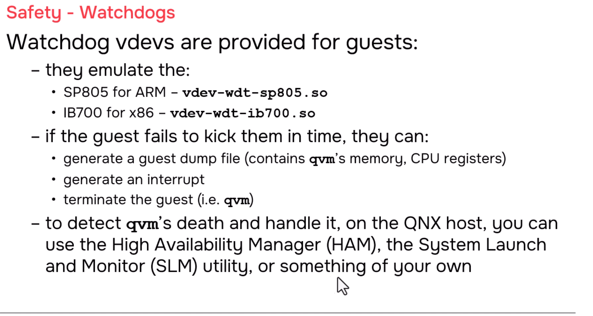

# QNX Hypervisor — Watchdogs

## Overview

This section covers watchdog timers in the QNX Hypervisor. Watchdogs are critical safety mechanisms that monitor system health and take action when software becomes unresponsive. The QNX Hypervisor provides emulated watchdog vdevs for both ARM and x86 platforms, offering flexible configuration options for detecting and handling system failures.

---

## 1. What is a Watchdog?

### Simple Concept

> A **watchdog timer** is a hardware (or software) timer that must be periodically "kicked" or "fed" by running software. If the software fails to do so within a timeout period, the watchdog assumes the system is stuck and triggers a corrective action.

### Analogy: The Security Guard

```
┌─────────────────────────────────────────────────────────────────────┐
│  WATCHDOG ANALOGY: SECURITY GUARD                                    │
│                                                                     │
│  You (the process) work in an office.                               │
│  A security guard (watchdog) checks on you every hour.            │
│                                                                     │
│  Every hour, you must call the guard: "I'm still alive!"            │
│                                                                     │
│  ┌─────────────────┐    ┌─────────────────┐                         │
│  │ Your Process    │───►│ Watchdog Timer  │                         │
│  │                 │    │                 │                         │
│  │ "I'm alive!"    │    │ Timer resets    │                         │
│  │ (every N ms)    │    │ (no action)     │                         │
│  └─────────────────┘    └─────────────────┘                         │
│                                                                     │
│  If you DON'T call:                                                 │
│  ┌─────────────────┐    ┌─────────────────┐                         │
│  │ Your Process    │    │ Watchdog Timer  │                         │
│  │ (stuck/crashed) │    │ "No call received!"                        │
│  │                 │───►│                 │                         │
│  │ (silent)        │    │ TIMEOUT!        │                         │
│  └─────────────────┘    └─────────────────┘                         │
│                              │                                       │
│                              ▼                                       │
│  ┌─────────────────┐    ┌─────────────────┐    ┌─────────────────┐ │
│  │ Option 1:       │    │ Option 2:       │    │ Option 3:       │ │
│  │ Generate dump   │    │ Generate IRQ    │    │ Kill qvm        │ │
│  │ (core file)     │    │ (handle it)     │    │ (restart)       │ │
│  └─────────────────┘    └─────────────────┘    └─────────────────┘ │
│                                                                     │
└─────────────────────────────────────────────────────────────────────┘
```

---

## 2. QNX Hypervisor Watchdog vdevs

### Provided Emulations

| Platform | Watchdog Chip | vdev Name | Notes |
|----------|--------------|-----------|-------|
| **ARM** | SP805 | `vdev-wdt-sp805.so` | ARM watchdog timer |
| **x86** | IB700 | `vdev-wdt-ib700.so` | x86 watchdog timer |

> **Important:** These are **100% software emulation**. No physical chip required.

### Why Emulation?

| Aspect | Explanation |
|--------|-------------|
| **No hardware needed** | Pure software implementation |
| **Consistent behavior** | Same watchdog across all boards |
| **Safety monitoring** | Can watch guest health from host |
| **Flexible actions** | Configurable response to timeout |

---

## 3. How the Watchdog Works

### Normal Operation: "I'm Alive!"

```
┌─────────────────────────────────────────────────────────────────────┐
│  WATCHDOG NORMAL OPERATION                                          │
│                                                                     │
│  Guest Process (your application):                                  │
│  ┌─────────────────────────────────────────────────────────────┐    │
│  │  while (running) {                                            │    │
│  │      // Do work                                               │    │
│  │      process_data();                                         │    │
│  │                                                               │    │
│  │      // Kick the watchdog                                     │    │
│  │      write_watchdog_register(WDT_KEEP_ALIVE, 1);            │    │
│  │      // ↑ This I/O is TRAPPED by the vdev                    │    │
│  │                                                               │    │
│  │      sleep_ms(100);  // Repeat every 100ms                   │    │
│  │  }                                                            │    │
│  └─────────────────────────────────────────────────────────────┘    │
│                                                                     │
│  When write_watchdog_register() is called:                          │
│                                                                     │
│  1. Guest executes I/O instruction to watchdog address              │
│  2. Virtualization hardware traps (guest exit)                        │
│  3. qvm calls vdev-wdt-sp805.so handler                             │
│  4. vdev resets its internal timer                                  │
│  5. vdev returns, guest entrance, process continues                 │
│                                                                     │
│  Result: Watchdog is happy, no timeout.                             │
│                                                                     │
└─────────────────────────────────────────────────────────────────────┘
```

### Timeout: "Something's Wrong!"

```
┌─────────────────────────────────────────────────────────────────────┐
│  WATCHDOG TIMEOUT SCENARIO                                          │
│                                                                     │
│  Guest Process (stuck in infinite loop):                            │
│  ┌─────────────────────────────────────────────────────────────┐    │
│  │  while (1) {  // Oops! Infinite loop, no exit!              │    │
│  │      // Do work... but never finish                         │    │
│  │      // NEVER reaches watchdog kick!                          │    │
│  │  }                                                            │    │
│  └─────────────────────────────────────────────────────────────┘    │
│                                                                     │
│  Watchdog vdev internal timer:                                      │
│  ┌─────────────────────────────────────────────────────────────┐    │
│  │  Timeout configured: 500 ms                                 │    │
│  │                                                               │    │
│  │  t=0ms:   Last kick received                                │    │
│  │  t=100ms: No kick... waiting                                │    │
│  │  t=200ms: No kick... waiting                                │    │
│  │  t=300ms: No kick... waiting                                │    │
│  │  t=400ms: No kick... waiting                                │    │
│  │  t=500ms: TIMEOUT! No kick received!                        │    │
│  │                                                               │    │
│  │  ACTION: (configured in vdev)                                 │    │
│  │  • Generate dump, or                                         │    │
│  │  • Generate interrupt, or                                     │    │
│  │  • Kill qvm                                                   │    │
│  └─────────────────────────────────────────────────────────────┘    │
│                                                                     │
└─────────────────────────────────────────────────────────────────────┘
```

---

## 4. Three Configurable Actions on Timeout

### Action 1: Generate Core Dump

```
┌─────────────────────────────────────────────────────────────────────┐
│  ACTION 1: GENERATE CORE DUMP (qvm memory image)                    │
│                                                                     │
│  When watchdog times out:                                           │
│  ┌─────────────────┐                                                │
│  │ Watchdog vdev   │  "Process hasn't kicked me in 500ms"          │
│  │                 │                                                │
│  │ Action: dump    │  → Create file: /var/dumps/qvm.guest-a.core   │
│  │ (no kill)       │                                                │
│  │                 │  Contents:                                      │
│  │                 │  • qvm process memory                          │
│  │                 │  • CPU registers                               │
│  │                 │  • Stack traces                                │
│  │                 │  • Guest state                                 │
│  └─────────────────┘                                                │
│                                                                     │
│  Result: qvm keeps running! Guest continues (but may be stuck).      │
│                                                                     │
│  Use case:                                                          │
│  • Debug analysis (give dump to QNX engineering)                    │
│  • Post-mortem investigation                                         │
│  • Non-fatal monitoring                                            │
│                                                                     │
│  Note: "Not much you can do if you don't work for QNX               │
│         because you don't have qvm's code.                          │
│         But you can at least give that core file to someone         │
│         from QNX and they can try to help you out."                  │
│                                                                     │
└─────────────────────────────────────────────────────────────────────┘
```

### Action 2: Generate Interrupt

```
┌─────────────────────────────────────────────────────────────────────┐
│  ACTION 2: GENERATE INTERRUPT TO GUEST                            │
│                                                                     │
│  When watchdog times out:                                           │
│  ┌─────────────────┐                                                │
│  │ Watchdog vdev   │  "Process hasn't kicked me in 500ms"          │
│  │                 │                                                │
│  │ Action: irq     │  → Signal interrupt to guest kernel            │
│  │                 │                                                │
│  └─────────────────┘                                                │
│           │                                                         │
│           ▼                                                         │
│  ┌─────────────────┐                                                │
│  │ Guest Kernel    │  "Watchdog interrupt received!"                │
│  │                 │                                                │
│  │ Handler runs:   │  • Log the event                               │
│  │                 │  • Attempt recovery                            │
│  │                 │  • Restart failed process                      │
│  │                 │  • Alert safety monitor                        │
│  │                 │  • (Your custom logic)                         │
│  └─────────────────┘                                                │
│                                                                     │
│  Result: Guest handles the situation. qvm NOT killed.              │
│                                                                     │
│  Use case:                                                          │
│  • Self-healing systems                                              │
│  • Graceful degradation                                            │
│  • Application-level recovery                                        │
│                                                                     │
│  "You know the interrupt is telling you that something's wrong       │
│   with that process. Do something."                                  │
│                                                                     │
└─────────────────────────────────────────────────────────────────────┘
```

### Action 3: Kill qvm

```
┌─────────────────────────────────────────────────────────────────────┐
│  ACTION 3: KILL QVM (Terminate Guest)                             │
│                                                                     │
│  When watchdog times out:                                           │
│  ┌─────────────────┐                                                │
│  │ Watchdog vdev   │  "Process hasn't kicked me in 500ms"          │
│  │                 │                                                │
│  │ Action: kill    │  → kill(qvm_pid, SIGKILL)                     │
│  │                 │                                                │
│  └─────────────────┘                                                │
│           │                                                         │
│           ▼                                                         │
│  ┌─────────────────┐                                                │
│  │ qvm process     │  "I'm dying..."                                 │
│  │                 │  • All vCPU threads stop                         │
│  │                 │  • Guest code no longer executes                 │
│  │                 │  • Memory freed by procnto                     │
│  │                 │  • Virtual devices unloaded                    │
│  └─────────────────┘                                                │
│                                                                     │
│  Result: Guest is TERMINATED. Other guests and host unaffected.      │
│                                                                     │
│  Use case:                                                          │
│  • Safety-critical systems (fail-safe)                               │
│  • Isolation of failed components                                    │
│  • Trigger automatic restart via monitoring process                  │
│                                                                     │
│  "Boom, gone."                                                       │
│                                                                     │
│  ⚠️ Remember DMA caveat: If guest was doing pass-through DMA,         │
│     hardware may be left in bad state. Driver must reset on restart. │
│                                                                     │
└─────────────────────────────────────────────────────────────────────┘
```

---

## 5. Configuration Examples

### Basic Watchdog Configuration

```qvmconf
# ============================================
# QNX Guest with Watchdog
# ============================================

system name=qnx-guest
ram addr=0x40000000,size=0x4000000
cpu cluster=0,cores=2

# Watchdog vdev (ARM SP805)
vdev wdt-sp805
    loc addr=0x100C0000    # Watchdog register address
    timeout=500            # 500ms timeout
    action=dump            # Options: dump | irq | kill

# Boot image
load addr=0x40000000,file=/data/guests/qnx/guest-boot.img
```

### Watchdog with Interrupt Action

```qvmconf
# ============================================
# QNX Guest with Watchdog Interrupt
# ============================================

system name=qnx-safety-guest
ram addr=0x40000000,size=0x4000000
cpu cluster=0,cores=2

# Watchdog vdev configured for interrupt
vdev wdt-sp805
    loc addr=0x100C0000
    timeout=1000           # 1 second timeout
    action=irq             # Generate interrupt on timeout
    irq=16                 # Use IRQ 16

# Boot image
load addr=0x40000000,file=/data/guests/safety/guest-boot.img
```

### Watchdog with Kill Action (Fail-Safe)

```qvmconf
# ============================================
# QNX Guest with Watchdog Kill (Safety Critical)
# ============================================

system name=qnx-critical-guest
ram addr=0x40000000,size=0x4000000
cpu cluster=0,cores=2

# Watchdog vdev configured to kill on timeout
vdev wdt-sp805
    loc addr=0x100C0000
    timeout=200            # 200ms timeout (very responsive)
    action=kill            # Terminate qvm immediately

# Boot image
load addr=0x40000000,file=/data/guests/critical/guest-boot.img
```

---

## 6. Detecting and Handling qvm Death

### Methods to Detect qvm Process Death

| Method | Description | Use Case |
|--------|-------------|----------|
| **POSIX child monitoring** | `waitpid()` if qvm is child process | Simple parent-child relationship |
| **QNX proc manager events** | `procmgr_event_notify()` for any process death | Monitor any qvm from any process |
| **HAM (High Availability Manager)** | QNX framework for process monitoring | Production systems with HA requirements |
| **SLM (System Launch and Monitor)** | Utility for launching and monitoring processes | System startup and service management |
| **Custom heartbeat** | Your own ping/ack protocol between host and guest | Application-specific monitoring |

### Example: POSIX Child Monitoring

```c
// ============================================================
// parent_monitor.c — Detect qvm death via waitpid()
// ============================================================

#include <sys/wait.h>
#include <unistd.h>
#include <stdio.h>
#include <stdlib.h>

int main() {
    pid_t qvm_pid = fork();
    
    if (qvm_pid == 0) {
        // Child: exec qvm
        execl("/usr/bin/qvm", "qvm", "guest.qvmconf", NULL);
        perror("exec failed");
        exit(1);
    }
    
    // Parent: monitor qvm
    int status;
    pid_t result = waitpid(qvm_pid, &status, 0);
    
    if (result == qvm_pid) {
        if (WIFEXITED(status)) {
            printf("qvm exited normally with status %d\n", WEXITSTATUS(status));
        } else if (WIFSIGNALED(status)) {
            printf("qvm killed by signal %d\n", WTERMSIG(status));
            // Watchdog likely triggered this!
            
            // Handle it: restart, alert, log, etc.
            restart_guest("guest.qvmconf");
        }
    }
    
    return 0;
}
```

### Example: QNX proc Manager Events

```c
// ============================================================
// proc_monitor.c — Detect any process death via proc events
// ============================================================

#include <sys/procmgr.h>
#include <sys/neutrino.h>
#include <stdio.h>
#include <stdlib.h>

int main() {
    // Request notification when ANY process dies
    int rc = procmgr_event_notify(PROCMGR_EVENT_DEATH, 
                                   SIGUSR1,  // Signal to receive
                                   0);
    if (rc != 0) {
        perror("procmgr_event_notify");
        return -1;
    }
    
    // Set up signal handler
    signal(SIGUSR1, handle_process_death);
    
    printf("Monitoring for process deaths...\n");
    
    while (1) {
        pause();  // Wait for signals
    }
    
    return 0;
}

void handle_process_death(int sig) {
    // Check which process died
    // Could be qvm, could be something else
    
    // Query procnto for recent deaths
    // Restart qvm if it was our guest
    
    printf("A process died! Checking if it was qvm...\n");
    check_and_restart_qvm();
}
```

### Example: Using HAM (High Availability Manager)

```bash
# ============================================================
# HAM configuration for qvm monitoring
# ============================================================

# Start HAM
ham &

# Register qvm as a critical service
# If qvm dies, HAM will restart it
ham_action_restart("qvm-guest-a", 
                   "/usr/bin/qvm", 
                   "/data/guests/qnx/guest.qvmconf",
                   5,     // Restart up to 5 times
                   1000); // Wait 1 second between restarts
```

### Example: Using SLM (System Launch and Monitor)

```bash
# ============================================================
# SLM configuration file (/etc/slm/slm-config.xml)
# ============================================================

<?xml version="1.0"?>
<<SLM:system>
    <SLM:component name="qvm-guest-a">
        <SLM:command>/usr/bin/qvm</SLM:command>
        <SLM:args>/data/guests/qnx/guest.qvmconf</SLM:args>
        <SLM:restart>yes</SLM:restart>
        <SLM:restart_max>5</SLM:restart_max>
        <SLM:restart_delay>1000</SLM:restart_delay>
    </SLM:component>
</SLM:system>
```

---

## 7. Guest Application: Kicking the Watchdog

### Example: QNX Guest Application

```c
// ============================================================
// guest_app.c — Application that kicks the watchdog
// ============================================================

#include <sys/mman.h>
#include <stdint.h>
#include <unistd.h>
#include <stdio.h>

// Watchdog register address (from .qvmconf)
#define WDT_BASE_ADDR    0x100C0000
#define WDT_KEEP_ALIVE   0x00  // Offset for kick register

int main() {
    // Map watchdog registers
    volatile uint32_t *wdt = mmap_device_io(0x1000, WDT_BASE_ADDR);
    if (wdt == MAP_FAILED) {
        perror("mmap_device_io");
        return -1;
    }
    
    printf("Starting main loop with watchdog kicks...\n");
    
    while (1) {
        // Do your work here
        process_sensor_data();
        update_control_outputs();
        check_safety_conditions();
        
        // Kick the watchdog!
        // This I/O will be trapped by vdev-wdt-sp805.so
        // vdev will reset its internal timer
        wdt[WDT_KEEP_ALIVE] = 1;
        
        printf("Watchdog kicked\n");
        
        // Sleep before next cycle
        // Must be LESS than watchdog timeout!
        usleep(100000);  // 100ms (timeout is 500ms, so safe)
    }
    
    // Should never reach here
    munmap_device_io((void*)wdt, 0x1000);
    return 0;
}
```

### What Happens When Kick is Trapped

```
┌─────────────────────────────────────────────────────────────────────┐
│  WATCHDOG KICK — TRAP HANDLING DETAIL                                │
│                                                                     │
│  Guest Application: wdt[0] = 1;  // Kick!                           │
│                                                                     │
│  1. CPU executes store instruction to 0x100C0000                   │
│                                                                     │
│  2. Virtualization hardware: "This address is watched!"              │
│     → Guest exit triggered                                          │
│                                                                     │
│  3. qvm saves guest state, examines trap                              │
│     "Oh, it's an access to 0x100C0000 — that's vdev-wdt-sp805"      │
│                                                                     │
│  4. qvm calls vdev handler: handle_wdt_write()                      │
│                                                                     │
│  5. vdev handler:                                                   │
│     ┌─────────────────────────────────────────────────────────┐    │
│     │ void handle_wdt_write(uint32_t value) {                 │    │
│     │     if (value == 1) {                                     │    │
│     │         // Keep-alive kick!                               │    │
│     │         reset_internal_timer();                           │    │
│     │         printf("Watchdog kicked, timer reset\n");         │    │
│     │     }                                                     │    │
│     │ }                                                         │    │
│     └─────────────────────────────────────────────────────────┘    │
│                                                                     │
│  6. vdev returns to qvm                                             │
│                                                                     │
│  7. qvm restores guest state, guest entrance                        │
│                                                                     │
│  8. Guest application continues                                     │
│                                                                     │
│  Total time: single-digit microseconds                               │
│                                                                     │
└─────────────────────────────────────────────────────────────────────┘
```

---

## 8. Complete Safety System Example

```
┌─────────────────────────────────────────────────────────────────────┐
│  COMPLETE SAFETY SYSTEM WITH WATCHDOG                                │
│                                                                     │
│  ┌─────────────────────────────────────────────────────────────┐    │
│  │  HOST (QNX)                                                   │    │
│  │                                                               │    │
│  │  ┌─────────────────┐    ┌─────────────────┐                   │    │
│  │  │ Safety Monitor  │    │ qvm (Guest A)   │                   │    │
│  │  │ (your process)   │    │                 │                   │    │
│  │  │                 │    │  ┌─────────────┐│                   │    │
│  │  │ • Detects qvm   │◄───│  │ Watchdog    ││                   │    │
│  │  │   death via     │    │  │ vdev        ││                   │    │
│  │  │   proc events   │    │  │ (SP805)     ││                   │    │
│  │  │                 │    │  └─────────────┘│                   │    │
│  │  │ • Restarts qvm  │───►│                 │                   │    │
│  │  │   if needed     │    │  ┌─────────────┐│                   │    │
│  │  │                 │    │  │ Safety App  ││                   │    │
│  │  │ • Logs events   │    │  │ (kicks WDT) ││                   │    │
│  │  │   to black box  │    │  └─────────────┘│                   │    │
│  │  │                 │    │                 │                   │    │
│  │  └─────────────────┘    └─────────────────┘                   │    │
│  │                                                               │    │
│  │  Watchdog configured: action=kill, timeout=200ms                │    │
│  │                                                               │    │
│  └─────────────────────────────────────────────────────────────┘    │
│                                                                     │
│  NORMAL OPERATION:                                                  │
│  1. Safety App runs, does work, kicks watchdog every 100ms          │
│  2. Watchdog happy, no timeout                                      │
│  3. System safe                                                     │
│                                                                     │
│  FAILURE SCENARIO:                                                  │
│  1. Safety App gets stuck (infinite loop, deadlock)                 │
│  2. No watchdog kick for 200ms                                      │
│  3. Watchdog times out → kills qvm                                  │
│  4. Safety Monitor detects qvm death                                │
│  5. Safety Monitor restarts qvm                                     │
│  6. Safety App starts fresh (driver resets hardware)                │
│  7. System recovered (or logged for analysis)                     │
│                                                                     │
│  ALTERNATIVE: Watchdog action=irq                                    │
│  1. Safety App gets stuck                                           │
│  2. Watchdog times out → sends IRQ to guest                         │
│  3. Guest IRQ handler attempts recovery (restart app, log, etc.)    │
│  4. If recovery fails, guest may call kill on itself                │
│                                                                     │
└─────────────────────────────────────────────────────────────────────┘
```

---

## 9. Summary Table

| Configuration | Action | Result | Use Case |
|-------------|--------|--------|----------|
| `action=dump` | Generate core dump | qvm continues, file saved | Debug, post-mortem analysis |
| `action=irq` | Generate interrupt | Guest handles it, qvm continues | Self-healing, graceful recovery |
| `action=kill` | Terminate qvm | Guest stops, can be restarted | Safety-critical, fail-safe |

---

## 10. Key Takeaways

| Concept | Key Point |
|---------|-----------|
| **Watchdog purpose** | Monitor that software is running correctly |
| **How it works** | Software must periodically "kick" the watchdog |
| **QNX vdevs** | `vdev-wdt-sp805.so` (ARM), `vdev-wdt-ib700.so` (x86) |
| **Emulation** | 100% software — no physical chip needed |
| **Kick mechanism** | I/O write trapped by vdev, resets internal timer |
| **Timeout actions** | dump (core file), irq (interrupt), kill (terminate qvm) |
| **qvm is just a process** | Can be detected and restarted when it dies |
| **Detection methods** | POSIX `waitpid()`, QNX proc events, HAM, SLM |
| **DMA caveat** | If guest killed during DMA, hardware may need reset |
| **Safety integration** | Combine with Design Safe State (DSS) for complete system |

---

## 11. Screenshots

Here is the screenshot section to append at the end of your README:

---



---
