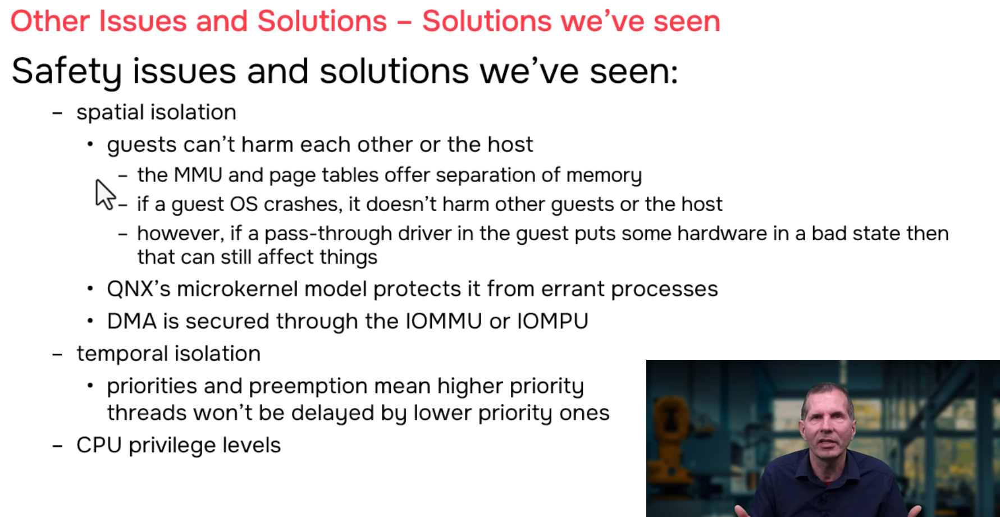

# QNX Hypervisor — Safety Issues and Solutions (Recap)

## Overview

This section recaps the key safety issues and solutions covered throughout the QNX Hypervisor course. It consolidates the concepts of spatial isolation, temporal isolation, process protection, DMA security, and CPU privilege levels into a comprehensive safety framework.

---

## 1. Spatial Isolation (Memory Separation)

### What It Is

> **Spatial isolation** ensures that each guest operates within its own private memory space, preventing one guest from reading or writing another guest's memory or the host's memory.

### How It Works

```
┌─────────────────────────────────────────────────────────────────────┐
│                    SPATIAL ISOLATION                                 │
│                                                                     │
│  ┌─────────────────────────────────────────────────────────────┐    │
│  │  HOST (QNX)                                                   │    │
│  │  ┌─────────────────┐    ┌─────────────────┐    ┌─────────┐ │    │
│  │  │ procnto         │    │ io-sock         │    │ qvm A   │ │    │
│  │  │ (microkernel)   │    │ (network)       │    │ qvm B   │ │    │
│  │  │                 │    │                 │    │ qvm C   │ │    │
│  │  │ Own address     │    │ Own address     │    │ Each in │ │    │
│  │  │ space           │    │ space           │    │ own     │ │    │
│  │  │                 │    │                 │    │ space   │ │    │
│  │  └─────────────────┘    └─────────────────┘    └─────────┘ │    │
│  │                                                               │    │
│  │  MMU enforces: each process can ONLY access its own memory    │    │
│  │                                                               │    │
│  └─────────────────────────────────────────────────────────────┘    │
│                                                                     │
│  Guest A (qvm A):                                                   │
│  ┌─────────────────────────────────────────────────────────────┐    │
│  │  GPA 0x40000000 → HPA 0x10000000 (via MMU Stage 2)          │    │
│  │  Can ONLY access HPA 0x10000000 - 0x13FFFFFF                │    │
│  │  Any other address → TRAP (guest exit)                      │    │
│  └─────────────────────────────────────────────────────────────┘    │
│                                                                     │
│  Guest B (qvm B):                                                   │
│  ┌─────────────────────────────────────────────────────────────┐    │
│  │  GPA 0x40000000 → HPA 0x20000000 (via MMU Stage 2)          │    │
│  │  Can ONLY access HPA 0x20000000 - 0x23FFFFFF                │    │
│  │  Any other address → TRAP (guest exit)                      │    │
│  └─────────────────────────────────────────────────────────────┘    │
│                                                                     │
│  RESULT: Guest A cannot access Guest B memory. Guest B cannot        │
│  access Guest A memory. Neither can access host kernel.             │
│                                                                     │
│  "Guests can't harm each other or the host."                         │
│                                                                     │
└─────────────────────────────────────────────────────────────────────┘
```

### The MMU Page Tables

```
┌─────────────────────────────────────────────────────────────────────┐
│  MMU PAGE TABLES (Three Layers)                                      │
│                                                                     │
│  Stage 1: Guest Virtual → Guest Physical (Guest OS)                   │
│  ─────────────────────────────────────────────────                   │
│  ┌─────────────────┐    ┌─────────────────┐                          │
│  │ Guest Process VA │───►│ Guest Physical   │                        │
│  │ 0x00010000       │    │ 0x40000000       │                        │
│  │ (program addr)   │    │ (guest's "phys") │                        │
│  └─────────────────┘    └─────────────────┘                          │
│                                                                     │
│  Stage 2: Guest Physical → Host Physical (qvm / Hypervisor)            │
│  ─────────────────────────────────────────────────────               │
│  ┌─────────────────┐    ┌─────────────────┐                          │
│  │ Guest Physical   │───►│ Host Physical    │                        │
│  │ 0x40000000       │    │ 0x10000000       │                        │
│  │ (guest's "phys") │    │ (real DRAM)      │                        │
│  └─────────────────┘    └─────────────────┘                          │
│                                                                     │
│  IOMMU: Device GPA → Host Physical (smmuman)                         │
│  ────────────────────────────────────────────                         │
│  ┌─────────────────┐    ┌─────────────────┐                          │
│  │ Device GPA       │───►│ Host Physical    │                        │
│  │ 0x40000000       │    │ 0x10000000       │                        │
│  │ (for DMA)        │    │ (real DRAM)      │                        │
│  └─────────────────┘    └─────────────────┘                          │
│                                                                     │
│  All three layers enforce: "You can only access what you're allowed" │
│                                                                     │
└─────────────────────────────────────────────────────────────────────┘
```

---

## 2. Process Protection (QNX Microkernel Model)

### What It Is

> The QNX microkernel architecture ensures that **processes are isolated from each other**. If one process crashes, it does not affect the kernel or other processes.

### Guest Crash = qvm Process Crash

```
┌─────────────────────────────────────────────────────────────────────┐
│  PROCESS ISOLATION: GUEST CRASH SCENARIO                             │
│                                                                     │
│  Before crash:                                                      │
│  ┌─────────────────┐    ┌─────────────────┐    ┌─────────────────┐   │
│  │ qvm A (Guest A) │    │ qvm B (Guest B) │    │ Host procnto    │   │
│  │ Running normally  │    │ Running normally  │    │ Running normally  │   │
│  │                 │    │                 │    │                 │   │
│  │ vCPU threads    │    │ vCPU threads    │    │ Managing all    │   │
│  │ executing guest │    │ executing guest │    │ processes       │   │
│  │ code            │    │ code            │    │                 │   │
│  └─────────────────┘    └─────────────────┘    └─────────────────┘   │
│                                                                     │
│  Guest A crashes (null pointer, stack overflow, etc.):                │
│  ┌─────────────────┐    ┌─────────────────┐    ┌─────────────────┐   │
│  │ qvm A (Guest A) │    │ qvm B (Guest B) │    │ Host procnto    │   │
│  │ 💥 CRASH! 💥     │    │ Running normally  │    │ Running normally  │   │
│  │                 │    │                 │    │                 │   │
│  │ Segmentation    │    │ vCPU threads    │    │ Detects qvm A   │   │
│  │ fault → qvm     │    │ still running   │    │ death, cleans   │   │
│  │ process dies    │    │ guest code      │    │ up resources    │   │
│  └─────────────────┘    └─────────────────┘    └─────────────────┘   │
│                                                                     │
│  RESULT:                                                            │
│  ✓ Guest A is dead (its qvm process crashed)                         │
│  ✓ Guest B is unaffected (still running)                             │
│  ✓ Host is unaffected (procnto continues)                            │
│  ✓ Other host processes unaffected                                   │
│                                                                     │
│  "If a guest crashes, it's just the qvm process crashing.             │
│   It doesn't harm anything."                                          │
│                                                                     │
│  "The QNX microkernel model protects you from errant processes."       │
│                                                                     │
└─────────────────────────────────────────────────────────────────────┘
```

---

## 3. The DMA Caveat (The "But, But, However")

### The Problem

> **"If you've got a pass-through driver that happened to be doing DMA at the time that your guest crashed, then that DMA memory could still be in a bad state."**

```
┌─────────────────────────────────────────────────────────────────────┐
│  THE DMA CRASH PROBLEM                                               │
│                                                                     │
│  Timeline:                                                          │
│                                                                     │
│  t=0   Guest A driver starts DMA transfer                            │
│  ┌─────────────────┐                                                │
│  │ Guest A Driver  │  "Start DMA from 0x40000000 to device"         │
│  │                 │  DMA engine begins autonomous transfer          │
│  └─────────────────┘                                                │
│                                                                     │
│  t=1   DMA engine running (hardware autonomous)                       │
│  ┌─────────────────┐                                                │
│  │ DMA Engine      │  "Transferring... 50% complete"                 │
│  │ (Hardware)      │  "Reading from 0x40000000, writing to device"  │
│  └─────────────────┘                                                │
│                                                                     │
│  t=2   Guest A CRASHES! (null pointer exception)                      │
│  ┌─────────────────┐                                                │
│  │ Guest A         │  "Segmentation fault! Dying!"                   │
│  │                 │  qvm process receives fatal signal              │
│  └─────────────────┘                                                │
│                                                                     │
│  t=3   qvm process killed by kernel                                  │
│  ┌─────────────────┐                                                │
│  │ qvm A           │  "Process terminated."                          │
│  │                 │  vCPU threads stop. Guest code no longer runs. │
│  │                 │  BUT: DMA engine is still hardware!           │
│  └─────────────────┘                                                │
│                                                                     │
│  t=4   DMA engine continues! (hardware doesn't know guest died)       │
│  ┌─────────────────┐                                                │
│  │ DMA Engine      │  "Still transferring... 80% complete"          │
│  │ (Hardware)      │  "Guest is dead but I don't know that!"         │
│  │                 │  "Continuing to read from 0x40000000..."        │
│  └─────────────────┘                                                │
│                                                                     │
│  t=5   DMA completes (or hangs) with partial/corrupted data         │
│  ┌─────────────────┐                                                │
│  │ Device State    │  "I got incomplete data"                       │
│  │                 │  "DMA registers show incomplete status"          │
│  │                 │  "Hardware in undefined state"                   │
│  └─────────────────┘                                                │
│                                                                     │
│  t=6   System tries to restart Guest A                                │
│  ┌─────────────────┐                                                │
│  │ New qvm A       │  "Starting fresh..."                           │
│  │                 │  "Let me initialize the device..."             │
│  │                 │  "Driver probes device..."                     │
│  └─────────────────┘                                                │
│                                                                     │
│  t=7   Driver confused by hardware state                               │
│  ┌─────────────────┐                                                │
│  │ Guest A Driver  │  "Device not responding correctly!"             │
│  │                 │  "DMA status register: 0xDEADBEEF (weird!)"    │
│  │                 │  "Cannot recover — previous DMA left bad state"│
│  │                 │  "System may hang or crash again"                │
│  └─────────────────┘                                                │
│                                                                     │
│  RESULT: Even though guest was "isolated," hardware state leaked      │
│  from crashed guest to new guest instance.                            │
│                                                                     │
│  "If you restart the guest and it tries to use that DMA,             │
│   it will have a memory that's in a bad state."                      │
│                                                                     │
└─────────────────────────────────────────────────────────────────────┘
```

### Solution 1: Driver Reset on Startup

```c
// ============================================================
// driver_init.c — Reset device on every startup
// ============================================================

int driver_init() {
    // CRITICAL: Always reset hardware, don't assume it's clean!
    
    // Step 1: Stop any ongoing DMA
    write_reg(DMA_CONTROL, DMA_STOP);
    
    // Step 2: Wait for DMA engine to quiesce
    int timeout = 1000;
    while (read_reg(DMA_STATUS) & DMA_ACTIVE) {
        delay_us(10);
        if (--timeout == 0) {
            log_error("DMA failed to stop — forcing reset");
            // Continue to reset anyway
        }
    }
    
    // Step 3: Reset DMA controller (hardware-specific)
    write_reg(DMA_RESET, 1);
    delay_us(100);  // Hardware reset pulse width
    write_reg(DMA_RESET, 0);
    
    // Step 4: Verify clean state
    if (read_reg(DMA_STATUS) != DMA_IDLE) {
        log_error("DMA reset failed — hardware may be damaged");
        return -EIO;
    }
    
    // Step 5: Clear any pending interrupts
    write_reg(DMA_IRQ_CLEAR, 0xFFFFFFFF);
    
    // Step 6: Now safe to configure
    write_reg(DMA_CONFIG, DEFAULT_CONFIG);
    
    log_info("Device reset complete — safe to use");
    return 0;
}
```

> **"Solution: One possible solution, where if you write that driver, if you're the one who writes it, just write it so that whenever you start up that driver, it resets the device. Puts it in a good state before it continues."**

### Solution 2: Full Reboot

```
┌─────────────────────────────────────────────────────────────────────┐
│  SOLUTION 2: FULL REBOOT                                             │
│                                                                     │
│  If driver reset is not possible or insufficient:                   │
│                                                                     │
│  1. Detect qvm crash (via proc events, HAM, etc.)                   │
│  2. Terminate ALL guests                                             │
│  3. Reboot host (QNX reboot)                                          │
│  4. Hardware power-cycled or fully reset                              │
│  5. All devices in known good state                                   │
│  6. Restart all guests fresh                                          │
│                                                                     │
│  "Or the other solution is reboot. That will put the hardware in      │
│   a good state."                                                      │
│                                                                     │
│  This is the GLOBAL DSS (Design Safe State) approach.                 │
│                                                                     │
│  Trade-off: Slower recovery, but guaranteed clean state.              │
│                                                                     │
└─────────────────────────────────────────────────────────────────────┘
```

---

## 4. DMA Security (IOMMU / IOMPU)

### What It Is

> **IOMMU** (Input/Output Memory Management Unit) and **IOMPU** (I/O Memory Protection Unit) secure DMA operations by translating and restricting device memory access.

### Without IOMMU: Dangerous

```
┌─────────────────────────────────────────────────────────────────────┐
│  DMA WITHOUT IOMMU: NO PROTECTION                                    │
│                                                                     │
│  Device can write ANYWHERE in physical memory!                       │
│                                                                     │
│  ┌─────────────────┐                                                │
│  │ Compromised     │  "I'll write to 0x00000000 (host kernel!)"     │
│  │ Device          │  "I'll write to 0x14000000 (Guest B RAM!)"     │
│  │                 │  "I'll write to 0x20000000 (device registers!)"│
│  └─────────────────┘                                                │
│                                                                     │
│  Result: Complete system compromise. Any guest can attack any       │
│  other guest or the host through DMA.                                 │
│                                                                     │
└─────────────────────────────────────────────────────────────────────┘
```

### With IOMMU: Protected

```
┌─────────────────────────────────────────────────────────────────────┐
│  DMA WITH IOMMU: CONTAINED AND PROTECTED                             │
│                                                                     │
│  Device can ONLY write to approved memory regions!                     │
│                                                                     │
│  ┌─────────────────┐     ┌─────────┐     ┌─────────────────┐         │
│  │ Device          │────►│ IOMMU   │────►│ Physical Memory │         │
│  │ "Write to       │     │ Checks: │     │                 │         │
│  │  0x40000000"    │     │ "0x4000 │     │ 0x10000000      │         │
│  │                 │     │  0000?  │     │ (Guest A RAM)   │         │
│  │                 │     │ Yes →   │     │                 │         │
│  │                 │     │ 0x1000  │     │                 │         │
│  │                 │     │ 0000"   │     │                 │         │
│  └─────────────────┘     └─────────┘     └─────────────────┘         │
│                                                                     │
│  ┌─────────────────┐     ┌─────────┐     ┌─────────────────┐         │
│  │ Device          │────►│ IOMMU   │────►│ BLOCKED!        │         │
│  │ "Write to       │     │ Checks: │     │                 │         │
│  │  0x99999999"    │     │ "0x9999 │     │ Not in table!   │         │
│  │                 │     │  9999?  │     │ smmuman notified│         │
│  │                 │     │ No!     │     │                 │         │
│  └─────────────────┘     └─────────┘     └─────────────────┘         │
│                                                                     │
│  "DMA can also be secured through an IOMMU or IOMPU."                │
│                                                                     │
│  IOMMU: Translation + Protection (full featured)                     │
│  IOMPU: Protection only, no translation (budget option)                │
│                                                                     │
└─────────────────────────────────────────────────────────────────────┘
```

---

## 5. Temporal Isolation (Time/Priority Management)

### What It Is

> **Temporal isolation** ensures that critical tasks get sufficient CPU time to meet their deadlines. This is achieved through QNX's priority-driven preemptive scheduling.

### How It Works

```
┌─────────────────────────────────────────────────────────────────────┐
│  TEMPORAL ISOLATION: PRIORITY SCHEDULING                             │
│                                                                     │
│  Physical CPU cores: 4                                               │
│                                                                     │
│  Priority levels (QNX): 0 (lowest) to 255 (highest)                   │
│                                                                     │
│  ┌─────────────────────────────────────────────────────────────┐    │
│  │  PRIORITY 255 (Highest)                                       │    │
│  │  ┌─────────────────┐    ┌─────────────────┐                   │    │
│  │  │ Safety Monitor  │    │ Emergency Stop  │                   │    │
│  │  │ (host)          │    │ Handler (host)  │                   │    │
│  │  │                 │    │                 │                   │    │
│  │  │ Must run FIRST  │    │ Must run FIRST  │                   │    │
│  │  │ if needed       │    │ if needed       │                   │    │
│  │  └─────────────────┘    └─────────────────┘                   │    │
│  │                                                               │    │
│  │  PRIORITY 200                                                   │    │
│  │  ┌─────────────────┐    ┌─────────────────┐                   │    │
│  │  │ vCPU for Guest A │    │ vCPU for Guest B │                   │    │
│  │  │ (safety-critical)│    │ (safety-critical)│                   │    │
│  │  │ sched=200        │    │ sched=200        │                   │    │
│  │  │                 │    │                 │                   │    │
│  │  │ Get CPU time    │    │ Get CPU time    │                   │    │
│  │  │ before lower    │    │ before lower    │                   │    │
│  │  │ priority stuff  │    │ priority stuff  │                   │    │
│  │  └─────────────────┘    └─────────────────┘                   │    │
│  │                                                               │    │
│  │  PRIORITY 100                                                   │    │
│  │  ┌─────────────────┐    ┌─────────────────┐                   │    │
│  │  │ Worker Threads   │    │ Data Logging    │                   │    │
│  │  │ (host)           │    │ (host)          │                   │    │
│  │  │                  │    │                 │                   │    │
│  │  │ Run when higher  │    │ Run when higher │                   │    │
│  │  │ priority idle    │    │ priority idle   │                   │    │
│  │  └─────────────────┘    └─────────────────┘                   │    │
│  │                                                               │    │
│  │  PRIORITY 10 (Lower)                                            │    │
│  │  ┌─────────────────┐    ┌─────────────────┐                   │    │
│  │  │ Background Tasks │    │ Idle Maintenance │                   │    │
│  │  │ (host)            │    │ (host)           │                   │    │
│  │  │                   │    │                  │                   │    │
│  │  │ Lowest priority,  │    │ Only run when    │                   │    │
│  │  │ preempted by all   │    │ nothing else to do│                  │    │
│  │  └─────────────────┘    └─────────────────┘                   │    │
│  │                                                               │    │
│  └─────────────────────────────────────────────────────────────┘    │
│                                                                     │
│  "You can set your priorities such that your guests will get        │
│   sufficient time to run."                                           │
│                                                                     │
│  "Lower priority things won't preempt them."                         │
│                                                                     │
│  "If higher priority things need to run, they'll preempt."           │
│                                                                     │
│  "But they're higher priority, you put them at higher priority       │
│   because you want them to preempt your thread."                     │
│                                                                     │
│  "They're more time-critical or they're more safety-critical."       │
│                                                                     │
└─────────────────────────────────────────────────────────────────────┘
```

### vCPU Priority Configuration

```qvmconf
# ============================================
# Guest with high-priority vCPU threads
# ============================================

system name=safety-guest
ram addr=0x40000000,size=0x4000000

# High priority vCPU threads (safety-critical)
cpu sched=200        # Priority 200 (high)
cpu sched=200        # Priority 200 (high)

# Boot image
load addr=0x40000000,file=/data/guests/safety/guest-boot.img
```

```qvmconf
# ============================================
# Guest with lower-priority vCPU threads
# ============================================

system name=ui-guest
ram addr=0x80000000,size=0x8000000

# Lower priority vCPU threads (non-critical UI)
cpu sched=50         # Priority 50 (lower)
cpu sched=50         # Priority 50 (lower)

# Boot image
load addr=0x80000000,file=/data/guests/ui/guest-boot.img
```

### Priority Scheduling Example

```
┌─────────────────────────────────────────────────────────────────────┐
│  SCHEDULING EXAMPLE: WHO RUNS WHEN?                                  │
│                                                                     │
│  Time    Event                    Running              Ready/Blocked  │
│  ─────────────────────────────────────────────────────────────────   │
│  t=0     Start                    vCPU A (prio 200)    vCPU B (200)   │
│                                                                     │
│  t=1     Safety IRQ fires         Safety Handler (255) vCPU A (200)  │
│          (highest priority!)                                        │
│                                                                     │
│  t=2     Safety Handler done      vCPU A (prio 200)    vCPU B (200)  │
│                                                                     │
│  t=3     Worker thread wakes       vCPU A still runs!   Worker (100)   │
│          (prio 100 — lower than 200)                                │
│                                                                     │
│  t=4     vCPU A does guest exit    vCPU B (prio 200)    vCPU A (200)  │
│          (handling trap)                                            │
│                                                                     │
│  t=5     vCPU B runs, then guest   vCPU A (prio 200)    vCPU B (200)  │
│          exit for B too                                             │
│                                                                     │
│  t=6     Both vCPUs blocked        Worker (prio 100)  Background    │
│          (waiting for I/O)                                            │
│                                                                     │
│  t=7     Worker completes          Background (prio 10) Idle         │
│                                                                     │
│  RESULT: Higher priority always preempts lower priority.             │
│  Safety-critical code gets CPU time first.                          │
│                                                                     │
│  "Arrange your priorities so that your guests can get sufficient    │
│   time to run."                                                      │
│                                                                     │
│  "And remember, it's the vCPU threads' priorities that you're       │
│   arranging here, which can be done in the configuration file        │
│   where you define your CPUs."                                       │
│                                                                     │
└─────────────────────────────────────────────────────────────────────┘
```

---

## 6. CPU Privilege Levels

### What It Is

> The CPU provides **hardware-enforced privilege levels** that prevent guest code from executing privileged instructions or accessing protected resources.

### ARM Exception Levels

```
┌─────────────────────────────────────────────────────────────────────┐
│  ARM PRIVILEGE LEVELS (Exception Levels)                             │
│                                                                     │
│  EL0 (Lowest)  ──► User applications (guest processes)            │
│       ↑                                                             │
│  EL1 ────────────► Guest OS kernel (QNX/Linux kernel)                 │
│       ↑                                                             │
│  EL2 ────────────► Hypervisor (qvm) ← QNX Hypervisor runs here!     │
│       ↑                                                             │
│  EL3 (Highest) ──► Secure Monitor (TrustZone)                       │
│                                                                     │
│  Guest code runs at EL0 or EL1.                                      │
│  Hypervisor runs at EL2 (higher privilege).                          │
│                                                                     │
│  If guest tries to execute EL2/EL3 instruction:                       │
│  → CPU traps to EL2 (guest exit)                                     │
│  → qvm handles it                                                    │
│  → Guest cannot bypass hypervisor!                                   │
│                                                                     │
│  "We also mentioned that we support CPU privileges."                   │
│                                                                     │
│  This prevents guest from:                                           │
│  • Accessing hypervisor memory                                         │
│  • Modifying CPU configuration                                         │
│  • Disabling virtualization                                          │
│  • Directly controlling other guests                                   │
│                                                                     │
└─────────────────────────────────────────────────────────────────────┘
```

### x86 Rings

```
┌─────────────────────────────────────────────────────────────────────┐
│  x86 PRIVILEGE LEVELS (Rings)                                        │
│                                                                     │
│  Ring 3 (Lowest) ──► User applications (guest processes)            │
│       ↑                                                             │
│  Ring 0 ────────────► Guest OS kernel                                 │
│       ↑                                                             │
│  Ring -1 (VMX) ────► Hypervisor (qvm) ← QNX Hypervisor runs here!   │
│                                                                     │
│  Same concept as ARM: higher privilege = more control.               │
│  Guest cannot escape to Ring -1.                                     │
│                                                                     │
└─────────────────────────────────────────────────────────────────────┘
```

---

## 7. Complete Safety Summary

| Safety Issue | Solution | Mechanism |
|-------------|----------|-----------|
| **Guest memory corruption** | Spatial isolation | MMU Stage 1 + Stage 2 page tables |
| **Guest crash affects others** | Process isolation | QNX microkernel (qvm = process) |
| **Guest crash leaves DMA bad state** | Driver reset on init | Code device reset in driver startup |
| **Guest crash, unrecoverable** | Full reboot | Global DSS (Design Safe State) |
| **DMA attacks between guests** | IOMMU / IOMPU | Hardware DMA translation + protection |
| **Guest starves for CPU time** | Temporal isolation | Priority scheduling (vCPU threads) |
| **Guest escapes hypervisor** | CPU privileges | ARM EL2 / x86 VMX root mode |

---

## 8. Key Takeaways

| Concept | Key Point |
|---------|-----------|
| **Spatial isolation** | MMU ensures guests cannot access each other's memory |
| **Process isolation** | Guest crash = qvm process crash, doesn't affect kernel |
| **DMA caveat** | Crashed guest may leave DMA hardware in bad state |
| **Driver reset** | Always reset device on driver initialization |
| **Reboot alternative** | Full reboot guarantees clean hardware state |
| **IOMMU/IOMPU** | Secures DMA by containing device memory access |
| **Temporal isolation** | Priority scheduling ensures guests get CPU time |
| **vCPU priorities** | Configured in `.qvmconf` with `sched=` parameter |
| **CPU privileges** | Hardware-enforced levels prevent guest escape |

---

## 9. Screenshots
Here is the screenshot section to append at the end of your README:

---



--- 
