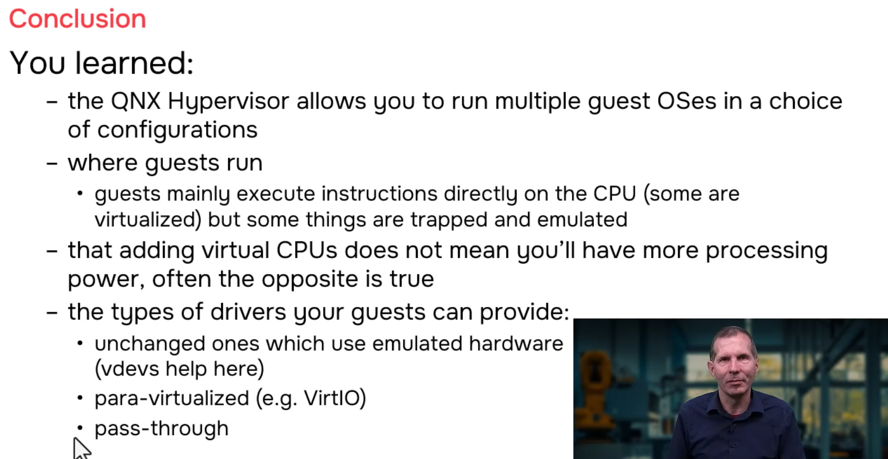
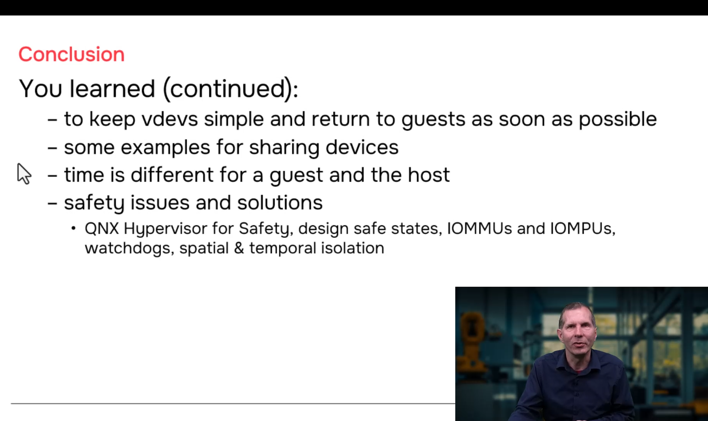

# QNX Hypervisor — Course Conclusion

## Overview

This section concludes the comprehensive QNX Hypervisor course, summarizing the key concepts, architectural principles, and practical lessons learned throughout the modules. It reinforces the fundamental nature of hypervisor virtualization, guest execution models, virtual CPU configuration, device types, and critical design considerations for building robust virtualized systems.

---

## 1. Core Hypervisor Definition

### Hypervisor vs. Emulator

| Aspect | Hypervisor | Emulator |
|--------|-----------|----------|
| **Instruction Execution** | Most instructions run **directly on CPU** (bare metal) | Every instruction is **emulated in software** |
| **Performance** | Fast — near-native speed | Slow — 10x to 1000x slower |
| **Guest Awareness** | Guest generally unaware (except para-virtualized) | Guest knows it's emulated |
| **Hardware Requirement** | Guest architecture must match host CPU | Can run ARM on x86, etc. |
| **Example** | QNX Hypervisor, VMware ESXi, KVM | QEMU (in emulation mode) |

> **"A hypervisor, in contrast to a simulation or an emulation, a hypervisor, most instructions execute directly on the CPU and only some are trapped and emulated. Unlike an emulator — an emulator emulates everything. It's much slower."**

### Virtualization Support

Modern CPUs include **hardware virtualization extensions** that assist the hypervisor:

```
┌─────────────────────────────────────────────────────────────────────┐
│  CPU VIRTUALIZATION SUPPORT                                          │
│                                                                     │
│  Guest executes: read timestamp counter (RDTSC on x86)               │
│                                                                     │
│  WITHOUT virtualization support:                                     │
│  ┌─────────┐    ┌─────────┐    ┌─────────┐    ┌─────────┐         │
│  │ Guest   │───►│ TRAP    │───►│ qvm     │───►│ Add     │         │
│  │         │    │ (exit)  │    │ handles │    │ offset  │         │
│  │         │    │         │    │ it      │    │ Return  │         │
│  └─────────┘    └─────────┘    └─────────┘    └─────────┘         │
│                                                                     │
│  WITH virtualization support:                                          │
│  ┌─────────┐    ┌─────────────────────────────────────────┐       │
│  │ Guest   │───►│ CPU hardware adds offset automatically   │       │
│  │         │    │ No trap! No exit! Minimal overhead!       │       │
│  └─────────┘    └─────────────────────────────────────────┘       │
│                                                                     │
│  "When the instructions are executed directly on the CPU,            │
│   some of them might be virtualized. In other words, a CPU           │
│   might do a little bit of extra work. Nothing that's too             │
│   time consuming."                                                   │
│                                                                     │
│  This is why hypervisors are fast — the CPU helps!                   │
│                                                                     │
└─────────────────────────────────────────────────────────────────────┘
```

---

## 2. Guest Execution Model

### Where Guests Run

> **"Guests mainly execute instructions directly on the CPU, on the bare metal, and only some instructions get trapped and emulated."**

```
┌─────────────────────────────────────────────────────────────────────┐
│  GUEST EXECUTION MODEL                                               │
│                                                                     │
│  ┌─────────────────────────────────────────────────────────────┐    │
│  │  GUEST RUNNING NORMALLY                                      │    │
│  │                                                              │    │
│  │  Guest code:                                                 │    │
│  │  add r0, r1, r2       ← Direct execution on CPU            │    │
│  │  sub r3, r4, r5       ← Direct execution on CPU            │    │
│  │  mul r6, r7, r8       ← Direct execution on CPU            │    │
│  │  ...                                                         │    │
│  │                                                              │    │
│  │  ~99% of instructions execute directly at full speed!        │    │
│  │                                                              │    │
│  └─────────────────────────────────────────────────────────────┘    │
│                              │                                       │
│                              │ Occasionally...                        │
│                              ▼                                       │
│  ┌─────────────────────────────────────────────────────────────┐    │
│  │  GUEST EXIT (TRAP)                                          │    │
│  │                                                              │    │
│  │  Guest code:                                                 │    │
│  │  write_reg 0x100C0000, 1   ← Access to vdev address!       │    │
│  │                                                              │    │
│  │  Virtualization hardware: "This address is watched!"           │    │
│  │  → Guest exit triggered                                       │    │
│  │  → qvm saves state, calls vdev handler                          │    │
│  │  → vdev handles it, returns                                     │    │
│  │  → qvm restores state, guest entrance                          │    │
│  │                                                              │    │
│  │  ~1% of instructions (privileged, vdev access, etc.)           │    │
│  │                                                              │    │
│  └─────────────────────────────────────────────────────────────┘    │
│                                                                     │
│  Result: Near-native performance with safe isolation.                │
│                                                                     │
└─────────────────────────────────────────────────────────────────────┘
```

---

## 3. Virtual CPU (vCPU) Configuration

### vCPUs are Just Threads

> **"These virtual CPUs are just threads and they're going to be doing round robin scheduling with each other."**

```
┌─────────────────────────────────────────────────────────────────────┐
│  vCPU THREADS INSIDE qvm PROCESS                                     │
│                                                                     │
│  Physical CPU cores: 4                                               │
│                                                                     │
│  qvm process for Guest A:                                            │
│  ┌─────────────────────────────────────────────────────────────┐    │
│  │  qvm main thread (resource manager)                           │    │
│  │  vCPU0 thread ────────────────────► runs guest code         │    │
│  │  vCPU1 thread ────────────────────► runs guest code         │    │
│  │  vdev worker threads (virtio-net, etc.)                      │    │
│  └─────────────────────────────────────────────────────────────┘    │
│                                                                     │
│  qvm process for Guest B:                                            │
│  ┌─────────────────────────────────────────────────────────────┐    │
│  │  qvm main thread (resource manager)                           │    │
│  │  vCPU0 thread ────────────────────► runs guest code         │    │
│  │  (single core guest)                                         │    │
│  └─────────────────────────────────────────────────────────────┘    │
│                                                                     │
│  All these threads compete for the 4 physical CPU cores.             │
│                                                                     │
└─────────────────────────────────────────────────────────────────────┘
```

### Critical Rule: Don't Over-Subscribe vCPUs

> **"Don't have more virtual CPUs than you absolutely need, and certainly not more than you have physical CPUs, that would make no sense whatsoever."**

```
┌─────────────────────────────────────────────────────────────────────┐
│  BAD: TOO MANY vCPUs (4 physical, 6 virtual)                        │
│                                                                     │
│  Time →                                                               │
│  ┌─────────────────────────────────────────────────────────────┐    │
│  │ Core 0: vCPU0(A) ► vCPU2(A) ► vCPU0(B) ► vCPU0(A) ► ...     │    │
│  │ Core 1: vCPU1(A) ► vCPU3(A) ► vCPU1(B) ► vCPU1(A) ► ...     │    │
│  │ Core 2: vCPU0(A) ► vCPU2(A) ► vCPU0(B) ► vCPU0(A) ► ...     │    │
│  │ Core 3: vCPU1(A) ► vCPU3(A) ► vCPU1(B) ► vCPU1(A) ► ...     │    │
│  └─────────────────────────────────────────────────────────────┘    │
│                                                                     │
│  Each arrow (►) = guest exit + guest entrance = overhead!            │
│  Constant context switching. Poor performance.                         │
│                                                                     │
│  "Adding more and more and more, it doesn't give you more            │
│   physical CPUs. And in fact, you'll usually end up getting           │
│   worse performance if you have too many."                           │
│                                                                     │
│  "Each time one of them is no longer running and the next one         │
│   is going to be running, there's going to be a guest exit and       │
│   guest entrance. So it slows things down."                            │
│                                                                     │
└─────────────────────────────────────────────────────────────────────┘
```

```
┌─────────────────────────────────────────────────────────────────────┐
│  GOOD: MATCHED vCPUs (4 physical, 4 virtual)                          │
│                                                                     │
│  Time →                                                               │
│  ┌─────────────────────────────────────────────────────────────┐    │
│  │ Core 0: vCPU0(A) ──────────────────────────────────────────  │    │
│  │ Core 1: vCPU1(A) ──────────────────────────────────────────  │    │
│  │ Core 2: vCPU0(B) ──────────────────────────────────────────  │    │
│  │ Core 3: vCPU1(B) ──────────────────────────────────────────  │    │
│  └─────────────────────────────────────────────────────────────┘    │
│                                                                     │
│  Each vCPU runs on dedicated core. Minimal preemption.               │
│  Guest exits only for traps, not for scheduling.                     │
│                                                                     │
│  "You certainly don't want more than you have actual physical CPUs."   │
│                                                                     │
└─────────────────────────────────────────────────────────────────────┘
```

### Configuration Example

```qvmconf
# ============================================
# GOOD: 2 vCPUs on 4-core system
# ============================================
system name=good-guest
cpu cluster=0,cores=2        # 2 vCPUs = 2 physical cores used
                             # Leaves 2 cores for other guests/host

# ============================================
# BAD: 6 vCPUs on 4-core system
# ============================================
system name=bad-guest
cpu                          # vCPU 0
cpu                          # vCPU 1
cpu                          # vCPU 2
cpu                          # vCPU 3
cpu                          # vCPU 4  ← Too many!
cpu                          # vCPU 5  ← Too many!
                             # 6 threads fighting for 4 cores
                             # Constant preemption and guest exits
```

---

## 4. Device Types Summary

### Three Types of Guest Devices

| Type | Guest Driver | Awareness | Performance | Use Case |
|------|-------------|-----------|-------------|----------|
| **Emulated** | Normal I/O (unchanged) | Unaware | Lower (trap overhead) | Legacy compatibility |
| **Para-Virtualized (VirtIO)** | VirtIO API | Aware | Higher (optimized) | High-performance I/O |
| **Pass-Through** | Normal I/O (direct) | Unaware | Native (fastest) | Exclusive hardware |

### Emulated Devices

```
┌─────────────────────────────────────────────────────────────────────┐
│  EMULATED DEVICE (vdev-*.so)                                         │
│                                                                     │
│  Guest driver: normal I/O instructions                                │
│  ┌─────────────────┐                                                │
│  │ Guest Driver    │  write_reg(0x100C0000, 1);  // Normal I/O      │
│  │ (unchanged)     │                                                │
│  └─────────────────┘                                                │
│           │                                                         │
│           ▼                                                         │
│  ┌─────────────────┐     ┌─────────────────┐     ┌─────────────┐ │
│  │ Virtualization  │────►│ qvm loads       │────►│ vdev-*.so   │ │
│  │ Hardware (trap) │     │ vdev-*.so       │     │ (emulation  │ │
│  │                 │     │                 │     │  code)       │ │
│  └─────────────────┘     └─────────────────┘     └─────────────┘ │
│                                                            │        │
│                                                            ▼        │
│                                                     ┌─────────────┐ │
│                                                     │ Real HW or  │ │
│                                                     │ pure sw emu │ │
│                                                     └─────────────┘ │
│                                                                     │
│  "The guest drivers are unchanged. They just do normal I/O           │
│   and their instructions are trapped and emulated."                    │
│                                                                     │
│  "The guests don't know there's anything going on here,              │
│   they're just doing normal I/O, that's trapped and emulated          │
│   by an emulated vdev."                                              │
│                                                                     │
└─────────────────────────────────────────────────────────────────────┘
```

### Para-Virtualized Devices (VirtIO)

```
┌─────────────────────────────────────────────────────────────────────┐
│  PARA-VIRTUALIZED DEVICE (vdev-virtio-*.so)                          │
│                                                                     │
│  Guest driver: VirtIO API (special driver)                            │
│  ┌─────────────────┐                                                │
│  │ Guest Driver    │  virtio_submit_request(vq, buf);  // VirtIO    │
│  │ (VirtIO-aware)  │                                                │
│  └─────────────────┘                                                │
│           │                                                         │
│           ▼                                                         │
│  ┌─────────────────┐     ┌─────────────────┐     ┌─────────────┐ │
│  │ Virtualization  │────►│ qvm loads       │────►│ vdev-virtio-│ │
│  │ Hardware (trap) │     │ vdev-virtio-*.so│     │ *.so         │ │
│  │                 │     │                 │     │ (VirtIO      │ │
│  └─────────────────┘     └─────────────────┘     │  backend)    │ │
│                                                            │        │
│                                                            ▼        │
│                                                     ┌─────────────┐ │
│                                                     │ Host Driver │ │
│                                                     │ (real HW)   │ │
│                                                     └─────────────┘ │
│                                                                     │
│  "Your drivers are not doing normal I/O, they're doing VirtIO.        │
│   So using a different API."                                          │
│                                                                     │
│  "It's a standard one that comes from the Linux world."                │
│                                                                     │
│  "Your guest is going to know that there's a hypervisor because       │
│   well, first of all, you've configured it to use a VirtIO driver.   │
│   That right away tells you that oh, there's a hypervisor under      │
│   the covers somewhere. You wouldn't do that unless there was."      │
│                                                                     │
└─────────────────────────────────────────────────────────────────────┘
```

### Pass-Through Devices

```
┌─────────────────────────────────────────────────────────────────────┐
│  PASS-THROUGH DEVICE (direct hardware access)                        │
│                                                                     │
│  Guest driver: direct memory access                                   │
│  ┌─────────────────┐                                                │
│  │ Guest Driver    │  write_reg(0xFE000000, 1);  // Direct access!  │
│  │ (unchanged)     │                                                │
│  └─────────────────┘                                                │
│           │                                                         │
│           ▼                                                         │
│  ┌─────────────────┐     ┌─────────────────┐                        │
│  │ MMU Stage 2     │────►│ Physical RAM    │                        │
│  │ (qvm set up)    │     │ 0x3F000000      │                        │
│  │                 │     │ (real device)   │                        │
│  └─────────────────┘     └─────────────────┘                        │
│                                                                     │
│  NO qvm involvement during access!                                   │
│  NO trap! NO emulation!                                             │
│  Fastest possible performance.                                       │
│                                                                     │
│  "Pass-through bypasses the hypervisor."                               │
│                                                                     │
│  "When your drivers do the memory I/O, like write to a register      │
│   in device memory, or read video memory or something like that,     │
│   it goes directly to the memory or comes directly from the memory."  │
│                                                                     │
│  "Pass-through bypasses the hypervisor."                               │
│                                                                     │
│  ⚠️ Only one guest should use pass-through device at a time!         │
│                                                                     │
└─────────────────────────────────────────────────────────────────────┘
```

---

## 5. vdev Design Principle: Keep It Simple

> **"If you are going to write your own vdevs, which you can do, you want to keep them simple, because more complex code, and the more complex some code is, the more likely it is to crash."**

```
┌─────────────────────────────────────────────────────────────────────┐
│  vdev COMPLEXITY = CRASH RISK                                        │
│                                                                     │
│  Simple vdev:                                                         │
│  ┌─────────────────┐                                                │
│  │ vdev-simple.so  │  • 500 lines of code                            │
│  │                 │  • Single handler function                        │
│  │                 │  • No threading                                   │
│  │                 │  • Easy to verify, easy to debug                  │
│  │                 │  • Low crash probability                        │
│  └─────────────────┘                                                │
│                                                                     │
│  Complex vdev:                                                        │
│  ┌─────────────────┐                                                │
│  │ vdev-complex.so │  • 5000 lines of code                           │
│  │                 │  • Multiple threads                               │
│  │                 │  • State machines                                 │
│  │                 │  • Complex locking                                │
│  │                 │  • Hard to verify, hard to debug                  │
│  │                 │  • Higher crash probability                     │
│  └─────────────────┘                                                │
│                                                                     │
│  Remember: vdev is a DLL loaded into qvm!                             │
│                                                                     │
│  ┌─────────────────┐                                                │
│  │ qvm process     │  ┌─────────────────┐                            │
│  │                 │  │ vdev-*.so       │  ← Your code runs here     │
│  │                 │  │ (your code)     │                            │
│  │                 │  └─────────────────┘                            │
│  │                 │         │                                      │
│  │                 │         ▼                                      │
│  │                 │  If vdev crashes → qvm crashes → guest dies!  │
│  └─────────────────┘                                                │
│                                                                     │
│  "Remember, vdev is just code that's a DLL that belongs to qvm,       │
│   and if it crashes, it crashes qvm, which crashes your guest."       │
│                                                                     │
│  DESIGN PRINCIPLE: Minimize vdev complexity.                           │
│  • Do heavy lifting in separate host process                          │
│  • Use IPC to communicate with vdev                                   │
│  • Keep vdev as thin translation layer                                │
│                                                                     │
└─────────────────────────────────────────────────────────────────────┘
```

---

## 6. Course Summary: What You Learned

| Topic | Key Learning |
|-------|-----------|
| **Hypervisor definition** | Software running multiple OSes on same SoC |
| **vs. Emulator** | Hypervisor = direct execution; Emulator = slow emulation |
| **Architecture** | One `qvm` process per guest + normal QNX host |
| **Guest execution** | Most instructions on bare metal; some trapped |
| **Virtual CPUs** | Threads in `qvm`; don't exceed physical CPUs |
| **Memory** | Two-stage translation: VA→GPA→HPA |
| **Devices** | Emulated, VirtIO, or Pass-through |
| **Configuration** | `.qvmconf` files describe entire VM |
| **Communication** | Shared memory, networking (peer-to-peer, host bridge) |
| **Shared devices** | Host intermediary or partitioned access |
| **Time** | Virtualized counters, guest-managed time-of-day |
| **Interrupts** | Virtual controllers, guest-side or pass-through |
| **Thin vs. Thick host** | Applications in guest or host |
| **Safety** | DSS, IOMMU, watchdogs, spatial/temporal isolation |
| **vdev design** | Keep simple — crashes kill qvm |

---

## 7. Documentation and Next Steps

| Resource | Location |
|----------|----------|
| **QNX Hypervisor User's Guide** | Installation, configuration, features |
| **Virtual Device Developer's Guide** | Building custom vdevs with examples |
| **Virtual Device Developer's API Reference** | `libhyp.a` API documentation |
| **QNX Hypervisor for Safety** | Safety Manual, Hazard Analysis, Safety Case |
| **BSPs** | Board Support Packages in QNX Software Center |

---

## 8. Final Takeaway

> **The QNX Hypervisor is not a separate, exotic piece of software. It is built on the proven QNX Neutrino RTOS microkernel architecture, extending it with virtualization capabilities. Guests run as normal QNX processes (`qvm`), with near-native performance through direct CPU execution, while maintaining strong isolation through MMU-based memory protection and optional IOMMU-based DMA containment.**

---

## 9. Screenshots
Here is the extra section to append at the end of your README for the 8 course screenshots:

---





---

