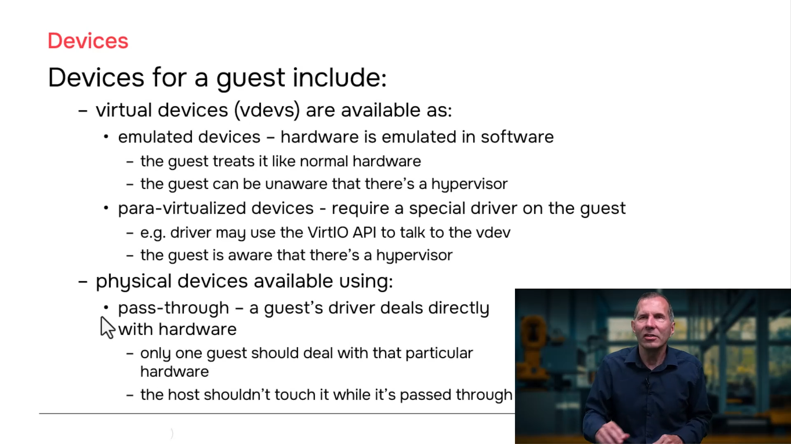
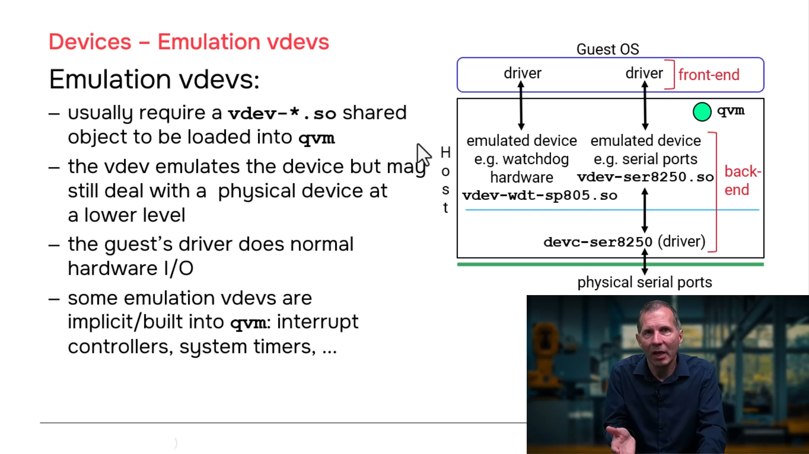
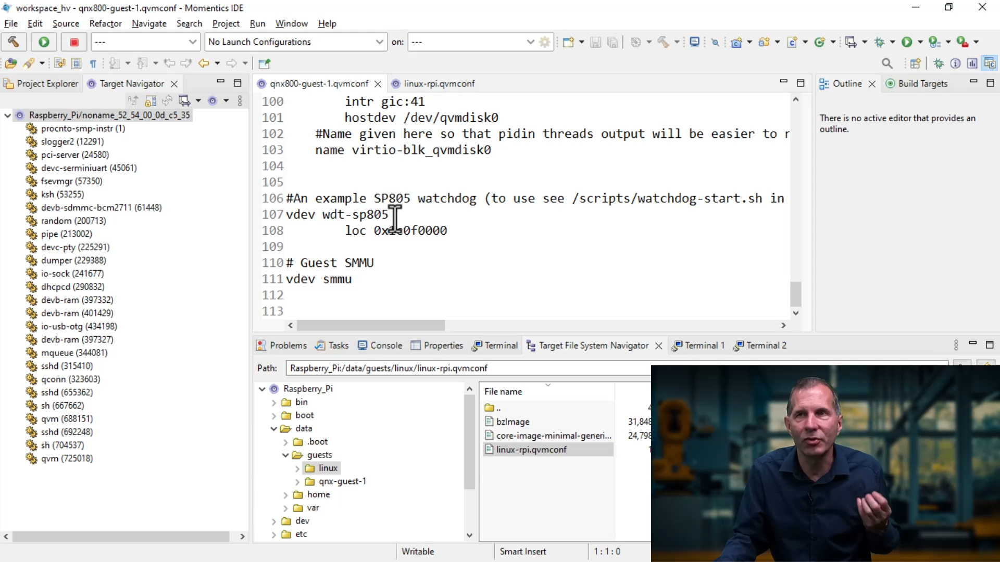
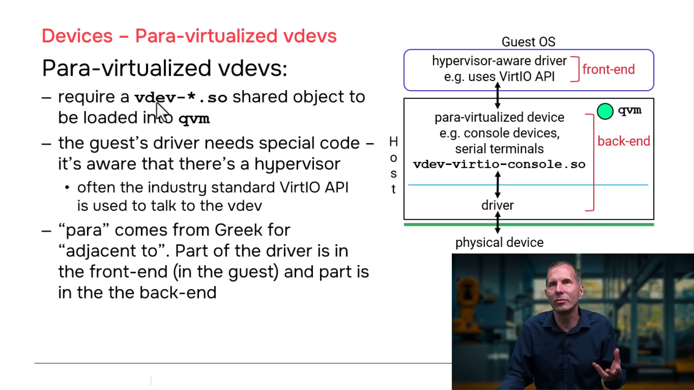
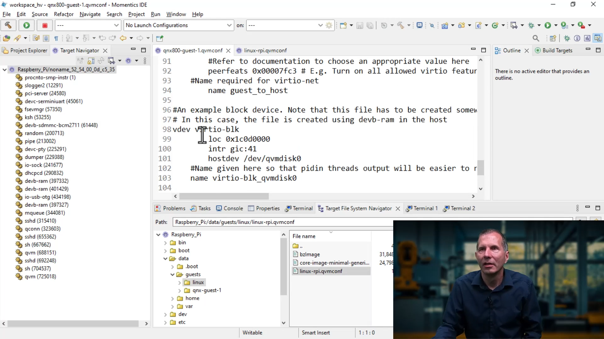
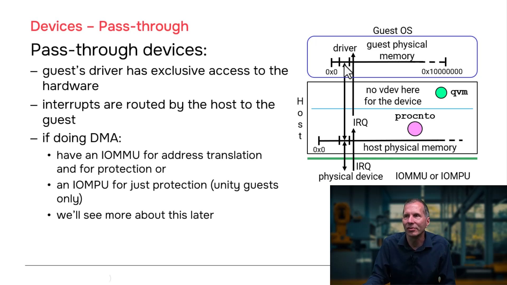
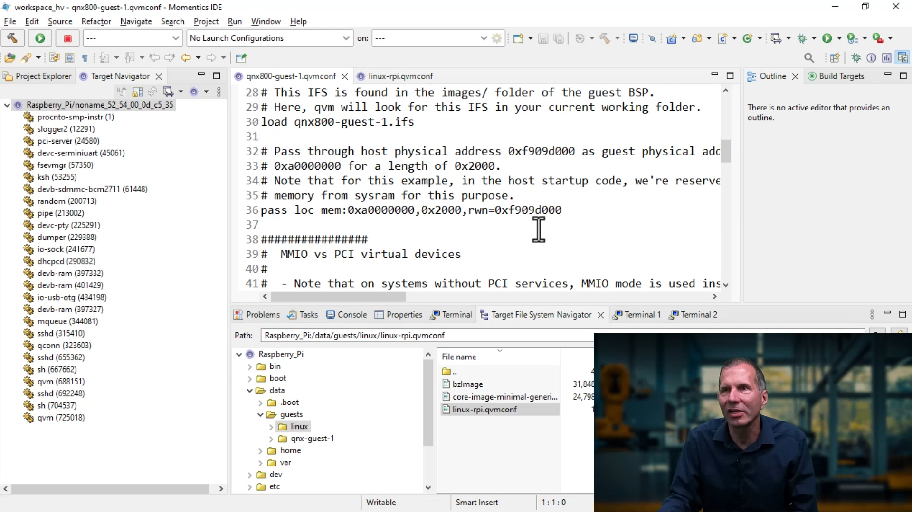

# QNX Hypervisor — Device Configuration

## Overview

This section covers the three types of devices you can configure for your guests: **emulated devices**, **para-virtualized devices**, and **pass-through devices**. Emulated and para-virtualized devices both fall under the category of **virtual devices (vdevs)**. Understanding these device types is essential for building efficient, secure, and performant virtualized systems.

---

## The Three Device Types

| Type | Guest Driver Behavior | Hypervisor Awareness | Performance | Use Case |
|------|----------------------|----------------------|-------------|----------|
| **Emulated** | Normal I/O (port I/O, MMIO, interrupts) | Guest is **unaware** | Lower (trapping overhead) | Legacy hardware compatibility |
| **Para-Virtualized** | VirtIO API | Guest is **aware** | Higher (optimized paths) | High-performance I/O (network, block, console) |
| **Pass-Through** | Direct hardware access | Guest is **unaware** | Native (bare metal) | Exclusive device ownership (GPU, video, custom hardware) |

---

## 1. Emulated Devices (Emulation vdevs)

### Concept
The guest runs a **normal, unmodified driver** that performs standard I/O operations. The hypervisor **traps and emulates** these operations in software.

- Guest driver does **normal I/O** (x86 port I/O, memory-mapped I/O, interrupt handling)
- Guest is **completely unaware** of the hypervisor
- The virtualization hardware monitors the configured address range
- When the guest accesses that address, the CPU traps to the hypervisor (`qvm`)
- `qvm` calls into the vdev shared object to emulate the operation

### How It Works

```
┌─────────────────┐     Normal I/O      ┌─────────────────┐
│  Guest Driver   │ ──────────────────► │  Virtualization │
│  (unmodified)   │  (trapped by CPU)   │  Hardware       │
└─────────────────┘                     └────────┬────────┘
                                                 │
                                                 ▼
                                        ┌─────────────────┐
                                        │  qvm process    │
                                        │  (loads vdev.so) │
                                        └────────┬────────┘
                                                 │
                                                 ▼
                                        ┌─────────────────┐
                                        │  vdev-*.so      │
                                        │  (emulation code) │
                                        └────────┬────────┘
                                                 │
                    ┌────────────────────────────┘
                    │ IPC (optional)
                    ▼
            ┌─────────────────┐
            │  Host Driver      │
            │  (talks to real   │
            │   hardware)       │
            └─────────────────┘
```

### Configuration Example

```qvmconf
# Emulated watchdog timer (ARM SP805)
vdev wdt-sp805
    loc addr=0x100C0000
```

When `qvm` reads this line, it:
1. Constructs the filename: `vdev-wdt-sp805.so`
2. Loads the shared object via `dlopen()`
3. Programs the address `0x100C0000` into the virtualization hardware
4. When the guest driver accesses `0x100C0000`, the trap is handled by the vdev

### Built-In Emulated vdevs

Some emulation vdevs are **statically linked into `qvm`** and do not require a separate `.so` file:

| Device | Type | Notes |
|--------|------|-------|
| Interrupt Controller (GIC) | Built-in | Configurable addresses and interrupt numbers |
| Generic Timer | Built-in | ARM architected timer |
| Some serial ports | Built-in | Platform-specific |

You still configure them in `.qvmconf` to set addresses and parameters, but no external `.so` is needed.

### Terminology: Front-End vs. Back-End

| Term | Meaning |
|------|---------|
| **Front-end** | The driver running inside the guest |
| **Back-end** | Everything else needed to support that driver (vdev code, host driver, hardware) |

In emulated devices, the back-end may consist of one component (pure software emulation) or two components (vdev + host driver talking to real hardware).

---

## 2. Para-Virtualized Devices (VirtIO vdevs)

### Concept
The guest runs a **special VirtIO-aware driver** that communicates with the hypervisor through the **VirtIO API** instead of normal hardware I/O.

- Guest driver is **hypervisor-aware** — it knows it's virtualized
- Uses **VirtIO API** (virtqueues, descriptors, notifications)
- **VirtIO** is a standard created by the Linux community with an active standards committee
- QNX follows the VirtIO standard closely and keeps up with new versions

### Why "Para-Virtualized"?

The term "para" comes from Greek, meaning **"adjacent to"**. The idea is that part of the driver logic runs in the guest and part runs in the host — they work **adjacent to each other**.

### How It Works

```
┌─────────────────┐     VirtIO API      ┌─────────────────┐
│  Guest Driver   │ ──────────────────► │  Virtualization │
│  (VirtIO-aware) │  (trapped by CPU)   │  Hardware       │
└─────────────────┘                     └────────┬────────┘
                                                 │
                                                 ▼
                                        ┌─────────────────┐
                                        │  qvm process    │
                                        │  (loads vdev-   │
                                        │   virtio-*.so)  │
                                        └────────┬────────┘
                                                 │
                                                 ▼
                                        ┌─────────────────┐
                                        │  vdev-virtio-*.so │
                                        │  (VirtIO backend) │
                                        └────────┬────────┘
                                                 │
                    ┌────────────────────────────┘
                    │ IPC
                    ▼
            ┌─────────────────┐
            │  Host Driver      │
            │  (talks to real   │
            │   hardware)       │
            └─────────────────┘
```

### Configuration Example

```qvmconf
# Para-virtualized block device
vdev virtio-blk
    file=/data/guests/linux/rootfs.ext4

# Para-virtualized network device
vdev virtio-net

# Para-virtualized console
vdev virtio-console
```

When `qvm` reads `vdev virtio-blk`, it:
1. Constructs the filename: `vdev-virtio-blk.so`
2. Loads the shared object via `dlopen()`
3. Sets up VirtIO virtqueues for communication
4. Handles guest requests through the VirtIO protocol

### VirtIO Key Concepts

| Concept | Description |
|---------|-------------|
| **Virtqueues** | Ring buffers used for guest-to-host communication |
| **Descriptors** | Data structures describing I/O buffers |
| **Notifications** | Efficient signaling between guest and host (avoids excessive trapping) |
| **Feature bits** | Negotiated capabilities between guest driver and host backend |

### Performance Advantage

VirtIO devices are significantly faster than emulated devices because:
- The guest driver **cooperates** with the hypervisor instead of pretending to be real hardware
- Batch processing via virtqueues reduces trap frequency
- Direct buffer sharing avoids unnecessary data copies

---

## 3. Pass-Through Devices

### Concept
The guest driver **talks directly to the physical hardware**, bypassing the hypervisor entirely. The hypervisor only sets up the memory mapping; after that, all access is direct.

- Guest driver has **exclusive access** to the hardware
- No trapping, no emulation, no VirtIO overhead
- **Native bare-metal performance**
- Achieved by creating an MMU mapping from **Host Physical Address (HPA)** to **Guest Physical Address (GPA)**

### How It Works

```
┌─────────────────┐
│  Guest Driver   │
│  (maps device   │
│   memory into   │
│   its VA space) │
└────────┬────────┘
         │
         ▼
┌─────────────────┐
│  Guest Physical │◄─────────────────────┐
│  Address (GPA)  │                     │
│  e.g., 0xFE000000                    │
└────────┬────────┘                     │
         │                              │
         │ MMU Stage 2                  │
         │ (set up by qvm)              │
         │                              │
         ▼                              │
┌─────────────────┐                     │
│  Host Physical  │                     │
│  Address (HPA)  │◄────────────────────┘
│  e.g., 0x3F000000                    │
└────────┬────────┘
         │
         ▼
┌─────────────────┐
│  Actual Hardware│
│  (Video Memory, │
│   Device Regs)  │
└─────────────────┘
```

### Memory Pass-Through Configuration

```qvmconf
# Map host video memory directly into guest
pass addr=0xFE000000,host=0x3F000000,size=0x100000
```

| Parameter | Meaning |
|-----------|---------|
| `addr` | Where this memory appears in **Guest Physical Address** space |
| `host` | The actual **Host Physical Address** of the device memory |
| `size` | How many bytes to map |

### Important Rules for Pass-Through

1. **Exclusive access** — Only one guest (and not the host) should use the device
2. **No enforcement** — The hypervisor does NOT prevent multiple guests from mapping the same device
3. **Sharing requires an intermediary** — If multiple guests need the same device, use a shared device model (covered in the Shared Devices video)

### Interrupt Pass-Through

You can also configure pass-through for interrupts:

```qvmconf
# Pass-through interrupt configuration
pass interrupt=42
```

> **Note:** Interrupt pass-through is more complex than it appears. The interrupt is **routed through the host** before reaching the guest — it is not a true direct pass-through. See the **Interrupts** video for full details.

### DMA Considerations

If the pass-through device performs **DMA** (Direct Memory Access):

| Scenario | Solution |
|----------|----------|
| Device has an **IOMMU** | The IOMMU translates device addresses for safety and isolation |
| Device has an **IOMPU** | Provides protection without translation |
| No IOMMU/IOMPU | Consider using a **Unity Guest** (GPA == HPA 1:1 mapping) for safety |

> See the **Safety** video for detailed coverage of IOMMUs, IOMPUs, and Unity Guests.

---

## Device Type Comparison Summary

| Aspect | Emulated | Para-Virtualized | Pass-Through |
|--------|----------|------------------|--------------|
| **Guest driver** | Normal, unmodified | VirtIO-aware, special | Normal, unmodified |
| **Guest knows hypervisor?** | No | Yes | No |
| **I/O method** | Normal port/MMIO | VirtIO API | Direct hardware access |
| **Performance** | Lowest (trap overhead) | High (optimized) | Highest (native) |
| **Portability** | Best (any OS) | Good (needs VirtIO driver) | Limited (needs compatible hardware) |
| **Configuration** | `vdev <name>` | `vdev virtio-<name>` | `pass addr=...,host=...` |
| **Shared object** | `vdev-<name>.so` | `vdev-virtio-<name>.so` | None (MMU mapping only) |
| **Use case** | Legacy compatibility | High-performance I/O | Exclusive hardware (GPU, custom) |

---

## Configuration File Examples

### QNX Guest with Mixed Device Types

```qvmconf
system name=qnx-guest
ram addr=0x40000000,size=0x8000000
cpu cluster=0,cores=2

# Boot image
load addr=0x40000000,file=/data/guests/qnx/qnx-boot.img

# Emulated devices
vdev wdt-sp805
    loc addr=0x100C0000
vdev pl011,addr=0x9000000
vdev gicd,addr=0x8000000
vdev generic_timer

# Pass-through: Video memory
pass addr=0xFE000000,host=0x3F000000,size=0x100000

# Para-virtualized (if available)
# vdev virtio-console
```

### Linux Guest with VirtIO Devices

```qvmconf
system name=linux-guest
ram addr=0x80000000,size=0x19000000
cpu cluster=0,cores=2

# Boot images
load addr=0x80000000,file=/data/guests/linux/Image
load addr=0x84000000,file=/data/guests/linux/initrd.img

cmdline "console=ttyAMA0 root=/dev/ram0 rw"

# Emulated serial (for early boot)
vdev pl011,addr=0x9000000

# Para-virtualized devices (high performance)
vdev virtio-net
vdev virtio-blk,file=/data/guests/linux/rootfs.ext4
vdev virtio-console

# Pass-through (if needed)
# pass addr=0xFE000000,host=0x3F000000,size=0x100000
```
---
Here is the screenshot section to append at the end of your README:

---














---

## Key Takeaways

1. **vdev = virtual device** — The umbrella term for both emulated and para-virtualized devices
2. **Emulated devices** — Guest uses normal drivers, hypervisor traps and emulates, lowest performance
3. **Para-virtualized devices** — Guest uses VirtIO drivers, hypervisor-aware, much better performance
4. **Pass-through devices** — Guest accesses hardware directly, native performance, requires exclusive access
5. **VirtIO is a standard** — Created by the Linux community, followed closely by QNX, with active standards development
6. **Shared objects (.so)** — Emulated and para-virtualized vdevs are loaded by `qvm` as DLLs
7. **Built-in vdevs** — Some devices (interrupt controllers, timers) are statically linked into `qvm`
8. **Pass-through interrupts** — Are routed through the host, not truly direct (see Interrupts video)
9. **DMA safety** — Requires IOMMU/IOMPU or Unity Guest configuration (see Safety video)

---
