# QNX Hypervisor — Running Guest Code

## Overview

This section explains the execution model of guest code in the QNX Hypervisor: how guests run directly on the CPU, what triggers guest exits, how virtual CPUs (vCPUs) are implemented as QNX threads, and how to tune CPU scheduling and priorities to ensure guests meet their timing requirements.

---

## 1. Where Do Guests Run?

### Core Principle: Bare Metal Execution

> **Most guest instructions execute directly on the CPU — not emulated.**

- Guest code runs at **near-native speed** on the physical hardware
- Only **privileged operations** trigger intervention by the hypervisor
- Some CPU instructions have **added virtualization support** — minimal overhead, no trap needed

### When the Hypervisor Gets Involved

| Scenario | What Happens |
|----------|-------------|
| **Privileged instruction** (e.g., SMC on ARM) | Trapped — guest lacks privilege level |
| **vdev address access** | Trapped — virtualization hardware watches configured addresses |
| **Invalid memory access** | Trapped — outside guest's physical address space |
| **Hardware interrupt** | Routed through host, requires guest exit |
| **vCPU preemption** | Host thread scheduling stops the guest |

---

## 2. Guest Exits and Guest Entrances

### The Trap Handling Flow

```
┌─────────────────┐
│  Guest Running  │ ◄── Direct execution on CPU (bare metal)
│  (vCPU thread)  │
└────────┬────────┘
         │ Guest does something requiring trap
         ▼
┌─────────────────┐
│  GUEST EXIT     │
│  • Virtualization hardware stops guest
│  • Save guest state (registers, context)
│  • Switch to qvm execution
└────────┬────────┘
         │
         ▼
┌─────────────────┐
│  qvm Handling   │
│  • Call vdev code (emulation or VirtIO)
│  • Or handle directly (SMC, IPI, etc.)
│  • Or route interrupt
└────────┬────────┘
         │
         ▼
┌─────────────────┐
│  GUEST ENTRANCE │
│  • Restore guest state
│  • Jump back to guest code
│  • Guest resumes direct execution
└─────────────────┘
```

### Key Terminology

| Term | Meaning |
|------|---------|
| **Guest Exit** | The entire trap sequence: guest stops → qvm runs → handling → guest resumes |
| **Guest Entrance** | The final step: restoring state and returning to guest execution |
| **Trap** | The low-level hardware event that triggers the exit (rarely used in conversation) |

> **Important:** In practice, people say "guest exit" to mean the **whole sequence** — not just the initial stop. A "guest exit" implies guest entrance happened too.

### Timing

| Operation | Typical Duration |
|-----------|------------------|
| Guest exit + entrance (state save/restore) | **Single-digit microseconds** |
| vdev handling (the actual work) | Variable — depends on device complexity |

---

## 3. Example: Emulated vdev Trap

### Configuration

```qvmconf
# Watchdog timer emulation vdev
vdev wdt-sp805
    loc addr=0x100C0000
```

### Execution Flow

1. **qvm reads config** → programs `0x100C0000` into virtualization hardware
2. **Virtualization hardware watches** for any access to that address
3. **Guest driver does normal I/O** → `load` or `store` to `0x100C0000`
4. **Hardware says "Aha!"** → stops guest, triggers guest exit
5. **qvm saves guest state** → calls into `vdev-wdt-sp805.so`
6. **vdev handler runs** → emulates watchdog timer (e.g., resets keep-alive timer)
7. **vdev returns** → qvm restores guest state, guest entrance
8. **Guest resumes** → continues executing directly on CPU

---

## 4. Causes of Guest Exits

### Guest-Initiated Causes

| Cause | Description |
|-------|-------------|
| **vdev register access** | Guest touches address configured for emulation vdev |
| **Invalid memory access** | Guest physical address not mapped or outside bounds |
| **Inter-Processor Interrupt (IPI)** | Guest kernel initiates IPI between vCPUs |
| **Privileged system register access** | Guest tries to read/write restricted registers |
| **Higher exception level request** | SMC instruction (TrustZone service request) |
| **SMC instruction** | Secure Monitor Call — requires EL3, guest trapped |

### Host-Initiated Causes

| Cause | Description |
|-------|-------------|
| **Hardware interrupt** | Physical IRQ needs routing to guest driver |
| **vCPU preemption** | Higher-priority host thread preempts vCPU thread |

---

## 5. Virtual CPUs (vCPUs)

### vCPUs Are Just QNX Threads

> **A vCPU is a thread inside the `qvm` process.**

```
┌─────────────────────────────────────────────┐
│  Host: Normal QNX                             │
│  ┌─────────────────────────────────────┐    │
│  │ qvm process (Linux guest)           │    │
│  │  • Main thread (resource manager)   │    │
│  │  • vCPU0 thread ────────────────────┼────┼──► Runs guest code
│  │  • vCPU1 thread ────────────────────┼────┼──► Runs guest code
│  │  • vdev threads (virtio-net, etc.)  │    │
│  └─────────────────────────────────────┘    │
│  ┌─────────────────────────────────────┐    │
│  │ qvm process (QNX guest)             │    │
│  │  • Main thread                      │    │
│  │  • vCPU0 thread ────────────────────┼────┼──► Runs guest code
│  │  • vdev threads                     │    │
│  └─────────────────────────────────────┘    │
│  ┌─────────────────────────────────────┐    │
│  │ Other host processes                │    │
│  │  • io-sock, devb-*, etc.            │    │
│  └─────────────────────────────────────┘    │
└─────────────────────────────────────────────┘
```

### What the Guest Sees

| Guest | Configured vCPUs | Physical CPUs on Board |
|-------|-----------------|------------------------|
| Linux guest | 2 vCPUs | 4 physical CPUs |
| QNX guest | 1 vCPU | 4 physical CPUs |

The guest kernel **thinks** these are its physical CPUs. It configures SMP, schedules threads, and sends IPIs based on this view.

### When Does a Guest Run?

> **A guest gets CPU time while its vCPU threads are scheduled.**

The vCPU thread:
- **Sometimes runs guest code** → jumps into the loaded guest image
- **Sometimes runs vdev code** → handles a trap, then returns

```
vCPU Thread Lifecycle:
   RUNNING guest code ──► GUEST EXIT ──► RUNNING vdev code ──► GUEST ENTRANCE ──► RUNNING guest code
        ▲                                                                            │
        └────────────────────────────────────────────────────────────────────────────┘
```

---

## 6. CPU Configuration in `.qvmconf`

### Basic vCPU Configuration

```qvmconf
# Create 2 vCPU threads for this guest
cpu
cpu

# With scheduling priority
cpu sched=21
cpu sched=21
```

| Parameter | Description |
|-----------|-------------|
| `cpu` | Creates one vCPU thread |
| `sched=<priority>` | Sets the QNX priority of that vCPU thread |

### Thread Naming

vCPU threads are named using the guest's `system name`:
```qvmconf
system name=linux-guest
cpu
cpu
```
→ Creates threads: `linux-guest-vCPU0`, `linux-guest-vCPU1`

---

## 7. Tuning: Minimizing Guest Exits

### Why Minimize?

Each guest exit has overhead (single-digit μs for exit/entrance + variable handling time). Frequent exits degrade guest performance.

### Technique: Emulated vs. Para-Virtualized

| Approach | Guest Exits for 4 Bytes | Driver Type |
|----------|------------------------|-------------|
| **Emulated serial** (`vdev-ser8250`) | **4 exits** (1 byte each) | Normal I/O driver |
| **Para-virtualized** (`vdev-virtio-console`) | **1 exit** (batch via virtqueue) | VirtIO driver |

```qvmconf
# Less efficient: emulated serial
vdev ser8250

# More efficient: para-virtualized console
vdev virtio-console
```

> **VirtIO virtqueues** allow batching multiple I/O operations into a single guest exit.

### Analyzing Guest Exits

qvm logs guest exits and entrances to the **QNX kernel event trace**:

1. Capture trace with `tracelogger`
2. Load into **QNX Momentics IDE → System Profiler**
3. Look for patterns: *"Holy cow, look at all these guest exits!"*
4. Reconfigure vdevs, recapture, compare

---

## 8. CPU Privilege Levels

### ARM Exception Levels

| Level | Privilege | What Runs There |
|-------|-----------|---------------|
| **EL0** | Lowest | User applications |
| **EL1** | Higher | Guest OS kernels |
| **EL2** | Higher | Hypervisor (`qvm`) |
| **EL3** | Highest | Secure Monitor (TrustZone) |

### x86 Rings

| Ring | Privilege | What Runs There |
|------|-----------|---------------|
| **Ring 3** | Lowest | User applications |
| **Ring 0** | Higher | Guest OS kernels |
| **Ring -1** (VMX root) | Higher | Hypervisor |

### Privilege Handling

```
Guest runs at EL1 (ARM) / Ring 0 (x86)
         │
         ▼
    Does SMC instruction
         │
         ▼
    Virtualization hardware: "Not allowed!"
         │
         ▼
    GUEST EXIT → qvm runs at EL2
         │
         ▼
    qvm handles SMC (emulates, forwards, or rejects)
         │
         ▼
    GUEST ENTRANCE → Guest resumes at EL1
```

---

## 9. CPU Scheduling and Priorities

### Critical Insight: Guest Priorities ≠ Host Priorities

```
┌─────────────────┐         ┌─────────────────┐
│  QNX Guest      │         │  Linux Guest    │
│  • High-priority│         │  • High-priority │
│    thread (255) │         │    thread (high) │
│  • Low-priority │         │  • Low-priority  │
│    thread (10)  │         │    thread (low)  │
└────────┬────────┘         └────────┬────────┘
         │                           │
         ▼                           ▼
    vCPU thread                  vCPU thread
    priority=10                  priority=21
    (LOW)                        (HIGH)
```

**Scenario:** The Linux guest has a "high-priority" thread, but its vCPU thread is low priority. The QNX guest has a "low-priority" thread, but its vCPU thread is high priority.

**Result:** The QNX guest's low-priority thread gets more CPU time than the Linux guest's high-priority thread — because **vCPU thread priority is what matters**.

> **Think of guest priorities as being compressed into the vCPU thread priority.**

### Priority Configuration

```qvmconf
# Give this guest's vCPU high priority
cpu sched=21

# Give this guest's vCPU lower priority
cpu sched=10
```

### Tuning Steps for Timing Issues

| Step | Action |
|------|--------|
| **1** | Check all code — is anything hogging CPU at high priority unnecessarily? |
| **2** | Arrange priorities — vCPU threads **and** all host threads |
| **3** | Use clusters — pin vCPUs to specific physical CPUs (last resort) |

---

## 10. CPU Clusters

### What is a Cluster?

A **cluster** is a set of physical CPUs configured at host boot time. In QNX 8, you define clusters in startup code instead of pinning individual threads to specific CPUs.

### Default Clusters

| Cluster Name | Contains | Use Case |
|-------------|----------|----------|
| `all-cores` | All physical CPUs | Default for most threads |
| `individual-core-0` | CPU 0 only | Fine-grained pinning |
| `individual-core-1` | CPU 1 only | Fine-grained pinning |
| ... | ... | ... |

### Custom Clusters

```c
// In host startup code
// Create cluster of "big" (high-performance) cores
cluster_create("bigcpus", {0, 1});   // CPUs 0 and 1 are big cores

// Create cluster of "little" (low-power) cores  
cluster_create("littlecpus", {2, 3}); // CPUs 2 and 3 are little cores
```

### Using Clusters in `.qvmconf`

```qvmconf
# Run this vCPU only on big cores
cpu cluster=bigcpus

# Run this vCPU only on little cores
cpu cluster=littlecpus
```

### Cluster Best Practices

| Do | Don't |
|----|-------|
| ✅ Use clusters to isolate guests from CPU-hogging worker threads | ❌ Put multiple vCPUs on the same **individual-core** cluster |
| ✅ Use big-core clusters for performance-critical guests | ❌ Configure 5 vCPUs when you only have 4 physical CPUs |
| ✅ Use little-core clusters for background/non-critical guests | ❌ Forget that vCPUs are just threads — they compete with all other threads |
| ✅ Give the kernel scheduling flexibility (multi-core clusters) | ❌ Ignore priority tuning before resorting to clusters |

### Why Not Over-Subscribe vCPUs?

```qvmconf
# BAD: 5 vCPUs on 4 physical CPUs
cpu
cpu
cpu
cpu
cpu
```

With 5 vCPUs and 4 physical CPUs:
- Only 4 vCPU threads can run simultaneously
- The 5th must **time-slice** — constant preemptions
- Each preemption = guest exit overhead
- **Performance degrades**

> **Rule:** Per guest: `virtual CPUs ≤ physical CPUs`. Across all guests: total vCPUs may exceed physical CPUs (expected in multi-guest systems).

---

## 11. Spinlocks and Interrupts: Where Problems Show

### Spinlock Problem

```c
// Guest kernel spinlock (tight loop, ~10s of μs)
while (lock_is_held()) { /* spin */ }
```

**What goes wrong:**
1. vCPU thread enters spinlock
2. Higher-priority host thread preempts it
3. Guest exit occurs
4. Host thread runs for milliseconds
5. vCPU resumes — spinlock has been "stopped" for ms instead of μs
6. **Timing violated**

### Interrupt Problem

**What goes wrong:**
1. Guest expects high-frequency interrupt (e.g., every 100 μs)
2. vCPU thread not scheduled frequently enough
3. Higher-priority host threads keep running
4. Interrupts pile up or are missed
5. **Real-time deadlines missed**

### Solutions

| Problem | Solution |
|---------|----------|
| Spinlock preemption | Pin vCPU to dedicated core (cluster) so it can't be preempted |
| Interrupt latency | Raise vCPU thread priority above host worker threads |
| General timing issues | First check code, then priorities, then clusters |

---

## 12. Virtualization Hardware Support

### CPU-Assisted Virtualization

Modern CPUs include **hardware virtualization extensions** that reduce guest exits:

| Feature | Platform | What It Does |
|---------|----------|-------------|
| **Extended Page Tables (EPT)** | x86 | Two-stage MMU translation in hardware |
| **Stage 2 Page Tables** | ARM | GPA→HPA translation in hardware |
| **TSC Offsetting** | x86 | `rdtsc` instruction adds offset without trap |
| **Virtual interrupt controllers** | ARM/x86 | Deliver interrupts directly to guest without host involvement |

### Example: TSC Offsetting (x86)

```
Without virtualization support:
  Guest does rdtsc ──► TRAP ──► qvm adds offset ──► GUEST ENTRANCE
  (expensive)

With virtualization support:
  Guest does rdtsc ──► CPU hardware adds offset automatically ──► Done!
  (no trap, minimal overhead)
```

> **Trend:** CPU manufacturers keep adding more virtualization support, reducing the hypervisor's involvement for common operations.

---
## 13. Screenshots

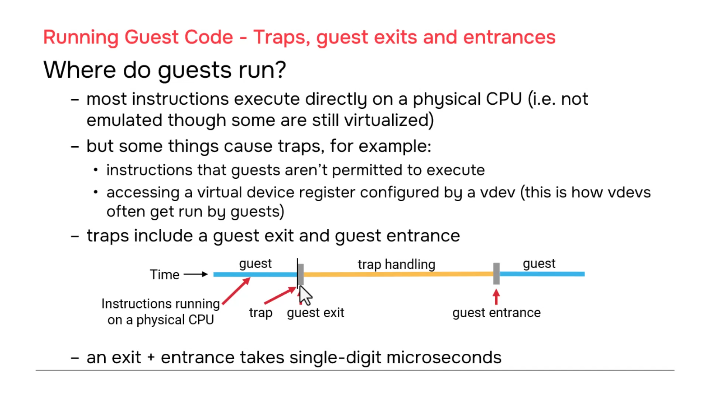

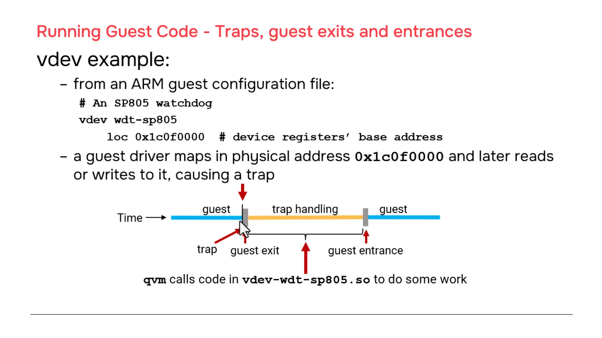

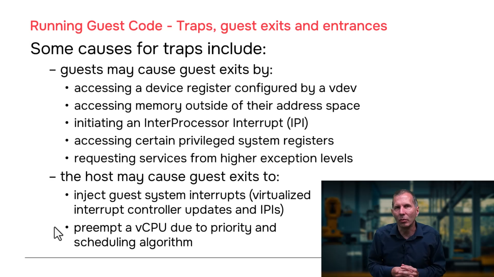

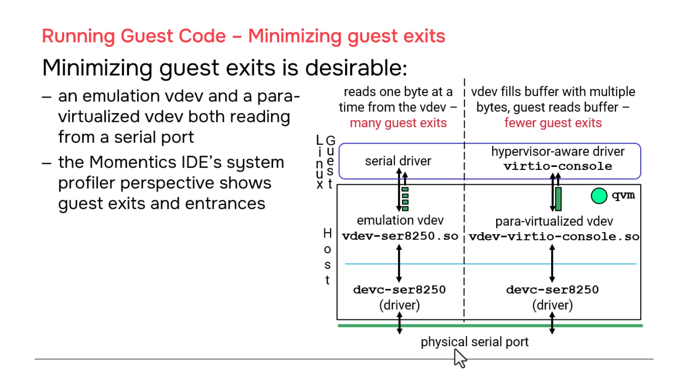

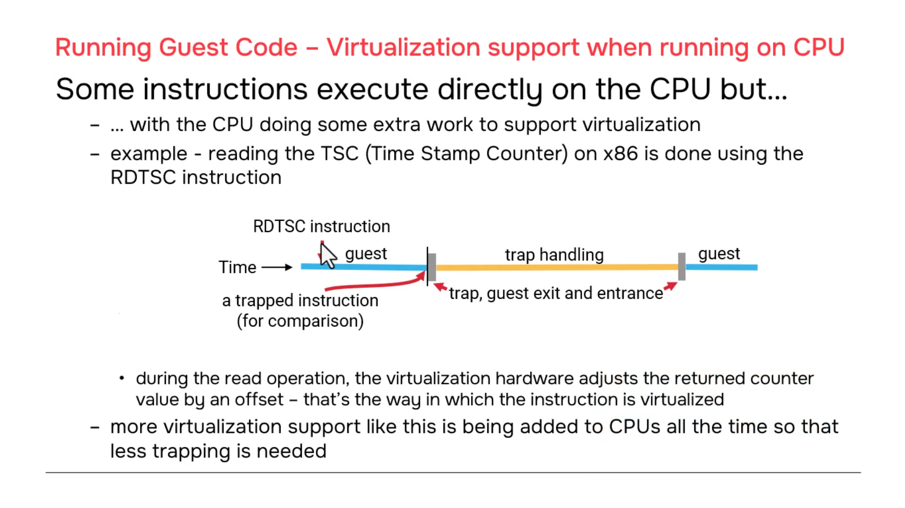

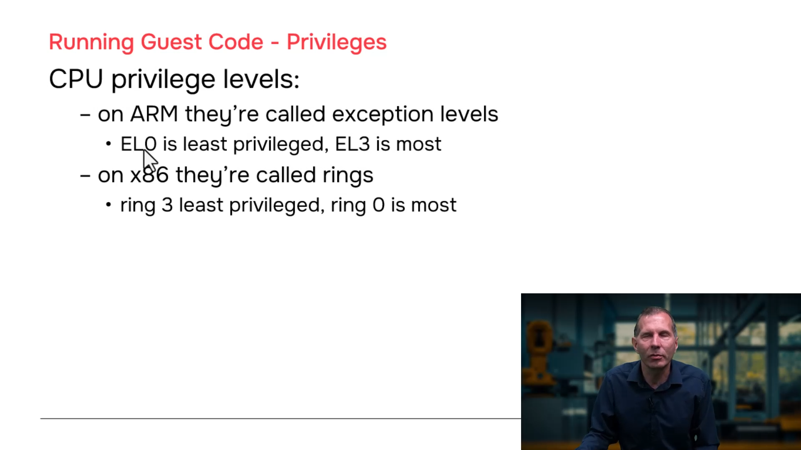

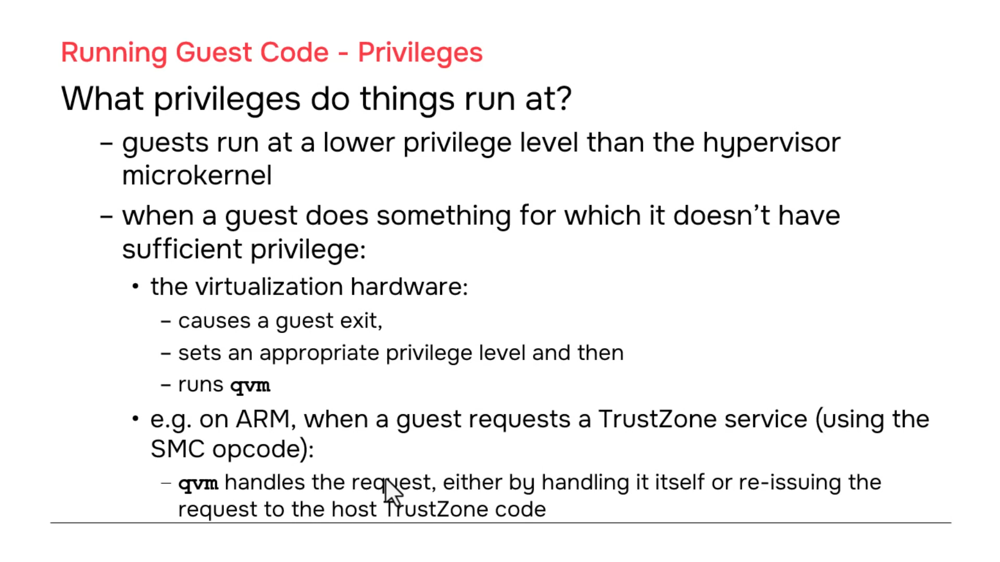

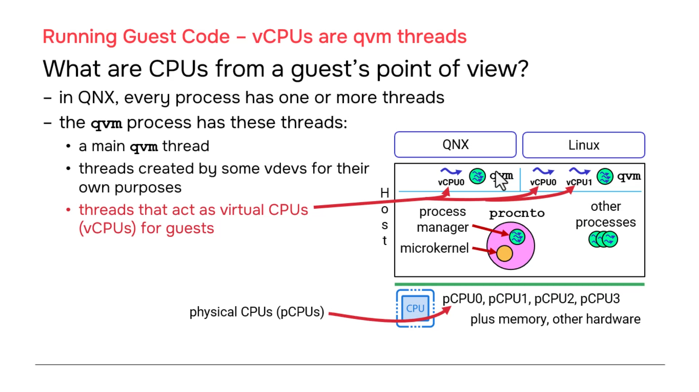

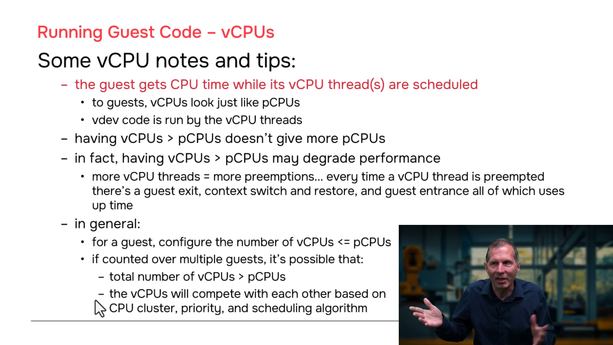

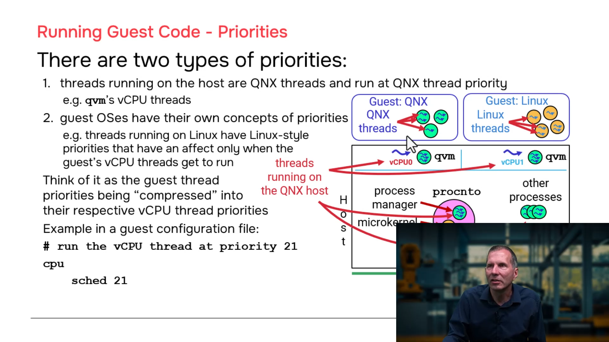

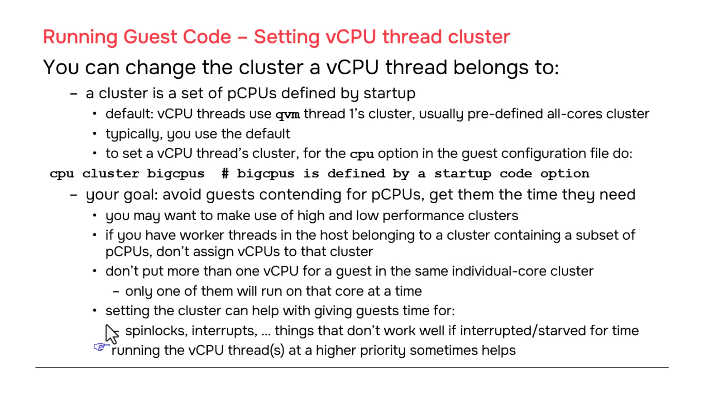

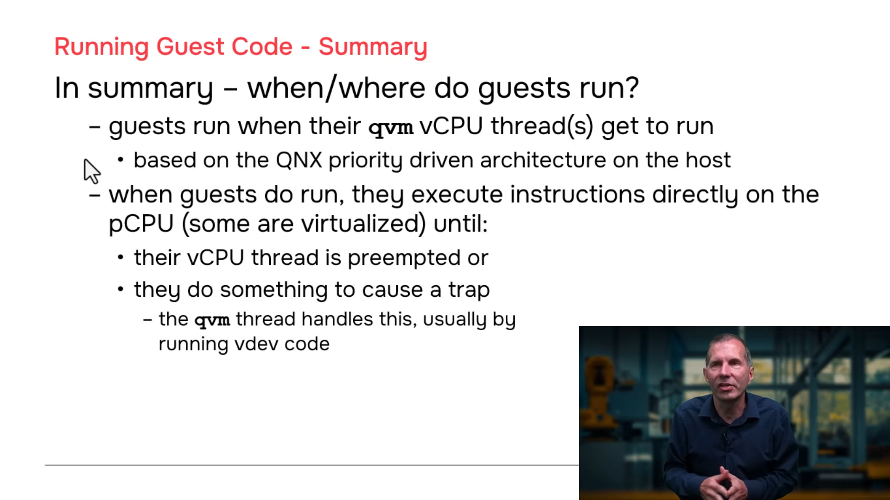

---
## 13. Summary

| Concept | Key Point |
|---------|-----------|
| **Guest execution** | Direct on CPU — bare metal speed |
| **Guest exit** | Trap + save state + handle + restore + resume |
| **vCPU** | Just a QNX thread inside `qvm` |
| **Guest runs when** | Its vCPU threads are scheduled |
| **Priority matters** | vCPU thread priority, not guest-internal priority |
| **Minimize exits** | Use VirtIO instead of emulated vdevs where possible |
| **Don't oversubscribe** | vCPUs per guest ≤ physical CPUs |
| **Clusters** | Last resort after checking code and priorities |
| **Spinlocks/Interrupts** | Where timing problems first become visible |

---
