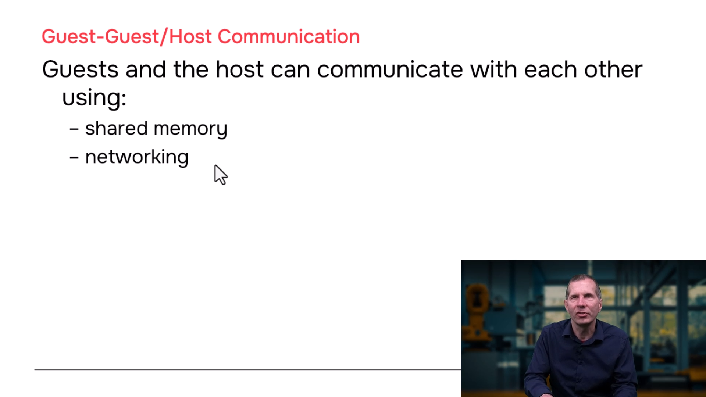
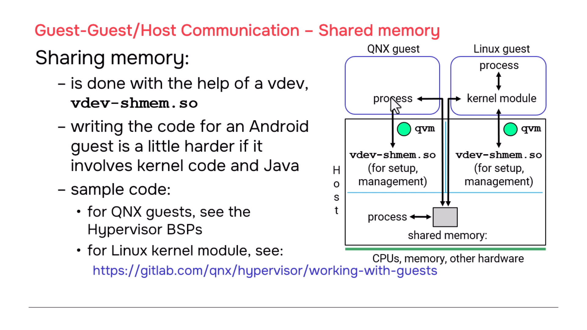
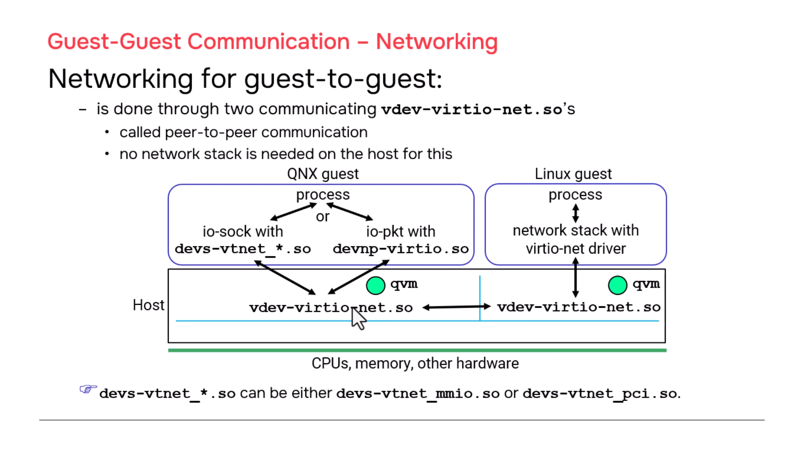
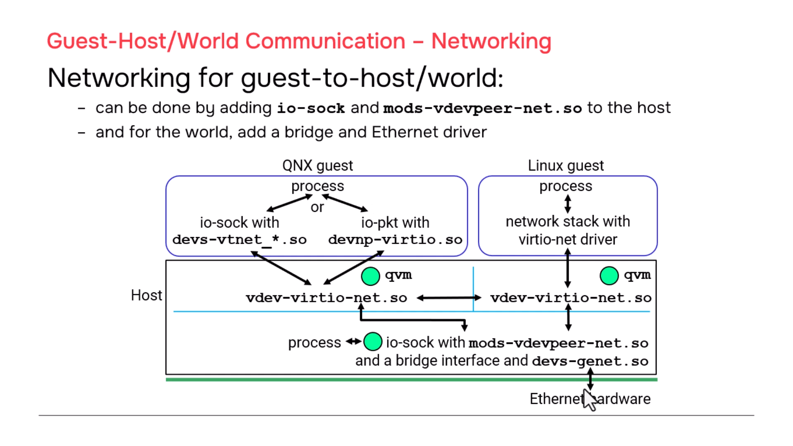

# QNX Hypervisor — Guest Communication

## Overview

This section covers how guests communicate with each other (guest-to-guest), with the host (guest-to-host), and with the external world. Two primary methods are available: **shared memory** and **networking (TCP/IP)**. Both approaches require configuration in the guest `.qvmconf` files and setup in the host.

---

## Communication Methods Overview

| Method | Use Case | Performance | Complexity |
|--------|----------|-------------|------------|
| **Shared Memory** | Large data transfer, low-latency notification | Highest (direct memory access) | Medium (requires vdev-shmem) |
| **Networking (Peer-to-Peer)** | Guest-to-guest socket communication | High (memcpy efficiency) | Low (standard TCP/IP) |
| **Networking (Host Bridge)** | Guest-to-host or guest-to-world | High (memcpy + bridge) | Medium (requires host network stack) |

---

## 1. Shared Memory Communication

### Concept

Shared memory allows processes in different guests (and the host) to access the same physical memory region directly. This is the fastest communication method because it bypasses network stacks and involves no data copying.

### Architecture

```
┌─────────────────┐         ┌─────────────────┐         ┌─────────────────┐
│   QNX Guest     │         │   Linux Guest   │         │   QNX Host      │
│                 │         │                 │         │                 │
│  ┌───────────┐  │         │  ┌───────────┐  │         │  ┌───────────┐  │
│  │ User Proc │◄─┼─────────┼──┤ User Proc │◄─┼─────────┼──┤ User Proc │  │
│  └─────┬─────┘  │         │  └─────┬─────┘  │         │  └─────┬─────┘  │
│        │        │         │        │        │         │        │        │
│  ┌─────┴─────┐  │         │  ┌─────┴─────┐  │         │        │        │
│  │ vdev-shmem│  │◄────────►│  │ vdev-shmem│  │◄──────►│        │        │
│  │  (vdev)   │  │  IRQ     │  │  (vdev)   │  │  IRQ   │        │        │
│  └───────────┘  │         │  └───────────┘  │         │        │        │
└─────────────────┘         └─────────────────┘         └─────────────────┘
         ▲                           ▲                           ▲
         └───────────────────────────┴───────────────────────────────┘
                              Shared Memory Region
                    (configured in each guest's .qvmconf)
```

### Components Required

| Component | Location | Purpose |
|-----------|----------|---------|
| `vdev-shmem` | Each guest `.qvmconf` | Sets up shared memory region and interrupt notification |
| User process | QNX guest / Host | Reads/writes shared memory directly |
| Kernel module | Linux guest | Handles physical memory mapping and interrupts (required because Linux user space cannot map physical memory directly) |

### Configuration

```qvmconf
# In QNX guest configuration
vdev shmem
    # Shared memory region parameters
```

### Linux Guest Complexity

Linux requires a **kernel module** because:
- User space processes cannot directly map physical memory
- Interrupt handling must be done in kernel space
- The kernel module maps the shared memory and notifies user space when data arrives

```c
// Linux kernel module (simplified concept)
// 1. Map shared memory physical address into kernel space
// 2. Register interrupt handler for vdev-shmem notification
// 3. Provide /dev interface for user space to read/write
// 4. Signal user process when interrupt fires (new data available)
```

### QNX Guest Simplicity

QNX user space processes can directly work with shared memory using standard POSIX APIs, making the implementation simpler than Linux.

### Notification via Interrupts

`vdev-shmem` provides an **interrupt-based notification** mechanism:
1. Process A writes to shared memory
2. Process A triggers notification via `vdev-shmem`
3. `vdev-shmem` sends interrupt to other guests
4. Other guests' kernel/modules receive interrupt
5. User processes are notified that new data is available

### Sample Code Resources

| Platform | Where to Find |
|----------|---------------|
| **QNX guest** | Hypervisor BSPs in QNX Software Center |
| **Linux kernel module** | [QNX Hypervisor documentation](https://www.qnx.com/developers/docs/) → *Using Virtual Devices* → *Networking, and Shared Memory* → *Shared Memory* |

---

## 2. Networking: Guest-to-Guest (Peer-to-Peer)

### Concept

Guests communicate using standard **TCP/IP sockets** over a virtual network. No host networking stack is required for peer-to-peer communication.

### Architecture

```
┌─────────────────┐                              ┌─────────────────┐
│   QNX Guest     │                              │   Linux Guest   │
│                 │                              │                 │
│  ┌───────────┐  │      ┌──────────────┐       │  ┌───────────┐  │
│  │ User Proc │◄─┼──────┤  TCP/IP Socket ├───────┼──┤ User Proc │  │
│  │ (io-sock) │  │      │  Communication │       │  │(Linux net)│  │
│  └─────┬─────┘  │      └──────────────┘       │  └─────┬─────┘  │
│        │        │                              │        │        │
│  ┌─────┴─────┐  │                              │  ┌─────┴─────┐  │
│  │virtio-net │  │◄────────────────────────────►│  │virtio-net │  │
│  │  (vdev)   │  │      Virtual Network Link     │  │  (vdev)   │  │
│  └───────────┘  │      (no host involved)       │  └───────────┘  │
└─────────────────┘                              └─────────────────┘
```

### Configuration

**QNX Guest:**
```qvmconf
# In QNX guest .qvmconf
vdev virtio-net
```

**Linux Guest:**
```qvmconf
# In Linux guest .qvmconf
vdev virtio-net
```

**Guest OS Setup:**

| Guest | Network Stack | Driver |
|-------|-------------|--------|
| QNX 8 | `io-sock` | Built-in |
| QNX 7.1 | `io-pkt` with `devnp-virtio.so` | VirtIO net driver |
| Linux | Standard Linux network stack | `virtio_net` (included in Linux kernel) |

### Usage

Once configured, use standard socket programming:

```c
// Standard TCP/IP socket code works without modification
// Just set appropriate IP addresses for each guest

// Server side
int sock = socket(AF_INET, SOCK_STREAM, 0);
bind(sock, (struct sockaddr*)&addr, sizeof(addr));
listen(sock, 5);
int client = accept(sock, NULL, NULL);

// Client side
int sock = socket(AF_INET, SOCK_STREAM, 0);
connect(sock, (struct sockaddr*)&server_addr, sizeof(server_addr));
```

> **Note:** The presenter confirmed this works with minimal effort — standard TCP/IP code found via Google search required only IP address tweaks to function between guests.

---

## 3. Networking: Guest-to-Host

### Concept

Guests communicate with host processes using the same VirtIO network infrastructure, but the host must run a networking stack with a special `vdevpeer-net` module.

### Architecture

```
┌─────────────────┐         ┌─────────────────────────────┐
│   QNX Guest     │         │        QNX Host             │
│                 │         │                             │
│  ┌───────────┐  │         │  ┌───────────┐  ┌────────┐ │
│  │ User Proc │◄─┼─────────┼──┤  io-sock  │◄─┤ User   │ │
│  │ (socket)  │  │  TCP/IP │  │  +        │  │ Proc   │ │
│  └─────┬─────┘  │         │  │vdevpeer-  │  └────────┘ │
│        │        │         │  │   net     │             │
│  ┌─────┴─────┐  │         │  └─────┬─────┘             │
│  │virtio-net │  │◄────────┼────────┘                   │
│  │  (vdev)   │  │         │                             │
│  └───────────┘  │         │                             │
└─────────────────┘         └─────────────────────────────┘
```

### Host Configuration

```bash
# Start host networking stack with vdevpeer module
io-sock -d vdevpeer-net
```

### Guest Configuration

```qvmconf
# Same as peer-to-peer
vdev virtio-net
```

### Efficiency

Communication between guest and host is **highly efficient** — primarily `memcpy()` operations with minimal overhead.

---

## 4. Networking: Guest-to-World (External Network)

### Concept

Guests access external networks (Ethernet, internet) through the host's physical network interface. Requires bridging the virtual network to the physical network.

### Architecture

```
┌─────────────────┐         ┌─────────────────────────────────────────┐
│   QNX Guest     │         │              QNX Host                    │
│                 │         │                                          │
│  ┌───────────┐  │         │  ┌───────────┐    ┌─────────┐   ┌─────┐ │
│  │ User Proc │◄─┼─────────┼──┤  io-sock  │◄───┤ Bridge  │◄──┤ENET │ │
│  │ (socket)  │  │  TCP/IP │  │  +        │    │ Interface│   │ HW  │ │
│  └─────┬─────┘  │         │  │vdevpeer-  │    └────┬────┘   └─────┘ │
│        │        │         │  │   net     │         │                │
│  ┌─────┴─────┐  │         │  └─────┬─────┘         │                │
│  │virtio-net │  │◄────────┼────────┘               │                │
│  │  (vdev)   │  │         │                          │                │
│  └───────────┘  │         │  ┌─────────────────────┐ │                │
└─────────────────┘         │  │ devs-genet.so       │◄┘                │
                            │  │ (Physical Ethernet  │                   │
                            │  │  driver for RPi)    │                   │
                            │  └─────────────────────┘                   │
                            └─────────────────────────────────────────┘
                                      │
                                      ▼
                              ┌───────────────┐
                              │  External     │
                              │  Network/     │
                              │  Internet     │
                              └───────────────┘
```

### Host Configuration

```bash
# 1. Start networking stack with both vdevpeer and physical driver
io-sock -d vdevpeer-net -d devs-genet.so

# 2. Configure bridge between virtual and physical interfaces
#    (bridge setup commands depend on your network configuration)
```

### Guest Configuration

```qvmconf
# Same virtio-net vdev as other networking modes
vdev virtio-net
```

### Required Components

| Component | Purpose |
|-----------|---------|
| `vdevpeer-net` | Connects guest virtual network to host |
| `devs-genet.so` | Physical Ethernet driver (example: Raspberry Pi Genet chip) |
| Bridge interface | Connects virtual interface to physical interface |

---

## 5. Hybrid Approach: Shared Memory + Networking

For applications requiring both high-bandwidth data transfer and reliable notification:

```
┌─────────────────┐                    ┌─────────────────┐
│   QNX Guest     │                    │   QNX Host      │
│                 │                    │                 │
│  ┌───────────┐  │   Shared Memory    │  ┌───────────┐  │
│  │ User Proc │◄─┼───────────────────►│  │ User Proc │  │
│  │           │  │  (megabytes of data)│  │           │  │
│  └───────────┘  │                    │  └───────────┘  │
│        │        │                    │        │        │
│  ┌─────┴─────┐  │   Socket Notification    ┌─────┴─────┐  │
│  │  TCP/IP   │◄─┼────────────────────────►│  TCP/IP   │  │
│  │  (Socket) │  │  ("Data ready" signal)  │  (Socket) │  │
│  └───────────┘  │                    │  └───────────┘  │
└─────────────────┘                    └─────────────────┘
```

**Workflow:**
1. Guest process writes large data block to shared memory
2. Guest process sends socket message to host: *"Data ready at offset X"*
3. Host process receives notification
4. Host process reads data directly from shared memory

This combines the **speed of shared memory** with the **convenience of socket-based notification**.

---

## 6. Configuration Summary

### Guest-to-Guest (Peer-to-Peer)

```qvmconf
# In EACH guest's .qvmconf
vdev virtio-net
```

**No host configuration required.**

### Guest-to-Host

```qvmconf
# In guest's .qvmconf
vdev virtio-net
```

```bash
# In host
io-sock -d vdevpeer-net
```

### Guest-to-World

```qvmconf
# In guest's .qvmconf
vdev virtio-net
```

```bash
# In host
io-sock -d vdevpeer-net -d devs-genet.so
# Plus bridge configuration between interfaces
```

### Shared Memory

```qvmconf
# In EACH guest's .qvmconf
vdev shmem
```

---

## 7. Documentation Reference

All configuration details are documented in the **QNX Hypervisor User's Guide**:

```
QNX Hypervisor Documentation
└── Using Virtual Devices, Networking, and Shared Memory
    ├── Shared Memory
    │   └── Setup, vdev-shmem configuration, sample code references
    ├── Guest-to-Guest Networking
    │   └── Peer-to-peer virtio-net configuration
    ├── Guest-to-Host Networking
    │   └── vdevpeer-net module configuration
    └── Guest-to-World Networking
        └── Bridge configuration with physical drivers
```

---
## 8. Screenshots









---
## 9. Key Takeaways

| Concept | Key Point |
|---------|-----------|
| **Shared memory** | Fastest method; requires `vdev-shmem`; Linux needs kernel module |
| **Peer-to-peer networking** | Standard TCP/IP between guests; no host stack needed |
| **Guest-to-host networking** | Requires `vdevpeer-net` module in host `io-sock` |
| **Guest-to-world networking** | Requires physical driver + bridge in host |
| **Hybrid approach** | Use shared memory for data + sockets for notification |
| **VirtIO efficiency** | `virtio-net` provides high-performance virtual networking |
| **Linux complexity** | Shared memory requires kernel module due to Linux architecture |
| **QNX simplicity** | User space can directly access shared memory |

---

