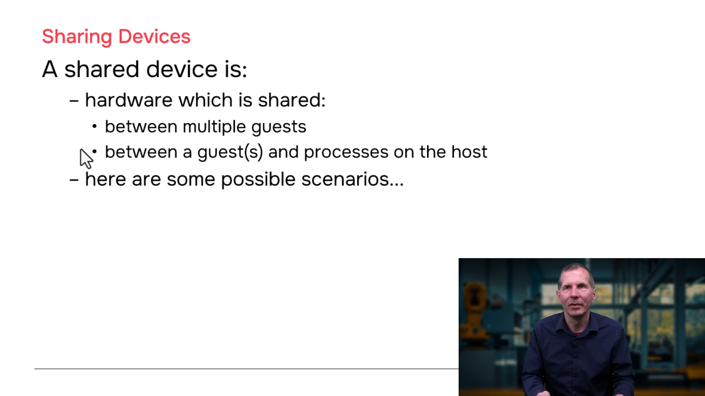
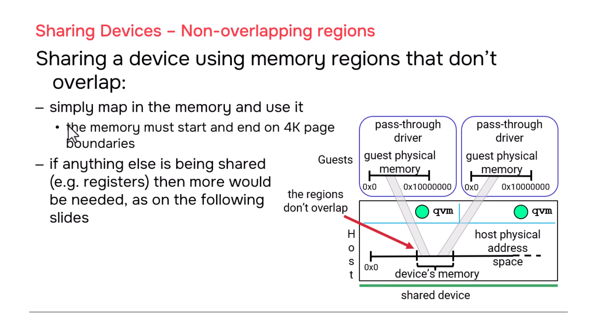
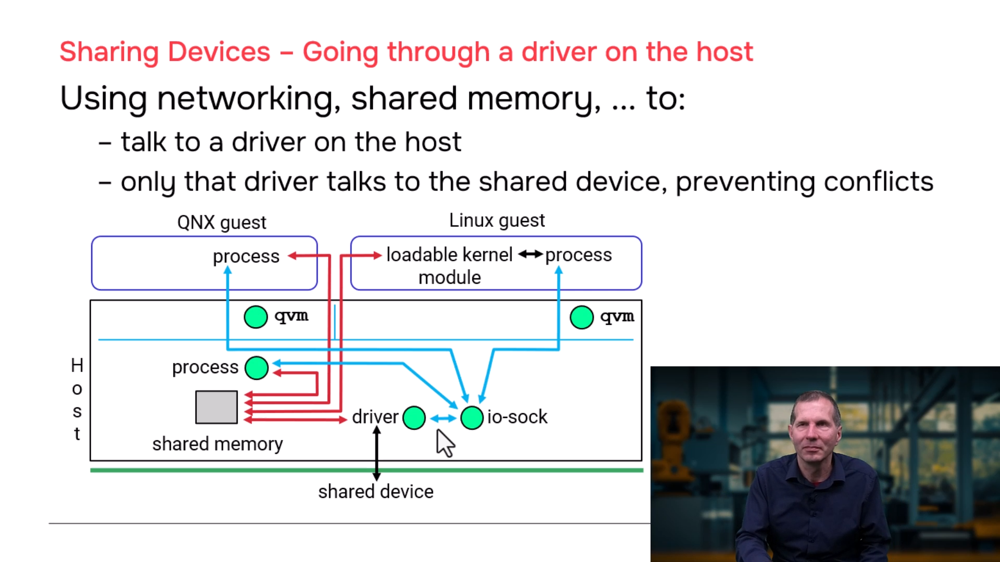
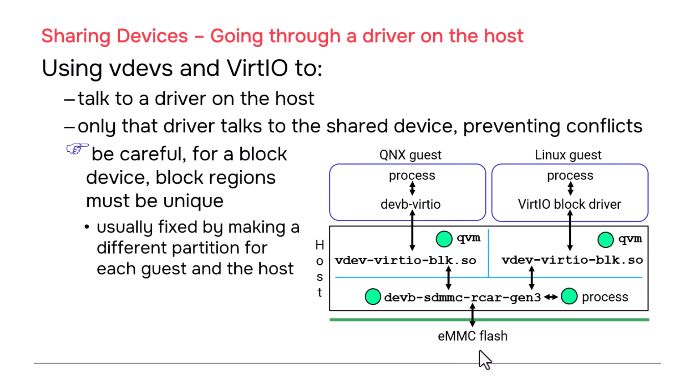
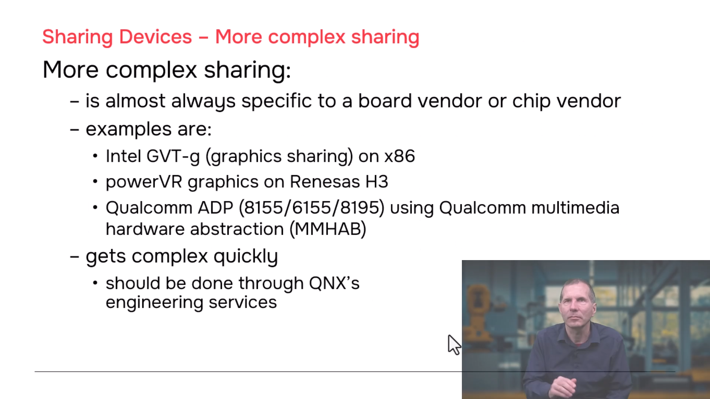

# QNX Hypervisor — Shared Devices

## Overview

This section covers how to safely share hardware devices between multiple guests and/or the host. Sharing is achieved through a combination of pass-through memory mappings, shared memory, networking, and controlling driver processes. The key principle is **avoiding conflicts** when multiple entities access the same hardware.

---

## 1. Simple Sharing: Non-Overlapping Memory Regions

### Concept

When a device's memory is divided into distinct, non-overlapping regions, each guest can be given pass-through access to its own region without interference.

### Architecture

```
┌─────────────────┐         ┌─────────────────┐
│   Guest A       │         │   Guest B       │
│                 │         │                 │
│  ┌───────────┐  │         │  ┌───────────┐  │
│  │ Driver    │  │         │  │ Driver    │  │
│  │ (accesses │  │         │  │ (accesses │  │
│  │  region 1)│  │         │  │  region 2)│  │
│  └─────┬─────┘  │         │  └─────┬─────┘  │
│        │        │         │        │        │
│  ┌─────┴─────┐  │         │  ┌─────┴─────┐  │
│  │ pass addr │  │         │  │ pass addr │  │
│  │ =0x1000   │  │         │  │ =0x2000   │  │
│  └───────────┘  │         │  └───────────┘  │
└─────────────────┘         └─────────────────┘
         │                           │
         └───────────┬───────────────┘
                     ▼
            ┌─────────────────┐
            │  Shared Device  │
            │  ┌─────────────┐│
            │  │ Region 1    ││◄── Guest A
            │  │ (0x1000)    ││
            │  ├─────────────┤│
            │  │ Region 2    ││◄── Guest B
            │  │ (0x2000)    ││
            │  └─────────────┘│
            └─────────────────┘
```

### Configuration

```qvmconf
# Guest A configuration
pass addr=0x1000,host=0xA0001000,size=0x1000   # Region 1

# Guest B configuration  
pass addr=0x2000,host=0xA0002000,size=0x1000   # Region 2
```

> **Key Point:** Each guest sees a different GPA mapping, but both map to non-overlapping regions of the same physical device. No synchronization needed.

---

## 2. Controlled Sharing: Host Driver as Intermediary

### Concept

When multiple guests need access to the **same device memory or control registers**, a single controlling driver in the host manages all access. Guests communicate with this driver via shared memory and/or networking.

### Architecture

```
┌─────────────────┐    ┌─────────────────┐    ┌─────────────────┐
│   Guest A       │    │   Guest B       │    │   QNX Host      │
│                 │    │                 │    │                 │
│  ┌───────────┐  │    │  ┌───────────┐  │    │  ┌───────────┐  │
│  │ User Proc │  │    │  │ User Proc │  │    │  │ Controlling│  │
│  │           │  │    │  │           │  │    │  │ Driver     │  │
│  └─────┬─────┘  │    │  └─────┬─────┘  │    │  │ (exclusive │
│        │        │    │        │        │    │  │  HW access)│  │
│  ┌─────┴─────┐  │    │  ┌─────┴─────┐  │    │  └─────┬─────┘  │
│  │ Shared    │◄─┼────┼──┤ Shared    │◄─┼────┼──┤      │        │
│  │ Memory    │  │    │  │ Memory    │  │    │  │      │        │
│  │ (data)    │  │    │  │ (data)    │  │    │  │      │        │
│  └───────────┘  │    │  └───────────┘  │    │  │      │        │
│  ┌───────────┐  │    │  ┌───────────┐  │    │  │      │        │
│  │ Socket    │◄─┼────┼──┤ Socket    │◄─┼────┼──┤      │        │
│  │ (notify)  │  │    │  │ (notify)  │  │    │  │      │        │
│  └───────────┘  │    │  └───────────┘  │    │  └──────┴────────┘  │
└─────────────────┘    └─────────────────┘    └─────────────────┘
                                                     │
                                                     ▼
                                            ┌─────────────────┐
                                            │  Physical Device │
                                            │  (exclusive)     │
                                            └─────────────────┘
```

### Why a Host Driver?

| Advantage | Explanation |
|-----------|-------------|
| **Isolation** | If the driver crashes, only the process dies — not the host |
| **Control** | Single point of arbitration for all device access |
| **Monitorable** | Another host process can watch for driver death and restart it |
| **Safe** | Prevents guests from conflicting directly on hardware |

### Communication Methods

| Method | Use Case | Setup |
|--------|----------|-------|
| **Shared Memory** | Large data transfers (MB) | `vdev-shmem` in each guest |
| **Sockets (TCP/IP)** | Notifications, commands | `virtio-net` + `vdevpeer-net` |
| **Both** | Data via SHM + notification via socket | Hybrid approach |

### Workflow Example

1. **Guest A writes data** → writes to shared memory region
2. **Guest A sends socket message** → `"New data ready, offset X, length Y"`
3. **Host driver receives notification** → reads data from shared memory
4. **Host driver accesses hardware** → writes data to physical device
5. **Host driver sends acknowledgment** → socket reply to Guest A

---

## 3. Shared Block Storage: Flash/eMMC/SD Card

### Concept

Multiple guests share a block device (flash, eMMC, SD card). Each guest gets its own partition to prevent conflicts.

### Architecture

```
┌─────────────────┐         ┌─────────────────┐
│   QNX Guest     │         │   Linux Guest   │
│                 │         │                 │
│  ┌───────────┐  │         │  ┌───────────┐  │
│  │ User Proc │  │         │  │ User Proc │  │
│  │ open()    │  │         │  │ open()    │  │
│  │ read()    │  │         │  │ read()    │  │
│  │ write()   │  │         │  │ write()   │  │
│  └─────┬─────┘  │         │  └─────┬─────┘  │
│        │        │         │        │        │
│  ┌─────┴─────┐  │         │  ┌─────┴─────┐  │
│  │ devb-     │  │         │  │ virtio_blk│  │
│  │ virtio    │  │         │  │ (Linux)   │  │
│  │ (driver)  │  │         │  │ (driver)  │  │
│  └─────┬─────┘  │         │  └─────┬─────┘  │
│        │        │         │        │        │
│  ┌─────┴─────┐  │         │  ┌─────┴─────┐  │
│  │ virtio-blk│  │◄───────►│  │ virtio-blk│  │
│  │ (vdev)    │  │         │  │ (vdev)    │  │
│  └───────────┘  │         │  └───────────┘  │
└─────────────────┘         └─────────────────┘
         │                           │
         └───────────┬───────────────┘
                     ▼
            ┌─────────────────┐
            │  QNX Host       │
            │                 │
            │  devb-sdmmc     │
            │  (block driver) │
            │  ↓              │
            │  Physical Flash │
            │  ┌─────────────┐│
            │  │ Partition 1 ││◄── QNX Guest
            │  │ (exclusive) ││
            │  ├─────────────┤│
            │  │ Partition 2 ││◄── Linux Guest
            │  │ (exclusive) ││
            │  └─────────────┘│
            └─────────────────┘
```

### Configuration

**Host:**
```bash
# Run block driver for the physical device
devb-sdmmc
```

**QNX Guest `.qvmconf`:**
```qvmconf
vdev virtio-blk
    file=/dev/hd0t1    # Partition 1
```

**Linux Guest `.qvmconf`:**
```qvmconf
vdev virtio-blk
    file=/dev/hd0t2    # Partition 2
```

**Guest OS Setup:**

| Guest | Driver | Source |
|-------|--------|--------|
| QNX | `devb-virtio` | QNX provides |
| Linux | `virtio_blk` | Linux kernel (community) |

### Critical Rule

> **Block regions must be unique.** Each guest must use a **different partition**. Never allow two guests to write to the same partition simultaneously — corruption will occur.

---

## 4. Complex Sharing: Vendor-Specific Hardware

### Examples

| Platform | Technology | Use Case |
|----------|-----------|----------|
| **x86** | Intel GVT-g | Graphics virtualization / sharing |
| **Renesas H3** | PowerVR | GPU sharing between guests |
| **Qualcomm** | Hardware Abstraction Layer | Chipset-specific resource sharing |

### Approach

Complex sharing is **almost always vendor-specific** and requires:
- Deep knowledge of the hardware architecture
- Custom vdev development
- Coordination with QNX engineering

> **Recommendation:** For complex sharing (especially graphics), work directly with **QNX engineering** rather than attempting custom implementation.

---

## 5. Sharing Patterns Summary

| Pattern | Conflict Risk | Method | When to Use |
|---------|--------------|--------|-------------|
| **Non-overlapping regions** | None | `pass` mappings | Device has distinct register/data regions |
| **Host driver intermediary** | Low (controlled) | SHM + sockets | Shared control, need arbitration |
| **Partitioned block device** | Low (if partitioned correctly) | `virtio-blk` + partitions | Shared flash/storage |
| **Vendor-specific** | Varies | Custom solution | GPUs, complex accelerators |

---
## 6. Screenshots













---
## 7. Key Principles

| Principle | Explanation |
|-----------|-------------|
| **Exclusive access is safest** | Pass-through to one guest only, when possible |
| **Use an intermediary for sharing** | Host driver, shared memory, or socket-based control |
| **Partition block devices** | Never let two guests write to the same partition |
| **Monitor controlling processes** | If the host driver dies, have a watcher restart it |
| **Consult QNX engineering for complex cases** | Graphics, DMA-heavy devices, vendor-specific hardware |

---

## 8. Related Documentation

All configuration details build on previous modules:

- **Guest Communication** — Shared memory setup (`vdev-shmem`), networking (`virtio-net`, `vdevpeer-net`)
- **Virtual Devices** — Emulated vs. para-virtualized vdevs
- **Pass-Through** — `pass` option for direct memory mapping

---

