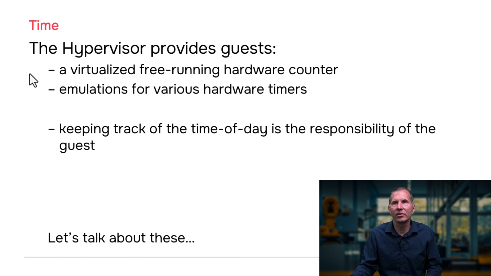
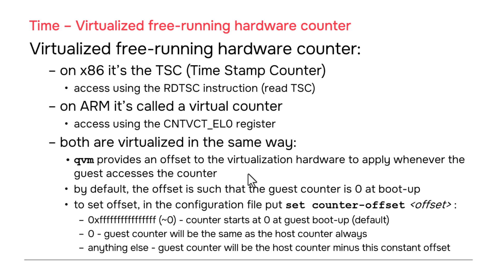
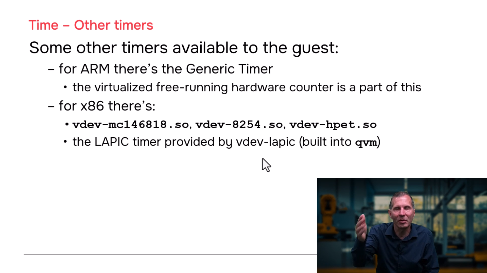
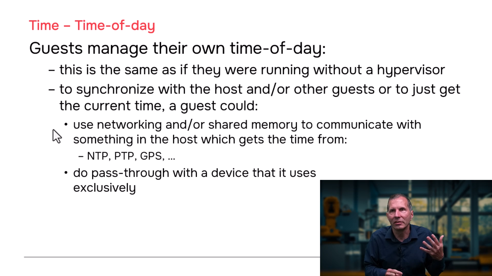
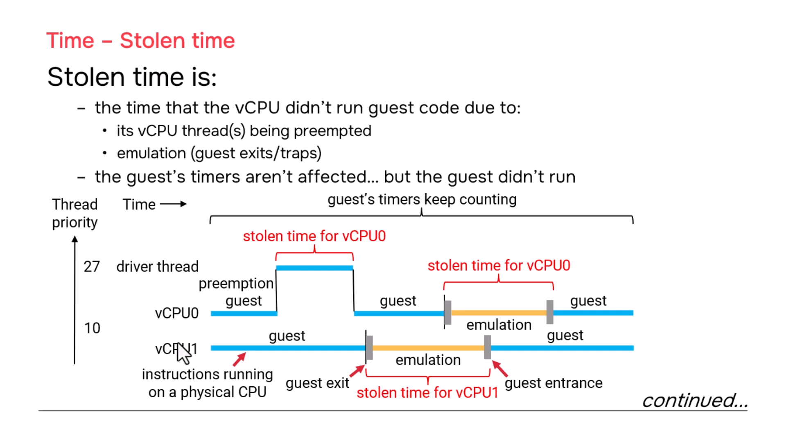
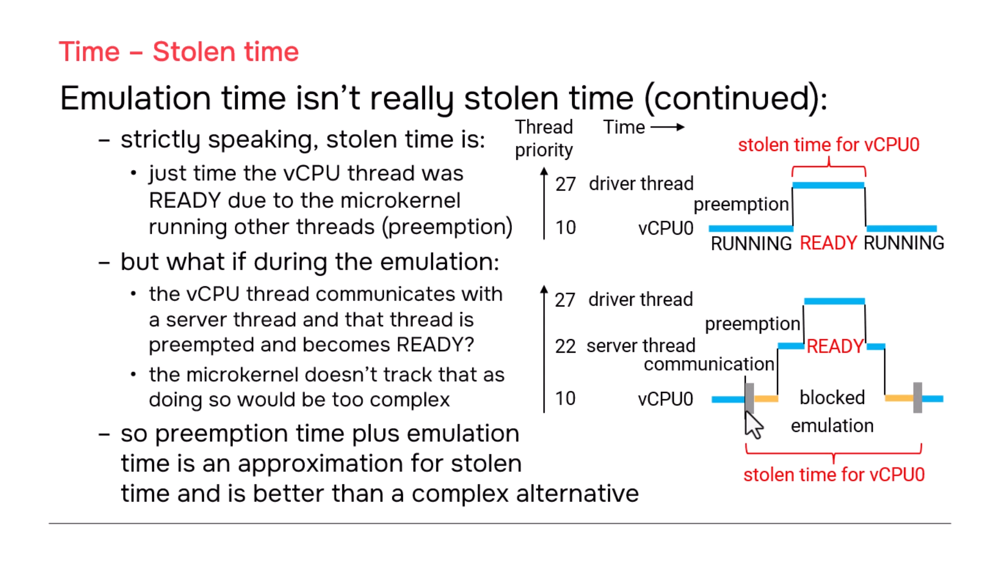

# QNX Hypervisor — Time in Hypervisor Guests

## Overview

This section covers how time is managed in virtualized guests: the virtualized free-running hardware counter, emulated hardware timers, time-of-day synchronization between guests and host, and the concept of stolen time for tracking vCPU scheduling overhead.

---

## 1. Virtualized Free-Running Hardware Counter

### What It Is

Every guest needs a free-running counter that increments continuously for timing, profiling, and scheduling. The QNX Hypervisor provides this through hardware virtualization:

| Platform | Hardware Counter | Access Method |
|----------|-----------------|---------------|
| **x86** | **TSC** (Time Stamp Counter) | `RDTSC` instruction |
| **ARM** | **Virtual Counter** | `CNTVCT_EL0` register read |

### Virtualization: The Offset Mechanism

The physical counter starts at 0 when the **host hardware boots**. But guests boot later — so should their counter start at 0 at guest boot time, or match the host's current counter value?

**QNX Hypervisor solution:** `qvm` programs an **offset** into the virtualization hardware. The guest sees: `(hardware_counter_value - offset)`.

```
Physical Counter (host boots at t=0)
    │
    ▼
0 ───────────────────────────────────────────────► time
    │           │                    │
    │           │ Guest boots here   │
    │           ▼                    │
    │      ┌─────────┐               │
    │      │ qvm     │               │
    │      │ grabs   │               │
    │      │ current │               │
    │      │ counter │               │
    │      │ value   │               │
    │      │ = 1000  │               │
    │      └────┬────┘               │
    │           │                    │
    │           ▼ offset = 1000      │
    │      Guest sees: 1000 - 1000 = 0
    │           │
    │           ▼ Guest runs...
    │      Guest reads counter later:
    │      Physical = 1500, Guest sees: 1500 - 1000 = 500
    │
    ▼
Host reads counter: always sees raw physical value (1500)
```

### Default Behavior

By default, `qvm` automatically sets the offset so that the guest counter reads **0 at guest boot time**:

```qvmconf
# Default — no set option needed
# Guest counter starts at 0 when guest boots
```

### Matching Host Counter

To make the guest counter always match the host counter (no offset):

```qvmconf
# Guest counter matches host counter exactly
set counter-offset=0
```

With `counter-offset=0`:
- Guest reads raw hardware counter value
- Guest counter = Host counter at all times
- Useful when you want time synchronization across all guests and host

### Configuration Options Summary

| Option | Effect | Use Case |
|--------|--------|----------|
| *(default, no option)* | Guest counter starts at 0 at guest boot | Independent guest timing |
| `set counter-offset=0` | Guest counter matches host counter | Synchronized timing across guests |
| `set counter-offset=~0` | Same as default (explicit) | Documentation clarity |

> **Note:** `~0` (all 1s, complement of 0) explicitly sets the default behavior. You would not typically use this, but it is valid.

---

## 2. Emulated Hardware Timers

### ARM Generic Timer

| Feature | Availability |
|---------|-------------|
| **Generic Timer** | Built-in, always available |
| **Virtual Counter** (`CNTVCT_EL0`) | Part of Generic Timer |
| **Timer components** | Various timer registers for scheduling, profiling |

The ARM Generic Timer is fully virtualized and available for guest use without special configuration.

### x86 Emulated Timers

QNX provides emulation vdevs for legacy x86 timer chips:

| Timer Chip | vdev Configuration | Notes |
|-----------|-------------------|-------|
| **MC146818** (RTC/CMOS) | `vdev mc146818` | Real-time clock |
| **8254** (PIT) | `vdev i8254` | Programmable Interval Timer |
| **HPET** | `vdev hpet` | High Precision Event Timer |

```qvmconf
# Example: Load MC146818 RTC vdev
vdev mc146818

# Example: Load 8254 PIT vdev
vdev i8254

# Example: Load HPET vdev
vdev hpet
```

### x86 LAPIC Timer

| Feature | Behavior |
|---------|----------|
| **LAPIC Timer** | Built into `qvm`, no separate vdev |
| **Availability** | Automatic, no configuration needed |

The Local APIC timer is an x86 timer that is **statically linked into qvm** — no `vdev` line required.

---

## 3. Time of Day Management

### Guest Responsibility

> **Keeping track of time-of-day is the guest kernel's responsibility.**

- Linux kernels manage time one way
- QNX kernels manage time another way
- This is true whether running on bare metal or under a hypervisor

### Synchronizing with Host / External Time

If you want the guest's clock synchronized with the host or an external time source:

| Method | Mechanism | Implementation |
|--------|-----------|----------------|
| **Networking** | TCP/IP sockets | Guest process ↔ Host process using NTP/PTP |
| **Shared Memory** | `vdev-shmem` | Host writes timestamp, guest reads it |
| **Pass-through** | `pass` option | Map hardware RTC register directly into guest |

#### Networking Approach

```qvmconf
# In guest configuration
vdev virtio-net
```

```c
// Guest process
// Connect to host time service via TCP/IP socket
// Host process runs NTP client or PTP stack
```

#### Shared Memory Approach

```qvmconf
# In guest and host configurations
vdev shmem
```

```c
// Host process: periodically writes current timestamp to shared memory
// Guest process: reads timestamp from shared memory
```

#### Pass-Through Approach

```qvmconf
# Map hardware RTC register directly
pass addr=0xFE000000,host=0x3F000000,size=0x1000
```

```c
// Guest process maps the physical address
// Reads RTC register directly — no host involvement
```

### External Time Sources

| Source | Protocol | Precision |
|--------|----------|-----------|
| **NTP** (Network Time Protocol) | UDP port 123 | Milliseconds |
| **PTP** (Precision Time Protocol) | IEEE 1588 | Microseconds |
| **GPS** | Serial/NMEA or PPS pulse | Nanoseconds (with PPS) |
| **Atomic Clock** | Custom interface | Highest precision |

> **True story:** The presenter once taught at a facility with an atomic clock in the adjacent building. Any precision time source can be used if the hardware interface is accessible.

---

## 4. Stolen Time

### Definition

**Stolen time** is the time that a vCPU thread was **not executing guest code** because:

1. The vCPU thread was **preempted** by a higher-priority host thread
2. The vCPU thread was handling a **guest exit** (trap/emulation)

### Origin

Stolen time is an **ARM concept** that QNX also makes available on **x86**.

### How It Works

```
Timeline for vCPU0 Thread:

┌─────────────────────────────────────────────────────────────────────────────┐
│  RUNNING guest code    │  PREEMPTED        │  RUNNING guest code         │
│                        │  (stolen time)    │                             │
│  Priority 10           │  Higher priority  │  Priority 10                │
│                        │  thread runs      │                             │
│  ─────────────────────►│  ◄── stolen ───► │◄──────────────────────────── │
│                        │  time counted     │                             │
│                        │                   │                             │
│  Guest exit occurs ───►│  HANDLING trap    │◄── guest entrance            │
│                        │  (stolen time)    │                             │
│                        │  ◄── stolen ───► │                             │
│                        │  time counted     │                             │
└─────────────────────────────────────────────────────────────────────────────┘
```

### Stolen Time Accounting

| Scenario | Counted as Stolen Time? | Notes |
|----------|------------------------|-------|
| vCPU preempted by higher-priority thread | **Yes** | Primary definition |
| Guest exit handling (emulation) | **Yes** | QNX extension for simplicity |
| Guest idle (`HLT` on x86, `WFI` on ARM) | **No** | Exception — idle is not "stolen" |
| vCPU running guest code | **No** | Normal execution |

### The Idle Exception

When a guest kernel goes idle (no work to do), it executes:

| Platform | Idle Instruction | Behavior |
|----------|-----------------|----------|
| **x86** | `HLT` (Halt) | Waits for next interrupt |
| **ARM** | `WFI` (Wait For Interrupt) | Suspends execution until event |

> **Important:** Time spent in `HLT`/`WFI` is **NOT** counted as stolen time. The system is genuinely idle, not deprived of CPU.

### Why Include Emulation Time?

Strictly speaking, ARM's original stolen time definition only included **preemption time**, not emulation time. QNX includes emulation time for practical reasons:

```
Scenario: Guest exit occurs, then vCPU thread gets preempted during handling

┌─────────────────────────────────────────────────────────────┐
│  Guest exit starts                                        │
│  ├── Emulation begins                                    │
│  │   ├── Higher priority thread preempts vCPU ──► PREEMPTION!
│  │   │   │                                               │
│  │   │   └── Preemption time = stolen time ✓            │
│  │   │                                                   │
│  │   └── Emulation time (before preemption)             │
│  │       Should this be stolen? Strictly: NO            │
│  │       QNX counts it: YES (simpler implementation)    │
│  │                                                       │
│  └── Guest entrance (when vCPU resumes)                  │
└─────────────────────────────────────────────────────────────┘
```

**QNX rationale:** Distinguishing "preempted during emulation" vs. "emulation only" adds significant microkernel complexity. Counting all emulation time as stolen is simpler and still useful for performance analysis.

### Accessing Stolen Time

Stolen time is tracked per-vCPU-thread and can be queried through:

- QNX kernel instrumentation
- System Profiler in Momentics IDE
- Custom monitoring tools

---

## 5. Timer Configuration Summary

### Guest `.qvmconf` Examples

```qvmconf
# ============================================
# ARM Guest — Generic Timer (automatic)
# ============================================
system name=arm-guest
ram addr=0x40000000,size=0x8000000
cpu cluster=0,cores=2

# Generic Timer is built-in — no vdev needed
# Counter offset: default (starts at 0 at guest boot)
# Or match host:
# set counter-offset=0

# ============================================
# x86 Guest — Multiple Timer Options
# ============================================
system name=x86-guest
ram addr=0x40000000,size=0x8000000
cpu cluster=0,cores=2

# Emulated legacy timers (optional)
vdev mc146818        # RTC/CMOS
vdev i8254           # PIT
vdev hpet            # High Precision Event Timer

# LAPIC timer is automatic — no vdev needed

# Counter offset: match host time
set counter-offset=0
```

---
## 6. Screenshots













---
## 7. Key Takeaways

| Concept | Key Point |
|---------|-----------|
| **Free-running counter** | Virtualized via offset; TSC on x86, Virtual Counter on ARM |
| **Default offset** | Guest counter starts at 0 at guest boot time |
| **Host-matched offset** | `set counter-offset=0` makes guest counter match host |
| **ARM Generic Timer** | Built-in, no configuration needed |
| **x86 timers** | MC146818, 8254, HPET as vdevs; LAPIC built into qvm |
| **Time of day** | Guest kernel's responsibility; sync via network, SHM, or pass-through |
| **Stolen time** | Time vCPU didn't run guest code (preemption + emulation) |
| **Idle exception** | `HLT`/`WFI` time is NOT stolen — system is genuinely idle |
| **Emulation in stolen time** | QNX includes it for implementation simplicity |

---

## 8. Related Documentation

- **Running Guest Code** — Guest exits, trap handling, vCPU threads
- **Virtual Devices** — Emulated vdevs (`mc146818`, `i8254`, `hpet`)
- **Guest Communication** — Shared memory (`vdev-shmem`), networking (`virtio-net`)
- **QNX Hypervisor User's Guide** — Timer configuration and stolen time APIs

---
