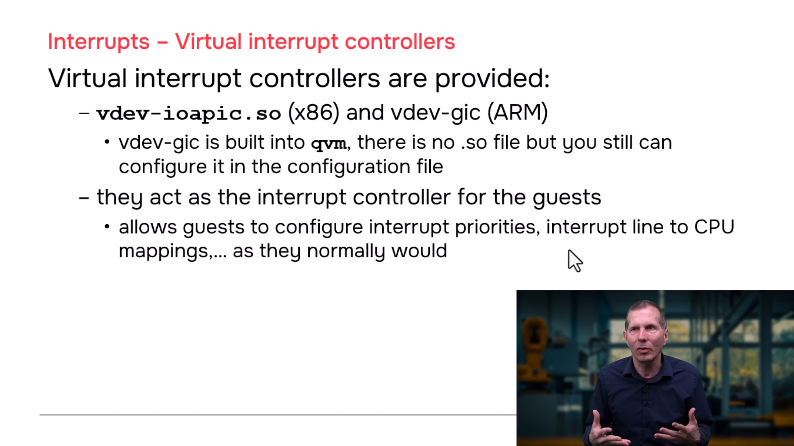
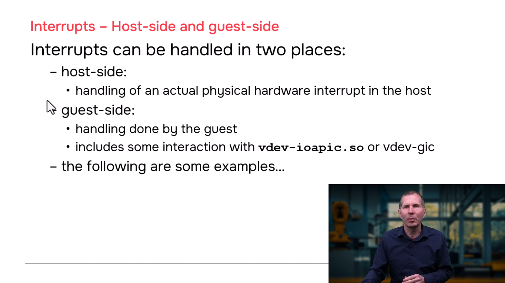
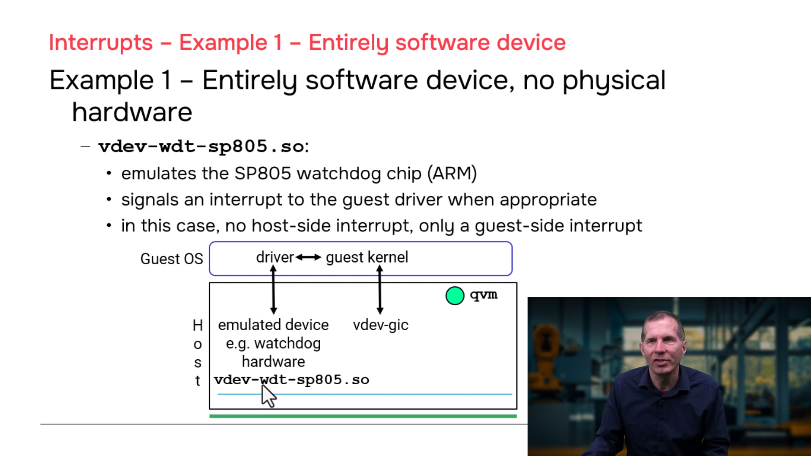
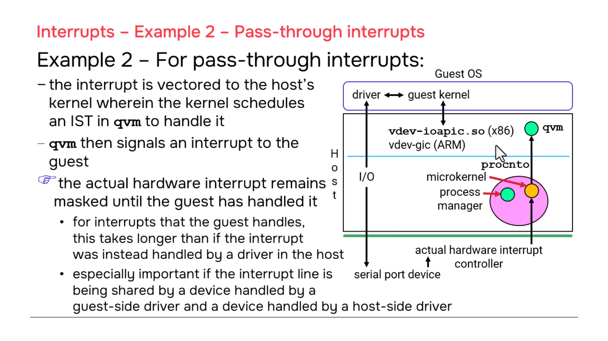

# QNX Hypervisor — Interrupts

## Overview

This section covers how interrupts work in the QNX Hypervisor: virtual interrupt controllers, the difference between guest-side and host-side interrupt handling, pass-through interrupts, and the performance implications of sharing interrupts between guests and host. Understanding interrupt virtualization is critical for building responsive, real-time systems.

---

## 1. Virtual Interrupt Controllers

### What Are They?

Every guest OS kernel (Linux, QNX) needs an interrupt controller to manage hardware interrupts. In a virtualized environment, the guest cannot access the physical interrupt controller directly — instead, it gets a **virtual interrupt controller** that the guest kernel treats as real hardware.

### Platform-Specific Implementation

| Platform | Virtual Controller | Implementation | Configuration |
|----------|-------------------|----------------|---------------|
| **x86** | **IOAPIC** | `vdev-ioapic.so` (shared object) | `vdev ioapic` in `.qvmconf` |
| **ARM** | **Virtual GIC** | Built into `qvm` (no `.so` file) | `vdev gicd` in `.qvmconf` |

### Key Points

- **x86:** You must include `vdev-ioapic.so` on your target filesystem
- **ARM:** No separate file needed — the virtual GIC is statically linked into `qvm`
- **Both:** You still need a `vdev` line in your `.qvmconf` to configure addresses and parameters

### Configuration Examples

```qvmconf
# ============================================
# x86 Guest — IOAPIC
# ============================================
system name=x86-guest
vdev ioapic
    addr=0xFEC00000

# ============================================
# ARM Guest — Virtual GIC
# ============================================
system name=arm-guest
vdev gicd
    addr=0x8000000
vdev gicc
    addr=0x8010000
vdev gicr
    addr=0x80A0000
```

---

## 2. The Guest Kernel Perspective

### Important Realization

> **A guest is not just an application — it contains a full operating system kernel.**

When you think of a guest, you might picture:
- A dashboard application
- A medical device UI
- An infotainment system

But inside that guest is also:
- A **Linux kernel** or **QNX kernel**
- Interrupt handlers
- Thread schedulers
- Memory managers

### What Kernels Do with Interrupt Controllers

| Operation | Description |
|-----------|-------------|
| **Configure priorities** | Set which interrupts are more urgent |
| **Map IRQ to CPU** | Route specific interrupts to specific cores |
| **ID the interrupt** | When IRQ fires, read controller to find which one |
| **Dispatch handler** | Call the appropriate driver IST/handler |
| **Mask/unmask** | Disable/enable specific interrupt lines |

The guest kernel does all of this **through the virtual interrupt controller**, completely unaware that it's virtualized.

---

## 3. Two Types of Interrupt Handling

### Type 1: Guest-Side Interrupts

**Definition:** The interrupt is entirely handled within the guest. No physical hardware is involved — it's triggered by an emulated vdev.

#### Architecture

```
┌─────────────────────────────────────────────────────────────────────┐
│                         GUEST-SIDE INTERRUPT                         │
│                                                                      │
│  ┌─────────────────┐                                                 │
│  │  Emulated vdev  │  (e.g., vdev-sp805.so — watchdog timer)        │
│  │  (no real HW)   │                                                 │
│  │                 │  guest_signal_intr()                            │
│  │  "Timer expired!"├─────────────────────────────────────┐         │
│  └─────────────────┘                                     │         │
│                                                           │         │
│                                                           ▼         │
│  ┌─────────────────┐                                    ┌──────────┐ │
│  │  Guest Kernel   │◄───────────────────────────────────│ Virtual  │ │
│  │                 │  "Oh, an interrupt!"               │ Interrupt│ │
│  │  • ID interrupt │  reads controller                  │ Controller│ │
│  │  • Find handler │  (thinks it's real hardware)       │ (IOAPIC/ │ │
│  │  • Wake thread  │                                    │  GIC)    │ │
│  │  • Handle it    │                                    └──────────┘ │
│  └─────────────────┘                                                 │
│         │                                                            │
│         ▼                                                            │
│  ┌─────────────────┐                                                 │
│  │  Guest Driver   │  (IST in QNX, kernel module in Linux)          │
│  │  (handles IRQ)  │                                                 │
│  └─────────────────┘                                                 │
└─────────────────────────────────────────────────────────────────────┘
                              │
                              ▼
                    NO HOST INVOLVEMENT
```

#### Example: Watchdog Timer (SP805)

```qvmconf
# Guest configuration
vdev wdt-sp805
    loc addr=0x0C0000
```

**Execution Flow:**

| Step | What Happens | Time |
|------|-------------|------|
| 1 | vdev-sp805 emulation code decides timer expired | — |
| 2 | Calls `guest_signal_intr()` | — |
| 3 | Virtual interrupt controller records pending IRQ | — |
| 4 | Guest entrance (if guest was running, immediate; if preempted, when scheduled) | varies |
| 5 | Guest kernel reads virtual controller, IDs interrupt | guest runs |
| 6 | Guest kernel dispatches to watchdog driver IST | guest runs |
| 7 | Driver handles interrupt (e.g., resets timer, logs event) | guest runs |
| 8 | Done | — |

**Key Characteristics:**
- ✅ No physical hardware involved
- ✅ Fast path (no host microkernel scheduling)
- ✅ Guest handles everything internally
- ⚠️ Only works for fully emulated devices

---

### Type 2: Pass-Through Interrupts

**Definition:** A physical hardware interrupt is routed through the host to the guest. The guest driver ultimately handles it, but the host is involved in the delivery path.

> **Important:** Despite the name "pass-through," the interrupt is **NOT** directly delivered to the guest. It goes through multiple host layers.

#### Architecture

```
┌─────────────────────────────────────────────────────────────────────────────┐
│                     PASS-THROUGH INTERRUPT (Full Path)                       │
│                                                                              │
│  PHYSICAL HARDWARE                                                           │
│  ┌─────────────┐                                                             │
│  │ Serial Port │  IRQ=42 fires                                               │
│  │  (hardware) │                                                             │
│  └──────┬──────┘                                                             │
│         │                                                                    │
│  HOST                                                                  │
│  ┌──────┴────────────────────────────────────────────────────────────────┐   │
│  │                                                                      │   │
│  │  ┌─────────────────┐                                                │   │
│  │  │ Physical GIC/   │  Receives IRQ=42                               │   │
│  │  │ Interrupt Ctrl  │                                                │   │
│  │  └────────┬────────┘                                                │   │
│  │           │                                                         │   │
│  │  ┌────────┴────────┐                                                │   │
│  │  │ Host procnto      │  "IRQ 42 registered by qvm process"          │   │
│  │  │ (microkernel)     │  Schedules qvm's IST                         │   │
│  │  └────────┬────────┘                                                │   │
│  │           │                                                         │   │
│  │  ┌────────┴────────┐                                                │   │
│  │  │ qvm IST           │  Interrupt Service Thread runs                 │   │
│  │  │ (in host)         │  Sets up guest to see interrupt on next run  │   │
│  │  │                   │  Masks physical interrupt                      │   │
│  │  └────────┬────────┘                                                │   │
│  │           │                                                         │   │
│  │  ┌────────┴────────┐                                                │   │
│  │  │ vCPU thread       │  Guest entrance when scheduled                 │   │
│  │  │ (runs guest code) │  Guest kernel now sees pending interrupt       │   │
│  │  └────────┬────────┘                                                │   │
│  │           │                                                         │   │
│  └───────────┼───────────────────────────────────────────────────────────┘   │
│              │                                                               │
│  GUEST       ▼                                                               │
│  ┌─────────────────────────────────────────────────────────────────────┐    │
│  │                                                                      │    │
│  │  ┌─────────────────┐                                                │    │
│  │  │ Guest Kernel      │  IDs interrupt via virtual controller          │    │
│  │  │                   │  (guest exit + guest entrance to read vdev)    │    │
│  │  └────────┬────────┘                                                │    │
│  │           │                                                         │    │
│  │  ┌────────┴────────┐                                                │    │
│  │  │ Guest Driver      │  Handles interrupt (IST in QNX, module Linux)│    │
│  │  │                   │  e.g., reads serial port data                  │    │
│  │  └────────┬────────┘                                                │    │
│  │           │                                                         │    │
│  │  ┌────────┴────────┐                                                │    │
│  │  │ Guest Kernel      │  "Done handling" — signals completion          │    │
│  │  │                   │  (another guest exit/entrance)                 │    │
│  │  └────────┬────────┘                                                │    │
│  │           │                                                         │    │
│  └───────────┼─────────────────────────────────────────────────────────┘    │
│              │                                                               │
│  HOST        │                                                               │
│  ┌───────────┼─────────────────────────────────────────────────────────────┐ │
│  │           │                                                             │ │
│  │  ┌────────┴────────┐                                                   │ │
│  │  │ qvm IST           │  Sees guest is done                              │ │
│  │  │                   │  Unmasks physical interrupt                      │ │
│  │  └─────────────────┘                                                   │ │
│  │                                                                        │ │
│  └────────────────────────────────────────────────────────────────────────┘ │
│                                                                              │
│  NEXT INTERRUPT CAN NOW FIRE                                                 │
└─────────────────────────────────────────────────────────────────────────────┘
```

#### Configuration

```qvmconf
# Guest configuration — pass-through interrupt
pass interrupt=42
```

**What qvm does at boot:**
1. Reads `pass interrupt=42`
2. Attaches an **Interrupt Service Thread (IST)** to IRQ 42 in the host
3. When IRQ 42 fires, host microkernel schedules qvm's IST
4. IST sets up guest to receive the interrupt

#### Execution Flow Detailed

| Step | Location | Action | Time |
|------|----------|--------|------|
| 1 | Hardware | Serial port generates IRQ 42 | — |
| 2 | Host HW | Physical interrupt controller receives it | — |
| 3 | Host | `procnto` sees qvm registered for IRQ 42 | — |
| 4 | Host | `procnto` schedules qvm's IST | ~μs |
| 5 | Host | qvm IST runs, masks physical interrupt | ~μs |
| 6 | Host | qvm sets "pending interrupt" for guest | ~μs |
| 7 | Host→Guest | Guest entrance (vCPU thread scheduled) | varies |
| 8 | Guest | Guest kernel reads virtual controller | guest runs |
| 9 | Guest | Guest exit to access virtual controller vdev | ~μs |
|  | Guest | Guest entrance, back to kernel | ~μs |
| 11 | Guest | Kernel IDs interrupt, dispatches driver | guest runs |
| 12 | Guest | Driver handles interrupt (reads data, etc.) | guest runs |
| 13 | Guest | Driver done, kernel signals completion | guest runs |
| 14 | Guest→Host | Guest exit to signal done to host | ~μs |
| 15 | Host | qvm IST sees completion, unmasks IRQ 42 | ~μs |
| 16 | Hardware | Next IRQ 42 can now fire | — |

**Total overhead vs. host-only handling:** ~-20× more steps

---

## 4. Interrupt Masking and Sharing

### Masking Behavior

| Scenario | Masked By | Unmasked When |
|----------|-----------|---------------|
| **Pass-through interrupt** | qvm IST when IRQ fires | Guest fully completes handling |
| **Host-only interrupt** | Host kernel when IRQ fires | Host IST completes handling |
| **Guest-side interrupt** | Virtual controller | Guest IST completes handling |

### The Sharing Problem

**Scenario:** Two devices share the same physical interrupt line (IRQ 42)

```
Device A ──┐
           ├──► IRQ 42 ──► Host ──► Guest A driver (pass-through)
Device B ──┘           │
                       └──► Host ──► Host driver (direct)
```

**The Problem:**

1. IRQ 42 fires (could be Device A or Device B)
2. Host microkernel schedules **both** handlers:
   - qvm IST (for guest)
   - Host IST (for host driver)
3. **BUT:** qvm masks IRQ 42 and doesn't unmask until **guest is completely done**
4. If guest is preempted or slow, Device B's host driver **cannot receive another IRQ 42** until guest finishes
5. **Host driver is blocked waiting for guest**

**Why This Matters:**

| Era | Interrupt Sharing | Impact |
|-----|-------------------|--------|
| Old systems | Very common (8-16 IRQs total) | Critical |
| Modern SoCs | Less common (hundreds of IRQs) | Usually avoidable |
| Your design | If you share across host/guest | Must understand this |

**Mitigation:**

| Approach | How |
|----------|-----|
| **Dedicated IRQs** | Assign unique interrupts to each device |
| **Host-only handling** | Handle shared device entirely in host, use SHM/network to notify guest |
| **Guest-only handling** | Pass entire shared device to one guest |
| **Avoid mixing** | Don't put one device in host and another in guest on same IRQ |

---

## 5. Complete Configuration Examples

### Example 1: ARM Guest with Virtual GIC + Guest-Side Watchdog

```qvmconf
# ============================================
# ARM Guest — All interrupts guest-side
# ============================================
system name=arm-guest
ram addr=0x40000000,size=0x8000000
cpu cluster=0,cores=2

# Virtual interrupt controller (built into qvm)
vdev gicd
    addr=0x8000000
vdev gicc
    addr=0x8010000
vdev gicr
    addr=0x80A0000

# Emulated watchdog — all interrupts stay in guest
vdev wdt-sp805
    loc addr=0x100C0000
    interrupt=16

# Virtual timer (built-in, guest-side)
vdev generic_timer

# Boot image
load addr=0x40000000,file=/data/guests/arm/guest-boot.img
```

### Example 2: x86 Guest with IOAPIC + Pass-Through Serial

```qvmconf
# ============================================
# x86 Guest — Mix of guest-side and pass-through
# ============================================
system name=x86-guest
ram addr=0x40000000,size=0x8000000
cpu cluster=0,cores=2

# Virtual interrupt controller (shared object)
vdev ioapic
    addr=0xFEC00000

# Emulated timer — guest-side only
vdev i8254
    addr=0x40

# Pass-through serial port — physical hardware
vdev pl011
    addr=0x9000000
pass interrupt=4          # Physical COM1 IRQ

# Pass-through NIC — physical hardware
pass interrupt=11         # Physical Ethernet IRQ

# Boot image
load addr=0x40000000,file=/data/guests/x86/guest-boot.img
```

### Example 3: Multiple Guests with Shared IRQ Consideration

```qvmconf
# ============================================
# Guest A — Gets IRQ 42 for serial port
# ============================================
system name=guest-a
ram addr=0x40000000,size=0x4000000
cpu cluster=0,cores=1

vdev gicd
    addr=0x8000000

# Serial port with dedicated IRQ
vdev pl011
    addr=0x9000000
pass interrupt=42         # DEDICATED — not shared

load addr=0x40000000,file=/data/guests/a/boot.img
```

```qvmconf
# ============================================
# Guest B — Gets IRQ 43 for different serial port
# ============================================
system name=guest-b
ram addr=0x80000000,size=0x4000000
cpu cluster=0,cores=1

vdev gicd
    addr=0x8000000

# Different serial port with DIFFERENT IRQ
vdev pl011
    addr=0xA000000
pass interrupt=43         # DEDICATED — not shared with guest-a

load addr=0x80000000,file=/data/guests/b/boot.img
```

### Example 4: Host-Only Handling with Guest Notification

```qvmconf
# ============================================
# Guest — No pass-through interrupts!
# Receives data via shared memory + virtio-net
# ============================================
system name=guest-safe
ram addr=0x40000000,size=0x8000000
cpu cluster=0,cores=2

vdev gicd
    addr=0x8000000

# No pass interrupts — all hardware handled in host

# Communication with host
vdev virtio-net
vdev shmem

# Boot image
load addr=0x40000000,file=/data/guests/safe/boot.img
```

**Host side:**
```bash
# Host handles all physical interrupts directly
# Uses shared memory to pass data to guest
# Uses virtio-net to notify guest "data ready"
io-sock -d vdevpeer-net
```

---

## 6. Performance Comparison

### Interrupt Handling Latency

| Path | Steps | Typical Latency | Jitter |
|------|-------|-----------------|--------|
| **Host-only** | 4-5 | ~1-5 μs | Low |
| **Guest-side (emulated)** | 6-7 | ~2-10 μs | Low |
| **Pass-through** | 15+ | ~10-50 μs | Higher (depends on guest scheduling) |

### Why Pass-Through is Slower

```
Host-only:        IRQ → kernel → IST → handle → done
                  [4 steps, all in host]

Pass-through:     IRQ → kernel → qvm IST → mask → set guest pending
                  → guest entrance → kernel ID → guest exit → read vdev
                  → guest entrance → dispatch driver → handle
                  → guest exit → signal done → qvm unmask
                  [15+ steps, host + guest + multiple exits]
```

---

## 7. Interrupt Handling Best Practices

| Practice | Rationale |
|----------|-----------|
| **Use dedicated IRQs** | Avoid sharing between host and guest |
| **Prefer guest-side for emulated devices** | Faster, no host involvement |
| **Use host-only + SHM for shared hardware** | Avoid pass-through overhead and masking issues |
| **Minimize guest IST execution time** | Long guest IST = IRQ masked longer = host drivers wait |
| **Avoid mixing host/guest on same IRQ** | If you must share, handle entirely in host |
| **Consider virtio instead of emulated + pass-through** | Batch processing reduces interrupt frequency |

---

## 8. Key Takeaways

| Concept | Key Point |
|---------|-----------|
| **Virtual interrupt controller** | Emulated in host (IOAPIC `.so` on x86, built-in GIC on ARM) |
| **Guest kernel is unaware** | Treats virtual controller as real hardware |
| **Guest-side interrupts** | Fastest path — no physical hardware, no host scheduling |
| **Pass-through interrupts** | NOT direct — routed through host IST, guest exit/entrance, masked until guest done |
| **Masking duration** | Physical IRQ stays masked until guest **fully** completes handling |
| **Sharing risk** | Host driver on same IRQ waits while guest handles its interrupt |
| **Design priority** | Dedicated IRQs > host-only handling > careful pass-through > shared IRQs |

---

## 9. Related Documentation

- **Virtual Devices** — Emulated vdevs (`vdev-sp805`, `vdev-pl011`) and how they signal interrupts
- **Running Guest Code** — Guest exits/entrances, vCPU threads, trap handling
- **Shared Devices** — Safe patterns for hardware shared between guests
- **Guest Communication** — Using shared memory and networking instead of pass-through

---


## 10. Scenario: Two Guests with Same Emulated Interrupt

### The Question

What happens if two guests both configure an emulated device with the same interrupt number (e.g., both use `vdev-sp805` with `interrupt=16`)?

### The Answer: Nothing Bad — They Are Independent

```
┌─────────────────┐         ┌─────────────────┐
│   Guest A       │         │   Guest B       │
│                 │         │                 │
│  ┌───────────┐  │         │  ┌───────────┐  │
│  │ vdev-sp805│  │         │  │ vdev-sp805│  │
│  │ (in qvmA) │  │         │  │ (in qvmB) │  │
│  │ interrupt=│  │         │  │ interrupt=│  │
│  │    16     │  │         │  │    16     │  │
│  └─────┬─────┘  │         │  └─────┬─────┘  │
│        │        │         │        │        │
│  ┌─────┴─────┐  │         │  ┌─────┴─────┐  │
│  │ Virtual   │  │         │  │ Virtual   │  │
│  │ GIC/IOAPIC│  │         │  │ GIC/IOAPIC│  │
│  │ (IRQ 16)  │  │         │  │ (IRQ 16)  │  │
│  └───────────┘  │         │  └───────────┘  │
└─────────────────┘         └─────────────────┘
         │                           │
         │   NO CONNECTION           │
         │   (completely separate)   │
         │                           │
         ▼                           ▼
    ┌─────────┐                 ┌─────────┐
    │ qvmA    │                 │ qvmB    │
    │ process │                 │ process │
    │ (host)  │                 │ (host)  │
    └─────────┘                 └─────────┘
```

### Why This Works

| Aspect | Reality |
|--------|---------|
| **Physical interrupt line** | **None exists** — purely software-generated |
| **Virtual controller** | Each guest has its **own** instance in its own `qvm` |
| **vdev code** | Each guest loads its **own** copy of `vdev-sp805.so` |
| **Actual conflict** | **None** — completely independent |

### Execution Flow

| Event | Guest A | Guest B |
|-------|---------|---------|
| Timer expires in vdev | `guest_signal_intr(16)` in **qvmA** | `guest_signal_intr(16)` in **qvmB** |
| Virtual controller records | IRQ 16 pending in **Guest A's** controller | IRQ 16 pending in **Guest B's** controller |
| Guest kernel sees | IRQ 16 on **its** controller | IRQ 16 on **its** controller |
| Handler runs | Guest A's watchdog driver | Guest B's watchdog driver |
| Conflict? | **No** | **No** |

### Configuration Example

```qvmconf
# ============================================
# Guest A — Independent watchdog
# ============================================
system name=guest-a
vdev wdt-sp805
    loc addr=0x100C0000
    interrupt=16

# ============================================
# Guest B — Independent watchdog (same IRQ number, no conflict)
# ============================================
system name=guest-b
vdev wdt-sp805
    loc addr=0x100C0000
    interrupt=16
```

### Key Takeaway

> **Emulated interrupts with the same IRQ number in different guests are NOT shared — they are completely independent instances in separate virtual controllers. The IRQ number is just a label inside each guest's private virtual hardware.**

---

## 11. Scenario: Two Guests with Same Pass-Through Interrupt (Same Device)

### The Question

What if both guests use `pass interrupt=42` for the **same physical device**?

### The Answer: **Fundamentally Broken — Do Not Do This**

```
┌─────────────────┐         ┌─────────────────┐
│   Guest A       │         │   Guest B       │
│                 │         │                 │
│  ┌───────────┐  │         │  ┌───────────┐  │
│  │ Driver    │  │         │  │ Driver    │  │
│  │ (thinks   │  │         │  │ (thinks   │  │
│  │  it owns  │  │         │  │  it owns  │  │
│  │  device)  │  │         │  │  device)  │  │
│  └─────┬─────┘  │         │  └─────┬─────┘  │
│        │        │         │        │        │
│  ┌─────┴─────┐  │         │  ┌─────┴─────┐  │
│  │ pass      │  │         │  │ pass      │  │
│  │ interrupt=│  │         │  │ interrupt=│  │
│  │    42     │  │         │  │    42     │  │
│  └───────────┘  │         │  └───────────┘  │
└─────────────────┘         └─────────────────┘
         │                           │
         └───────────┬───────────────┘
                     │
                     ▼
            ┌─────────────────┐
            │  qvmA IST       │◄── Registers for IRQ 42
            │  (in host)      │
            └────────┬────────┘
                     │
            ┌────────┴────────┐
            │  qvmB IST       │◄── ALSO registers for IRQ 42
            │  (in host)      │
            └────────┬────────┘
                     │
                     ▼
            ┌─────────────────┐
            │  Host procnto   │◄── "Two handlers for IRQ 42?!"
            │  (microkernel)  │
            └────────┬────────┘
                     │
                     ▼
            ┌─────────────────┐
            │  Physical Device│
            │  (ONE device,   │
            │   ONE IRQ 42)   │
            └─────────────────┘
```

### What Happens at Runtime

| Step | Action | Result |
|------|--------|--------|
| 1 | Device generates IRQ 42 | — |
| 2 | Host `procnto` sees **two** registered ISTs | Schedules **both** |
| 3 | `qvmA` IST runs | Masks IRQ 42, sets Guest A pending |
| 4 | `qvmB` IST runs | Masks IRQ 42 (already masked), sets Guest B pending |
| 5 | Both guests see "IRQ 42 pending" | Both try to handle it |

### The Disasters

#### Disaster 1: Race on Device Registers

```
Guest A:  "IRQ 42! I'll read the status register!"
          → Reads STATUS_REG → sees "DATA_READY"
          → Reads DATA_REG → gets data
          → Writes CLEAR_REG → clears interrupt
          
Guest B:  "IRQ 42! I'll read the status register!"
          → Reads STATUS_REG → sees "NO_DATA" (already cleared by A)
          → Confused: "Where's my interrupt?!"
          → Spins forever, or crashes, or reads garbage
```

#### Disaster 2: Device State Corruption

```
Guest A driver:  write CONTROL_REG = 0x01  (start DMA mode 1)
Guest B driver:  write CONTROL_REG = 0x02  (start DMA mode 2)
                 
Device:  "Wait... you told me to do TWO different things?!"
         → Undefined behavior
         → DMA to wrong address
         → Memory corruption or system crash
```

#### Disaster 3: Interrupt Never Properly Cleared

```
Guest A:  Handles IRQ 42, does partial clear sequence
Guest B:  Tries to clear, but device already in weird state
          
Host:     IRQ 42 remains asserted (or fires spuriously)
Both:     Infinite interrupt loops, or missed interrupts forever
```

### Why This Is Fundamentally Broken

| Principle | Violation |
|-----------|-----------|
| **One device, one owner** | Two drivers think they own the same hardware |
| **Interrupt masking** | Both mask/unmask — race on physical line |
| **Device state** | Two kernels mutate same registers |
| **DMA safety** | Two different address spaces program same DMA engine |
| **Cache coherency** | Guest A caches register values, Guest B sees stale data |

### The Broken Configuration (DO NOT USE)

```qvmconf
# ============================================
# GUEST A — WRONG! NEVER DO THIS!
# ============================================
system name=guest-a
pass interrupt=42          # ← SAME IRQ
pass addr=0xFE000000,host=0x3F000000,size=0x100000

# ============================================
# GUEST B — WRONG! NEVER DO THIS!
# ============================================
system name=guest-b
pass interrupt=42          # ← SAME IRQ, SAME DEVICE!
pass addr=0xFE000000,host=0x3F000000,size=0x100000
```

### Symptoms You'll See

| Symptom | Cause |
|---------|-------|
| Random crashes in both guests | Race on device registers |
| Data corruption | Both drivers writing same registers |
| "Spurious interrupt" warnings | Interrupt cleared by one, other still waiting |
| Device stops responding | State machine confused by two drivers |
| Host kernel panic | Unrecoverable hardware state |
| Infinite interrupt loops | Neither guest properly clears device |
| DMA errors | IOMMU may catch some; without IOMMU = memory corruption |

---

## Safe Alternatives for Shared Device Access

### Alternative 1: Host-Only Handling (Recommended)

```
┌─────────────────┐         ┌─────────────────┐
│   Guest A       │         │   Guest B       │
│                 │         │                 │
│  ┌───────────┐  │         │  ┌───────────┐  │
│  │ User Proc │◄─┼─────────┼──┤ User Proc │  │
│  │ (socket)  │  │  TCP/IP │  │ (socket)  │  │
│  └─────┬─────┘  │         │  └─────┬─────┘  │
│        │        │         │        │        │
│  ┌─────┴─────┐  │         │  ┌─────┴─────┐  │
│  │ virtio-net│  │◄────────►│  │ virtio-net│  │
│  │  or shmem │  │         │  │  or shmem │  │
│  └───────────┘  │         │  └───────────┘  │
└─────────────────┘         └─────────────────┘
         │                           │
         └───────────┬───────────────┘
                     │
                     ▼
            ┌─────────────────┐
            │  QNX Host       │
            │                 │
            │  ┌───────────┐  │
            │  │ Controlling│  │
            │  │ Driver     │  │
            │  │ (sole owner)│  │
            │  │ IRQ 42     │  │
            │  └─────┬─────┘  │
            │        │        │
            │  ┌─────┴─────┐  │
            │  │ Physical   │  │
            │  │ Device     │  │
            │  │ (IRQ 42)   │  │
            │  └───────────┘  │
            └─────────────────┘
```

**Host handles IRQ 42 exclusively. Guests communicate via network or shared memory.**

### Alternative 2: One Guest Owns the Device

```
┌─────────────────┐         ┌─────────────────┐
│   Guest A       │         │   Guest B       │
│   (owns device) │         │   (no access)   │
│                 │         │                 │
│  ┌───────────┐  │         │                 │
│  │ Driver    │  │         │  (uses host     │
│  │ (IRQ 42)  │  │         │   intermediary  │
│  └─────┬─────┘  │         │   for data)     │
│        │        │         │                 │
│  ┌─────┴─────┐  │         │                 │
│  │ pass      │  │         │                 │
│  │ interrupt=│  │         │                 │
│  │    42     │  │         │                 │
│  └───────────┘  │         │                 │
└─────────────────┘         └─────────────────┘
         │
         ▼
┌─────────────────┐
│  Physical Device│
│  (IRQ 42)       │
└─────────────────┘
```

**Guest A `.qvmconf`:**
```qvmconf
system name=guest-a
pass interrupt=42
pass addr=0xFE000000,host=0x3F000000,size=0x100000
```

**Guest B `.qvmconf`:**
```qvmconf
system name=guest-b
# NO pass for this device!
# Access via host intermediary only
vdev virtio-net
vdev shmem
```

### Alternative 3: Hardware Virtualization (If Available)

Some advanced hardware supports device virtualization (e.g., SR-IOV for NICs):

```
┌─────────────────┐         ┌─────────────────┐
│   Guest A       │         │   Guest B       │
│                 │         │                 │
│  ┌───────────┐  │         │  ┌───────────┐  │
│  │ VF Driver │  │         │  │ VF Driver │  │
│  │ (Virtual  │  │         │  │ (Virtual  │  │
│  │  Function)│  │         │  │  Function)│  │
│  │ IRQ 42-A  │  │         │  │ IRQ 42-B  │  │
│  └─────┬─────┘  │         │  └─────┬─────┘  │
│        │        │         │        │        │
│  ┌─────┴─────┐  │         │  ┌─────┴─────┐  │
│  │ PF splits │  │         │  │ PF splits │  │
│  │ device    │  │         │  │ device    │  │
│  │ into VFs  │  │         │  │ into VFs  │  │
│  └───────────┘  │         │  └───────────┘  │
└─────────────────┘         └─────────────────┘
         │                           │
         └───────────┬───────────────┘
                     │
                     ▼
            ┌─────────────────┐
            │  Physical Device│
            │  (PF - Physical │
            │   Function)     │
            │  Hardware does  │
            │  the multiplexing│
            └─────────────────┘
```

> **Note:** Requires hardware support (SR-IOV, Intel VT-d, etc.). Consult QNX engineering.

---

## Summary Comparison

| Scenario | Same IRQ Number | Same Physical Device | Safe? | Why |
|----------|---------------|---------------------|-------|-----|
| Emulated vdev in two guests | Yes | No (no physical device) | ✅ **Yes** | Independent virtual controllers |
| Pass-through, different devices | Yes | No | ⚠️ Risky | Host must coordinate masking |
| Pass-through, **same device** | Yes | **Yes** | ❌ **NO** | Fundamental hardware conflict |
| Host-only handling | N/A | Yes | ✅ Yes | Single owner, guests via IPC |
| One guest owns device | N/A | Yes | ✅ Yes | Exclusive access |
| Hardware virtualization (SR-IOV) | Different | Hardware-split | ✅ Yes | Hardware enforces isolation |

---

## Bottom Line

> **Emulated interrupts with the same number across guests are harmless — each guest has its own private virtual controller. But two guests sharing the same pass-through interrupt on the same physical device is a fundamental hardware conflict that will cause races, corruption, and crashes. The only safe pattern is a single controlling owner (host or one guest) with inter-process communication to others.**

---
## 11. Screenshots
Here is the screenshot section to append at the end of your README:

---








--- 
