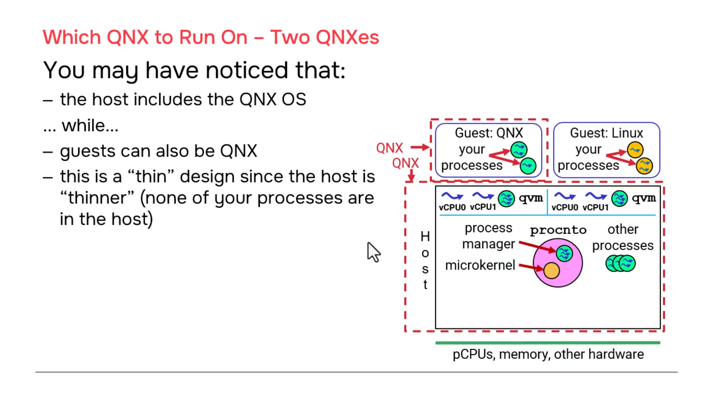
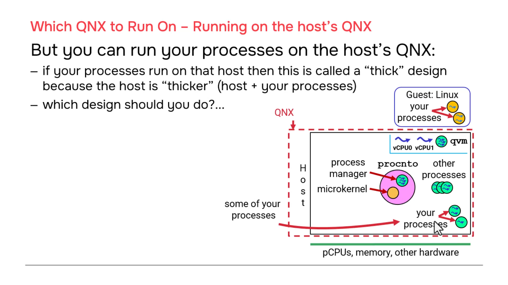
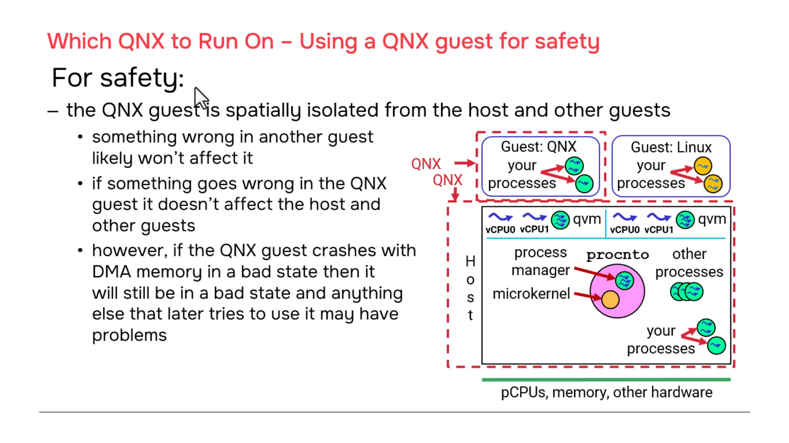
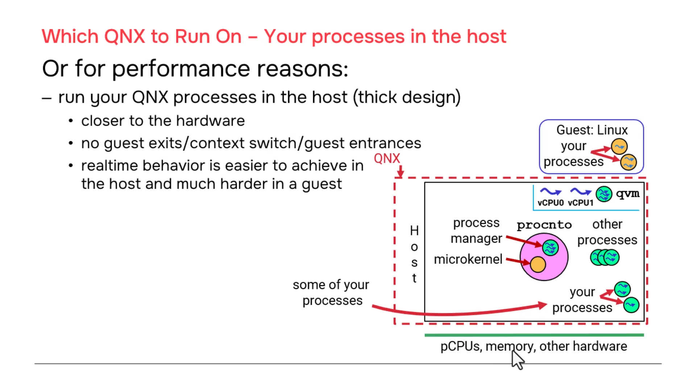
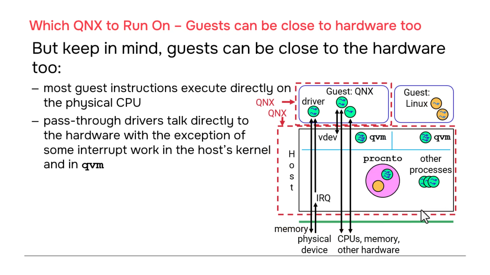

# QNX Hypervisor — Which QNX to Run On?

## Overview

This section addresses a fundamental architectural decision: **where do you place your application code?** In the host (the native QNX environment running the hypervisor), or in a guest (a virtualized QNX instance)? This choice between "thin" and "thick" host designs has profound implications for safety, real-time performance, and system complexity.

---

## 1. The Core Question

> **"Why would I ever run QNX in a guest if I already have QNX in the host?"**

When customers first encounter the QNX Hypervisor, they naturally wonder about this redundancy. The answer lies in understanding the different roles the host and guests play, and how your application's requirements map to each environment.

---

## 2. Two Design Patterns

### Pattern A: Thin Host Design

```
┌─────────────────────────────────────────────────────────────────────┐
│                         THIN HOST DESIGN                             │
│                                                                      │
│  ┌─────────────────────────────────────────────────────────────────┐  │
│  │  QNX HOST                                                       │  │
│  │  (minimal — only system processes)                               │  │
│  │                                                                 │  │
│  │  ┌─────────┐  ┌─────────┐  ┌─────────┐  ┌─────────┐           │  │
│  │  │ procnto │  │ io-sock │  │ devb-*  │  │ qvm     │           │  │
│  │  │ (micro- │  │ (network│  │ (block  │  │ (guest  │           │  │
│  │  │  kernel)│  │  stack) │  │  driver)│  │  mgr)   │           │  │
│  │  └─────────┘  └─────────┘  └─────────┘  └─────────┘           │  │
│  │                                                                 │  │
│  │  ❌ NO application processes in host                            │  │
│  │  ❌ NO automotive/medical/industrial code in host                 │  │
│  │                                                                 │  │
│  └─────────────────────────────────────────────────────────────────┘  │
│                              │                                       │
│                              │ runs                                  │
│                              ▼                                       │
│  ┌─────────────────────────────────────────────────────────────────┐  │
│  │  GUEST 1: QNX 8                                                 │  │
│  │                                                                 │  │
│  │  ┌─────────┐  ┌─────────┐  ┌─────────┐  ┌─────────┐           │  │
│  │  │ procnto │  │ io-sock │  │ YOUR    │  │ YOUR    │           │  │
│  │  │ (guest) │  │ (guest) │  │ APP #1  │  │ APP #2  │           │  │
│  │  └─────────┘  └─────────┘  └─────────┘  └─────────┘           │  │
│  │                                                                 │  │
│  │  ✅ All your application code runs here                        │  │
│  │                                                                 │  │
│  └─────────────────────────────────────────────────────────────────┘  │
│                              │                                       │
│                              │ runs                                  │
│                              ▼                                       │
│  ┌─────────────────────────────────────────────────────────────────┐  │
│  │  GUEST 2: Linux / Android                                       │  │
│  │                                                                 │  │
│  │  ┌─────────┐  ┌─────────┐  ┌─────────┐                        │  │
│  │  │ Linux   │  │ YOUR    │  │ YOUR    │                        │  │
│  │  │ Kernel  │  │ APP #3  │  │ APP #4  │                        │  │
│  │  └─────────┘  └─────────┘  └─────────┘                        │  │
│  │                                                                 │  │
│  └─────────────────────────────────────────────────────────────────┘  │
│                                                                      │
└─────────────────────────────────────────────────────────────────────┘
```

**Characteristics:**
- Host contains **only** QNX system processes (`procnto`, `io-sock`, `devb-*`, `qvm`)
- **Zero** customer application code in host
- All applications run in guests (QNX guest or Linux/Android guest)
- Host is "thin" — minimal attack surface, minimal complexity

**When to Use:**
- Safety-critical systems requiring strong isolation
- Mixed-criticality systems (safety + non-safety on same SoC)
- Regulatory compliance (ISO 26262, IEC 61508)
- When guest crashes must not affect other software

---

### Pattern B: Thick Host Design

```
┌─────────────────────────────────────────────────────────────────────┐
│                         THICK HOST DESIGN                            │
│                                                                      │
│  ┌─────────────────────────────────────────────────────────────────┐  │
│  │  QNX HOST                                                       │  │
│  │  (contains both system AND application processes)                │  │
│  │                                                                 │  │
│  │  ┌─────────┐  ┌─────────┐  ┌─────────┐  ┌─────────┐           │  │
│  │  │ procnto │  │ io-sock │  │ devb-*  │  │ qvm     │           │  │
│  │  │ (micro- │  │ (network│  │ (block  │  │ (guest  │           │  │
│  │  │  kernel)│  │  stack) │  │  driver)│  │  mgr)   │           │  │
│  │  └─────────┘  └─────────┘  └─────────┘  └─────────┘           │  │
│  │                                                                 │  │
│  │  ┌─────────┐  ┌─────────┐  ┌─────────┐  ┌─────────┐           │  │
│  │  │ YOUR    │  │ YOUR    │  │ YOUR    │  │ YOUR    │           │  │
│  │  │ RT APP  │  │ SAFETY  │  │ SENSOR  │  │ CONTROL │           │  │
│  │  │ #1      │  │ APP #2  │  │ FUSION  │  │ LOOP    │           │  │
│  │  └─────────┘  └─────────┘  └─────────┘  └─────────┘           │  │
│  │                                                                 │  │
│  │  ✅ All real-time / safety-critical code runs here             │  │
│  │                                                                 │  │
│  └─────────────────────────────────────────────────────────────────┘  │
│                              │                                       │
│                              │ runs                                  │
│                              ▼                                       │
│  ┌─────────────────────────────────────────────────────────────────┐  │
│  │  GUEST 1: Linux / Android                                       │  │
│  │                                                                 │  │
│  │  ┌─────────┐  ┌─────────┐  ┌─────────┐                        │  │
│  │  │ Linux   │  │ YOUR    │  │ YOUR    │                        │  │
│  │  │ Kernel  │  │ APP #3  │  │ APP #4  │                        │  │
│  │  │         │  │ (UI,    │  │ (infotain│                        │  │
│  │  │         │  │  non-RT)│  │  ment)  │                        │  │
│  │  └─────────┘  └─────────┘  └─────────┘                        │  │
│  │                                                                 │  │
│  │  ✅ Non-critical applications run here                         │  │
│  │                                                                 │  │
│  └─────────────────────────────────────────────────────────────────┘  │
│                                                                      │
│  ❌ NO QNX guest needed — your code is in the host                   │
│                                                                      │
└─────────────────────────────────────────────────────────────────────┘
```

**Characteristics:**
- Host contains **both** system processes **and** customer application code
- Applications run directly on bare metal (well, on QNX microkernel)
- No QNX guest needed — only Linux/Android guests for non-QNX workloads
- Host is "thick" — more complex, but closer to hardware

**When to Use:**
- Hard real-time requirements with tight deadlines
- When interrupt latency is critical
- When you need direct hardware access without virtualization overhead
- Performance-critical control loops

---

## 3. Decision Matrix: Thin vs. Thick

| Factor | Thin Host (Apps in Guest) | Thick Host (Apps in Host) |
|--------|---------------------------|---------------------------|
| **Safety / Isolation** | ✅ Better — guest crash contained | ⚠️ Host crash affects everything |
| **Real-time Performance** | ⚠️ Guest exits add latency | ✅ Best — direct kernel scheduling |
| **Interrupt Latency** | ⚠️ Pass-through adds steps | ✅ Fastest — host IST directly |
| **Hardware Access** | ⚠️ Needs pass-through config | ✅ Direct — no mapping needed |
| **System Complexity** | ⚠️ More VMs to manage | ✅ Simpler — fewer moving parts |
| **Guest Crash Impact** | ✅ Limited to that guest | N/A (no guest for your code) |
| **Certification** | ✅ Easier to certify per-guest | ⚠️ Entire host must be certified |
| **Mixed OS Support** | ✅ Natural — Linux/Android guests | ✅ Also works — just add guests |
| **Code Reuse** | ✅ Guest can be moved to different host | ⚠️ Tied to this specific host |

---

## 4. Safety Considerations

### The Isolation Promise (With Caveats)

```
┌─────────────────────────────────────────────────────────────────────┐
│                    SAFETY ISOLATION MODEL                           │
│                                                                      │
│  ┌─────────────────┐    ┌─────────────────┐    ┌─────────────────┐   │
│  │   QNX Guest     │    │   Linux Guest   │    │   QNX Host      │   │
│  │   (Safety)      │    │   (Non-Safety)  │    │   (Safety)      │   │
│  │                 │    │                 │    │                 │   │
│  │  ┌───────────┐  │    │  ┌───────────┐  │    │  ┌───────────┐  │   │
│  │  │ ASIL-D    │  │    │  │ QM (non-  │  │    │  │ ASIL-D    │  │   │
│  │  │ Braking   │  │    │  │  safety)  │  │    │  │ Steering  │  │   │
│  │  │ Control   │  │    │  │ Infotain- │  │    │  │ Control   │  │   │
│  │  │           │  │    │  │ ment      │  │    │  │           │  │   │
│  │  └───────────┘  │    │  └───────────┘  │    │  └───────────┘  │   │
│  │                 │    │                 │    │                 │   │
│  │  IF THIS CRASHES│    │  IF THIS CRASHES│    │  IF THIS CRASHES│   │
│  │  → Only braking │    │  → Only radio   │    │  → EVERYTHING   │   │
│  │    affected     │    │    affected     │    │    affected     │   │
│  │                 │    │                 │    │                 │   │
│  │  ✅ ISOLATED    │    │  ✅ ISOLATED    │    │  ❌ NOT ISOLATED│   │
│  └─────────────────┘    └─────────────────┘    └─────────────────┘   │
│                                                                      │
│  BUT: Guest crash during DMA is a special case...                    │
│                                                                      │
└─────────────────────────────────────────────────────────────────────┘
```

### The DMA Caveat

> **"If a guest crashes while doing DMA, the DMA may be left in a bad state."**

```
Timeline: Guest Crash During DMA

┌─────────────────────────────────────────────────────────────────────┐
│  t=0   Guest starts DMA transfer to physical device                   │
│        ┌─────────┐                                                   │
│        │ DMA     │  "Transfer 1MB from GPA 0x40000000 to device"    │
│        │ Engine  │                                                   │
│        └────┬────┘                                                   │
│             │                                                        │
│  t=1   Guest crashes! (null pointer, stack overflow, etc.)           │
│        ┌─────────┐                                                   │
│        │ GUEST   │  "Segmentation fault — I'm dead"                  │
│        │ CRASH   │                                                   │
│        └────┬────┘                                                   │
│             │                                                        │
│  t=2   DMA engine still running! (hardware autonomous)               │
│        ┌─────────┐                                                   │
│        │ DMA     │  "Still transferring... 500KB done, 500KB to go" │
│        │ ACTIVE  │  "Reading from guest memory that no longer valid"│
│        └────┬────┘                                                   │
│             │                                                        │
│  t=3   Guest restarted by watchdog                                   │
│        ┌─────────┐                                                   │
│        │ NEW     │  "I'm back! Let me initialize the device..."      │
│        │ GUEST   │                                                   │
│        └────┬────┘                                                   │
│             │                                                        │
│  t=4   Device/DMA in bad state — new driver confused                 │
│        ┌─────────┐                                                   │
│        │ DRIVER  │  "Device not responding correctly!"                │
│        │ ERROR   │  "DMA registers show weird values"                 │
│        └─────────┘                                                   │
│                                                                      │
│  RESULT: Even though guest was isolated, DMA hardware state leaks    │
│          to next guest instance (or host)                             │
│                                                                      │
└─────────────────────────────────────────────────────────────────────┘
```

### Mitigation: Driver Reset on Startup

```c
// In your device driver — always reset hardware on init

int driver_init() {
    // 1. Stop any ongoing DMA
    write_reg(DMA_CONTROL, DMA_STOP);
    
    // 2. Wait for DMA engine to quiesce
    while (read_reg(DMA_STATUS) & DMA_ACTIVE) {
        delay_us(10);
    }
    
    // 3. Reset DMA controller
    write_reg(DMA_RESET, 1);
    delay_us(100);  // Hardware-specific reset time
    write_reg(DMA_RESET, 0);
    
    // 4. Verify clean state
    if (read_reg(DMA_STATUS) != DMA_IDLE) {
        log_error("DMA reset failed!");
        return -1;
    }
    
    // 5. Now safe to configure for new operation
    write_reg(DMA_CONFIG, default_config);
    
    return 0;
}
```

> **Rule:** Any driver that uses DMA or pass-through device access must implement a **hardware reset sequence** on initialization to handle the previous owner crashing.

---

## 5. Real-Time Performance Comparison

### Interrupt Handling: Host vs. Guest

```
┌─────────────────────────────────────────────────────────────────────┐
│           INTERRUPT LATENCY COMPARISON                             │
│                                                                      │
│  HOST-SIDE HANDLING (Fastest)                                       │
│  ─────────────────────────────                                      │
│  IRQ fires                                                          │
│    │                                                                │
│    ▼                                                                │
│  Physical Interrupt Controller ──► Host procnto                     │
│    │                                    │                           │
│    │                                    ▼                           │
│    │                              Schedule IST                     │
│    │                                    │                           │
│    │                                    ▼                           │
│    │                              IST runs (your code)            │
│    │                                    │                           │
│    │                                    ▼                           │
│    │                              Done! (~1-5 μs total)            │
│    │                                                                │
│  Total: ~4 steps, minimal latency                                   │
│                                                                      │
│  ═══════════════════════════════════════════════════════════════   │
│                                                                      │
│  GUEST-SIDE HANDLING (Pass-Through)                                 │
│  ─────────────────────────────────                                  │
│  IRQ fires                                                          │
│    │                                                                │
│    ▼                                                                │
│  Physical Interrupt Controller ──► Host procnto                     │
│    │                                    │                           │
│    │                                    ▼                           │
│    │                              Schedule qvm IST                 │
│    │                                    │                           │
│    │                                    ▼                           │
│    │                              qvm IST: mask IRQ                │
│    │                                    │                           │
│    │                                    ▼                           │
│    │                              Set "pending" for guest            │
│    │                                    │                           │
│    │                                    ▼                           │
│    │                              Guest entrance (when scheduled)  │
│    │                                    │                           │
│    │                                    ▼                           │
│    │                              Guest kernel IDs interrupt        │
│    │                                    │                           │
│    │                                    ▼                           │
│    │                              Guest exit (read virtual ctrl)    │
│    │                                    │                           │
│    │                                    ▼                           │
│    │                              Guest entrance                   │
│    │                                    │                           │
│    │                                    ▼                           │
│    │                              Guest driver IST runs             │
│    │                                    │                           │
│    │                                    ▼                           │
│    │                              Guest signals done                │
│    │                                    │                           │
│    │                                    ▼                           │
│    │                              Guest exit                        │
│    │                                    │                           │
│    │                                    ▼                           │
│    │                              qvm unmasks IRQ                   │
│    │                                    │                           │
│    │                                    ▼                           │
│    │                              Done! (~10-50 μs total)          │
│    │                                                                │
│  Total: ~15+ steps, higher latency and jitter                       │
│                                                                      │
└─────────────────────────────────────────────────────────────────────┘
```

### Performance Numbers

| Path | Typical Latency | Jitter | Use Case |
|------|-----------------|--------|----------|
| **Host IST** | 1–5 μs | Low | Hard real-time control loops |
| **Guest-side emulated** | 2–10 μs | Low | Virtual devices, no hardware |
| **Guest pass-through** | 10–50 μs | Higher | Physical hardware in guest |

---

## 6. Practical Examples

### Example 1: Automotive ADAS (Thin Host)

```
┌─────────────────────────────────────────────────────────────────────┐
│  AUTOMOTIVE ADAS — THIN HOST DESIGN                                 │
│  (ASIL-D Safety Requirements)                                       │
│                                                                      │
│  HOST (QNX 8, minimal, certified)                                   │
│  ┌─────────────────────────────────────────────────────────────┐    │
│  │  • procnto (microkernel)                                    │    │
│  │  • io-sock (networking)                                     │    │
│  │  • devb-* (storage)                                         │    │
│  │  • qvm (guest manager)                                    │    │
│  │  • Safety monitor (watches guests)                        │    │
│  │                                                             │    │
│  │  ❌ NO infotainment code                                     │    │
│  │  ❌ NO UI code                                               │    │
│  │  ❌ NO non-safety apps                                       │    │
│  └─────────────────────────────────────────────────────────────┘    │
│                              │                                       │
│                              │ runs                                  │
│                              ▼                                       │
│  GUEST 1: QNX 8 (ASIL-D)                                          │
│  ┌─────────────────────────────────────────────────────────────┐    │
│  │  • Emergency braking control                                │    │
│  │  • Lane keeping assist                                      │    │
│  │  • Collision avoidance                                      │    │
│  │  • Direct camera/radar access via pass-through            │    │
│  │                                                             │    │
│  │  If this crashes → Braking fails, but host and other       │    │
│  │  guest keep running. Safety monitor restarts this guest.    │    │
│  └─────────────────────────────────────────────────────────────┘    │
│                              │                                       │
│                              │ runs                                  │
│                              ▼                                       │
│  GUEST 2: Android (QM — non-safety)                               │
│  ┌─────────────────────────────────────────────────────────────┐    │
│  │  • Infotainment system                                      │    │
│  │  • Navigation                                               │    │
│  │  • Music player                                             │    │
│  │  • Touchscreen UI                                           │    │
│  │                                                             │    │
│  │  If this crashes → Radio stops, but braking still works.    │    │
│  │  User annoyed but alive.                                     │    │
│  └─────────────────────────────────────────────────────────────┘    │
│                                                                      │
└─────────────────────────────────────────────────────────────────────┘
```

**Why Thin Host:**
- Safety certification focuses only on host + QNX guest
- Android guest does not need certification
- Crash isolation prevents infotainment bugs from affecting braking
- Safety monitor in host can restart failed guests

---

### Example 2: Medical Device (Thick Host)

```
┌─────────────────────────────────────────────────────────────────────┐
│  MEDICAL DEVICE — THICK HOST DESIGN                                 │
│  (Hard Real-Time Control Loop)                                      │
│                                                                      │
│  HOST (QNX 8, contains all critical code)                         │
│  ┌─────────────────────────────────────────────────────────────┐    │
│  │  • procnto (microkernel)                                    │    │
│  │  • io-sock (networking)                                     │    │
│  │  • devb-* (storage)                                         │    │
│  │  • qvm (guest manager)                                      │    │
│  │                                                             │    │
│  │  • PUMP CONTROL LOOP (1 kHz, 1ms deadline)                  │    │
│  │    - Direct motor control                                   │    │
│  │    - Pressure sensor feedback                               │    │
│  │    - Safety interlocks                                      │    │
│  │                                                             │    │
│  │  • INFUSION MONITORING (100 Hz)                             │    │
│  │    - Flow rate calculation                                  │    │
│  │    - Alarm detection                                        │    │
│  │                                                             │    │
│  │  ✅ All real-time code in host for minimal latency          │    │
│  └─────────────────────────────────────────────────────────────┘    │
│                              │                                       │
│                              │ runs                                  │
│                              ▼                                       │
│  GUEST 1: Linux (non-real-time)                                   │
│  ┌─────────────────────────────────────────────────────────────┐    │
│  │  • Data logging                                             │    │
│  │  • Network upload to hospital server                        │    │
│  │  • User interface (settings, history)                       │    │
│  │                                                             │    │
│  │  If this crashes → Logging stops, but pump keeps running.   │    │
│  └─────────────────────────────────────────────────────────────┘    │
│                                                                      │
│  ❌ NO QNX guest — all QNX code is in host                         │
│                                                                      │
└─────────────────────────────────────────────────────────────────────┘
```

**Why Thick Host:**
- 1 ms control loop cannot tolerate guest exit overhead
- Motor control needs direct interrupt handling
- Safety interlocks must respond in microseconds
- Linux guest handles non-critical UI and networking

---

### Example 3: Industrial Controller (Hybrid)

```
┌─────────────────────────────────────────────────────────────────────┐
│  INDUSTRIAL ROBOT CONTROLLER — HYBRID DESIGN                      │
│  (Mixed Criticality)                                                │
│                                                                      │
│  HOST (QNX 8, system + some apps)                                 │
│  ┌─────────────────────────────────────────────────────────────┐    │
│  │  • procnto, io-sock, devb-*, qvm                            │    │
│  │                                                             │    │
│  │  • MOTION PLANNING (soft real-time, 10ms)                   │    │
│  │    - Path calculation                                       │    │
│  │    - Trajectory generation                                  │    │
│  │    - Runs in host for performance                           │    │
│  │                                                             │    │
│  │  • SAFETY MONITOR (hard real-time, 1ms)                     │    │
│  │    - Emergency stop detection                               │    │
│  │    - Direct safety I/O access                               │    │
│  │    - Must be in host for guaranteed response                 │    │
│  └─────────────────────────────────────────────────────────────┘    │
│                              │                                       │
│                              │ runs                                  │
│                              ▼                                       │
│  GUEST 1: QNX 8 (SIL 2)                                           │
│  ┌─────────────────────────────────────────────────────────────┐    │
│  │  • AXIS SERVO CONTROL (5 axes)                              │    │
│  │    - Position loops                                         │    │
│  │    - Velocity loops                                         │    │
│  │    - Torque limits                                          │    │
│  │                                                             │    │
│  │  Why in guest? Each axis is isolated. If one axis crashes, │    │
│  │  other 4 keep running.                                       │    │
│  └─────────────────────────────────────────────────────────────┘    │
│                              │                                       │
│                              │ runs                                  │
│                              ▼                                       │
│  GUEST 2: Linux (non-safety)                                      │
│  ┌─────────────────────────────────────────────────────────────┐    │
│  │  • HMI (Human-Machine Interface)                            │    │
│  │  • Production scheduling                                    │    │
│  │  • Remote diagnostics                                       │    │
│  │  • Data analytics                                           │    │
│  └─────────────────────────────────────────────────────────────┘    │
│                                                                      │
└─────────────────────────────────────────────────────────────────────┘
```

**Why Hybrid:**
- Safety monitor in host for fastest emergency stop
- Motion planning in host for performance
- Axis control in separate QNX guest for isolation
- Linux guest for flexible UI and networking

---

## 7. Pass-Through: How Close Guests Get to Hardware

### Memory Pass-Through

```qvmconf
# Guest configuration — direct memory access
pass addr=0xFE000000,host=0x3F000000,size=0x100000
```

**What happens:**
- Guest driver accesses `0xFE000000` (GPA)
- MMU translates directly to `0x3F000000` (HPA)
- **No hypervisor involvement during access**
- Guest code runs at full speed

```
Guest Driver:  read 0xFE000000
                    │
                    ▼
              MMU Stage 2
              (set up by qvm)
                    │
                    ▼
              Physical RAM
              0x3F000000
                    │
                    ▼
              Device Register
              (direct access)
```

### Interrupt "Pass-Through" (Not Really)

> **Important:** Despite the name, pass-through interrupts are **NOT** direct.

```
IRQ fires
    │
    ▼
Physical Interrupt Controller
    │
    ▼
Host procnto ──► Schedules qvm IST
    │
    ▼
qvm IST ──► Masks IRQ, sets guest pending
    │
    ▼
Guest entrance (when vCPU scheduled)
    │
    ▼
Guest kernel ──► IDs interrupt via virtual controller
    │
    ▼
Guest driver handles it
    │
    ▼
Guest signals done ──► qvm unmasks IRQ
```

**This is NOT true pass-through.** It's mediated through the host. For true low-latency interrupt handling, run the driver in the **host**.

---

## 8. Configuration Examples

### Thin Host: QNX Guest for Safety Apps

```qvmconf
# ============================================
# HOST: Minimal QNX, no apps
# ============================================
# (No .qvmconf for host — it's the base system)

# Host processes running:
# procnto, io-sock, devb-sdmmc, qvm

# ============================================
# GUEST 1: QNX 8 — Safety Applications
# ============================================
system name=safety-guest
ram addr=0x40000000,size=0x4000000
cpu cluster=0,cores=2

# Safety-critical apps in this guest
load addr=0x40000000,file=/data/guests/safety/safety-boot.img

# Pass-through for direct hardware access
pass addr=0xFE000000,host=0x3F000000,size=0x100000   # Safety I/O

# Virtual devices
vdev gicd,addr=0x8000000
vdev generic_timer

# ============================================
# GUEST 2: Android — Infotainment
# ============================================
system name=android-guest
ram addr=0x80000000,size=0x8000000
cpu cluster=1,cores=2

load addr=0x80000000,file=/data/guests/android/android-boot.img

vdev virtio-net
vdev virtio-blk,file=/data/guests/android/system.img
```

### Thick Host: Real-Time Apps in Host

```qvmconf
# ============================================
# HOST: QNX 8 with application processes
# ============================================
# (No .qvmconf for host — apps run directly)

# Host processes:
# procnto, io-sock, devb-sdmmc, qvm
# PLUS:
# /usr/bin/rt-control-loop (priority 255, pinned to CPU 0)
# /usr/bin/safety-monitor (priority 254, pinned to CPU 1)
# /usr/bin/data-logger (priority 10)

# ============================================
# GUEST 1: Linux — Non-critical services
# ============================================
system name=linux-services
ram addr=0x40000000,size=0x4000000
cpu cluster=2,cores=2

load addr=0x40000000,file=/data/guests/linux/Image

vdev virtio-net
vdev virtio-blk,file=/data/guests/linux/rootfs.img

# NO pass-through — all hardware handled in host
```

---

## 9. Key Decision Checklist

| Question | If Yes → | If No → |
|----------|----------|---------|
| Is safety certification required? | Thin host, isolate in guest | Thick host acceptable |
| Is hard real-time (< 1ms) needed? | Thick host, run in host | Thin host acceptable |
| Is DMA used by the application? | Add driver reset logic | Less concern |
| Can guest crash affect other functions? | Separate guests | Same guest or host |
| Is Linux/Android needed for the app? | Guest mandatory | Host or guest |
| Is interrupt latency critical? | Host IST | Guest pass-through |
| Need to minimize certification scope? | Thin host, certify only what's needed | Thick host, certify everything |

---

## 10. Summary

| Design | Host Contents | Guest Contents | Best For |
|--------|-------------|----------------|----------|
| **Thin** | Only QNX system | All applications | Safety, isolation, mixed criticality |
| **Thick** | QNX system + RT apps | Non-RT apps, other OS | Hard real-time, simple architecture |
| **Hybrid** | QNX system + critical apps | Isolated subsystems | Complex systems with multiple requirements |

> **Bottom Line:** Run safety-critical and hard real-time code in the **host** for performance and direct hardware access. Run non-safety and isolated functionality in **guests** for containment and certification simplicity. The hypervisor gives you the flexibility to choose — or mix both approaches.
---
## 11. Screenshots












---
