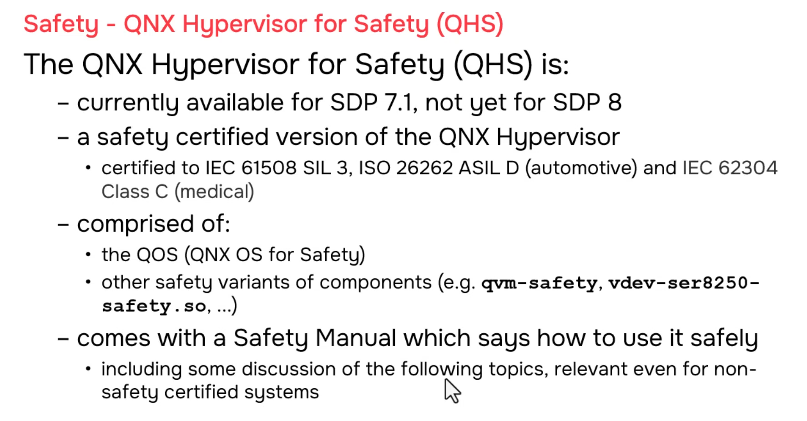

# QNX Hypervisor — Safety Introduction

## Overview

This section introduces the **QNX Hypervisor for Safety**, a safety-certified version of the QNX Hypervisor designed for systems requiring formal certification to international safety standards. The module covers available certifications, product components, and the relationship between the safety-certified hypervisor and the general safety topics covered in subsequent modules.

---

## 1. What is QNX Hypervisor for Safety?

The QNX Hypervisor for Safety is a **safety-certified variant** of the standard QNX Hypervisor. It provides the same virtualization capabilities but with additional assurance, documentation, and certified components required for regulated industries.

### Certifications

| Standard | Level | Industry |
|----------|-------|----------|
| **IEC 61508** | SIL 3 | Industrial, general functional safety |
| **ISO 26262** | ASIL D | Automotive (highest automotive safety integrity level) |
| **IEC 62304** | Class C | Medical devices (highest software safety class) |

> **Note:** As of the video recording, QNX Hypervisor for Safety was available for **SDP 7.1** only. Check current QNX documentation for **SDP 8** availability.

---

## 2. Product Components

### Base Requirement

| Component | Requirement |
|-----------|-------------|
| **QNX OS for Safety** | **Mandatory** — The safety-certified hypervisor requires the safety-certified QNX operating system as its foundation |

### Safety-Certified Variants

All hypervisor components have safety-certified equivalents with `-safety` suffix:

| Standard Component | Safety-Certified Equivalent |
|-------------------|----------------------------|
| `qvm` | `qvm-safety` |
| `vdev-ser8250.so` | `vdev-ser8250-safety.so` |
| `vdev-virtio-blk.so` | `vdev-virtio-blk-safety.so` |
| `vdev-virtio-net.so` | `vdev-virtio-net-safety.so` |
| Other vdevs | `vdev-*-safety.so` |

### The Safety Manual

The most critical deliverable is the **Safety Manual**:

| Aspect | Description |
|--------|-------------|
| **Purpose** | Tells you how to use the hypervisor safely in your system |
| **Contents** | Restrictions, recommendations, usage guidelines, hazard analysis |
| **Requirement** | Mandatory reading for anyone using the safety product |
| **Usage** | Guides your system design, configuration, and validation |

---

## 3. Architecture Comparison

```
┌─────────────────────────────────────────────────────────────────────┐
│              STANDARD QNX HYPERVISOR                               │
│                                                                     │
│  ┌─────────────────┐    ┌─────────────────┐    ┌─────────────────┐ │
│  │     qvm         │    │ vdev-ser8250.so │    │ vdev-virtio-*.so│ │
│  │                 │    │                 │    │                 │ │
│  │  (standard)     │    │  (standard)     │    │  (standard)     │ │
│  └─────────────────┘    └─────────────────┘    └─────────────────┘ │
│                                                                     │
│  • General purpose virtualization                                   │
│  • No formal safety certification                                   │
│  • Suitable for non-safety applications                             │
│                                                                     │
└─────────────────────────────────────────────────────────────────────┘

                              vs.

┌─────────────────────────────────────────────────────────────────────┐
│           QNX HYPERVISOR FOR SAFETY                                │
│                                                                     │
│  ┌─────────────────┐    ┌─────────────────┐    ┌─────────────────┐ │
│  │   qvm-safety    │    │vdev-ser8250-   │    │vdev-virtio-*-   │ │
│  │                 │    │   safety.so     │    │   safety.so     │ │
│  │ (SIL 3/ASIL D/  │    │                 │    │                 │ │
│  │  Class C)       │    │  (SIL 3/ASIL D/ │    │  (SIL 3/ASIL D/ │ │
│  │                 │    │   Class C)      │    │   Class C)      │ │
│  └─────────────────┘    └─────────────────┘    └─────────────────┘ │
│                                                                     │
│  ┌─────────────────────────────────────────────────────────────┐   │
│  │  QNX OS for Safety (mandatory foundation)                   │   │
│  │  • Certified microkernel                                      │   │
│  │  • Certified process manager                                  │   │
│  │  • Certified drivers (where applicable)                     │   │
│  └─────────────────────────────────────────────────────────────┘   │
│                                                                     │
│  ┌─────────────────────────────────────────────────────────────┐   │
│  │  SAFETY MANUAL                                              │   │
│  │  • Restrictions on use                                        │   │
│  │  • Recommendations for safe configuration                   │   │
│  │  • Hazard analysis and mitigations                          │   │
│  │  • Validation and verification guidance                       │   │
│  └─────────────────────────────────────────────────────────────┘   │
│                                                                     │
│  • Formal safety certification to IEC 61508 SIL 3                 │
│  • ISO 26262 ASIL D for automotive                                │
│  • IEC 62304 Class C for medical                                  │
│                                                                     │
└─────────────────────────────────────────────────────────────────────┘
```

---

## 4. Safety Topics in This Course

The upcoming safety modules cover topics that are **relevant to all hypervisor users**, not only those using the certified product:

| Topic | Requires QNX Hypervisor for Safety? | Relevance |
|-------|-----------------------------------|-----------|
| **Design Safe State** | No | Best practice for any safety-critical system |
| **IOMMUs** | No | Hardware security feature for any hypervisor deployment |
| **Freedom from Interference** | No | Core virtualization principle |
| **Memory Isolation** | No | Standard hypervisor capability |
| **Using the Safety Manual** | **Yes** | Specific to certified product |

### Why Learn These Topics Even Without the Safety Product?

```
┌─────────────────────────────────────────────────────────────────────┐
│  EVEN WITHOUT QNX HYPERVISOR FOR SAFETY...                         │
│                                                                     │
│  These topics make your system safer:                               │
│                                                                     │
│  • IOMMUs prevent DMA attacks from compromised guests               │
│  • Design Safe State ensures graceful failure modes                 │
│  • Proper isolation prevents guest-to-guest interference            │
│  • Understanding certification requirements guides architecture     │
│                                                                     │
│  When you later need certification:                                 │
│  • You'll already understand the concepts                           │
│  • Migration to certified product is easier                         │
│  • Your design will align with safety manual requirements           │
│                                                                     │
└─────────────────────────────────────────────────────────────────────┘
```

---

## 5. Certification Levels Explained

### IEC 61508 SIL 3 (Industrial)

| Aspect | SIL 3 Requirement |
|--------|-------------------|
| **Risk Reduction** | 10⁻⁸ to 10⁻⁹ probability of dangerous failure per hour |
| **Coverage** | Quantitative and qualitative analysis required |
| **Industries** | Process control, machinery, railway, nuclear |

### ISO 26262 ASIL D (Automotive)

| Aspect | ASIL D Requirement |
|--------|-------------------|
| **Risk Level** | Highest automotive integrity level |
| **Examples** | Steering, braking, airbag control |
| **Hazard Analysis** | HARA (Hazard Analysis and Risk Assessment) |
| **Metrics** | SPFM (Single-Point Fault Metric) ≥ 99%, LFM (Latent-Fault Metric) ≥ 90% |

### IEC 62304 Class C (Medical)

| Aspect | Class C Requirement |
|--------|-------------------|
| **Risk** | Software where failure could cause death or serious injury |
| **Examples** | Infusion pumps, pacemakers, surgical robots |
| **Process** | Full lifecycle documentation, traceability, validation |

---

## 6. Product Availability

| Status | Detail |
|--------|--------|
| **Current (at video recording)** | Available for **SDP 7.1** |
| **Future** | Check QNX documentation for **SDP 8** availability |
| **Recommendation** | Contact QNX sales/support for latest status |

---

## 7. Key Takeaways

| Concept | Key Point |
|---------|-----------|
| **QNX Hypervisor for Safety** | Certified variant of standard hypervisor |
| **Required foundation** | QNX OS for Safety |
| **Certifications** | IEC 61508 SIL 3, ISO 26262 ASIL D, IEC 62304 Class C |
| **Component naming** | All components have `-safety` suffix |
| **Critical document** | Safety Manual (restrictions, recommendations, hazards) |
| **Upcoming topics** | Apply to all hypervisor users, not just safety product |
| **Design Safe State** | Best practice for any safety-critical system |
| **IOMMUs** | Hardware security relevant to any deployment |

---

## 8. Screenshots


---
